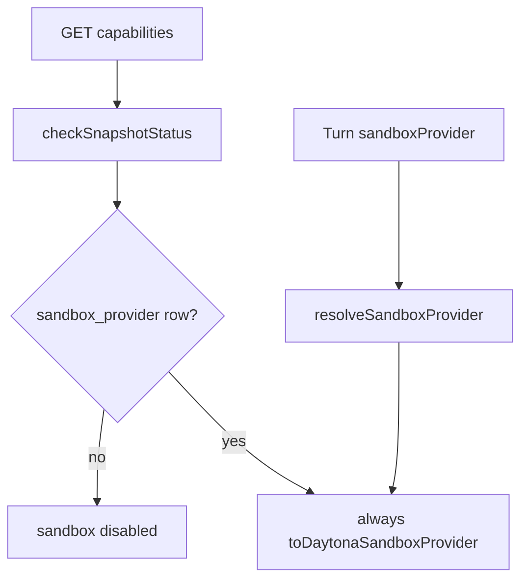

# Local sandbox server integration

## Product rules (locked)

- **Local only when `STANDALONE=true`** (from [`packages/server/src/config.ts`](packages/server/src/config.ts)). When `STANDALONE=false`, there is no local fallback path — only a Daytona DB row can enable sandbox (same as today).
- **No DB upsert for local.** The `sandbox_provider` table stays empty until the user configures Daytona. Local is an **in-memory runtime fallback** when there is no row and the host supports it.
- **GET settings does not return local** — no row → **404** as today. Local is invisible on the settings API.
- **Capabilities:** when local fallback applies, report sandbox (and skills) **enabled** even with no DB row.
- **PUT stays Daytona-only.** First Daytona PUT upgrades off implicit local.
- **Session continuity:** persisted `sandbox_id` uses `v1:provider_type:raw_id`. When starting a turn, if the id is `v1:`-prefixed and `provider_type` ≠ current provider → **do not carry forward** (create fresh). If `v1:` is absent (legacy) → carry forward as today. Same-type missing remote/local root → recreate (below).

## Current gaps



- Manifest/schema/catalog are Daytona-only ([`sandboxProvider.ts`](packages/server/src/schemas/sandboxProvider.ts), [`sandbox-catalog.yaml`](packages/server/catalog/sandbox-catalog.yaml)).
- [`resolveSandboxProvider`](packages/server/src/runtime/sessionResources.ts) always builds Daytona.
- [`LocalSandboxProvider.createSandbox`](packages/local-sandbox/src/provider/LocalSandboxProvider.ts) returns an absolute path as `sandboxId`. Tenant-prefix ownership checks are not needed for local (or Daytona session reattach): ids are not client-supplied.
- Settings UI hides Available once any provider is configured — with GET 404 + capabilities enabled, Available (Daytona) must remain visible so users can upgrade.

## Design — interface / method surface

### Move `@truefoundry/local-sandbox` into `packages/server`

Local sandbox is server-only (standalone). **Copy first, delete later:**

1. **Copy** `packages/local-sandbox` sources into [`packages/server/src/sandbox/local/`](packages/server/src/sandbox/local/) (provider, core, schemas, local Python client, codegen). Tests → [`packages/server/tests/sandbox/local/`](packages/server/tests/sandbox/local/). Scripts/smoke/lima → under server scripts.
2. Add needed deps to [`packages/server/package.json`](packages/server/package.json); wire resolve/capabilities/main to the **server copy**.
3. Prove green: server typecheck/tests + local smoke via server scripts; standalone fallback works.
4. **Stop and ask the developer** before deleting `packages/local-sandbox`. Do **not** remove the top-level package until explicitly confirmed.
5. After confirmation: remove `packages/local-sandbox`, drop root `typecheck` filter / lockfile entries, and any remaining `@truefoundry/local-sandbox` imports.

Do not delete the top-level package in the same step as the first copy — keep it until the in-server path is verified **and** the developer approves removal.

Local UDS `mcp_client` stays under `server/src/sandbox/local/` (tightly coupled); not merged with product NATS `mcp_client.py`.

### New: sandbox ref helpers — [`packages/harness/src/core/sandbox/sandboxRef.ts`](packages/harness/src/core/sandbox/sandboxRef.ts) (name OK to adjust)

```ts
export interface SandboxRefParts {
  /** Provider kind from `SandboxProvider.type` (e.g. `daytona`, `local`) — plain string, not a closed union. */
  providerType: string;
  rawId: string;
}

/** `v1:type:raw` — raw may contain `:` (split only on first two colons after version). */
export function formatSandboxId(parts: SandboxRefParts): string;

/**
 * Parse fancy id. No `v1:` prefix → `{ kind: 'legacy', rawId: fullString }`.
 * Malformed `v1:` (too few segments) → `{ kind: 'legacy', rawId: fullString }` so carry-forward stays safe.
 */
export function parseSandboxId(
  sandboxId: string,
): { kind: 'v1'; parts: SandboxRefParts } | { kind: 'legacy'; rawId: string };

/** Carry-forward gate for turn admit / download. */
export function existingSandboxIdForProvider(params: {
  existingSandboxId: string | undefined;
  currentProviderType: string;
}): string | undefined;
```

Export from [`packages/harness/src/core/index.ts`](packages/harness/src/core/index.ts).

### [`SandboxProvider`](packages/harness/src/core/sandbox/provider/Provider.ts)

```ts
export interface SandboxProvider {
  /** Stable provider kind used in fancy sandbox ids and carry-forward (plain string). */
  readonly type: string;
  // ...existing methods unchanged; createSandbox still returns raw id only
}
```

- [`DaytonaSandboxProvider`](packages/harness/src/core/sandbox/provider/DaytonaProvider.ts): `readonly type = 'daytona'`
- [`LocalSandboxProvider`](packages/server/src/sandbox/local/provider/LocalSandboxProvider.ts): `readonly type = 'local'`
- Any other `SandboxProvider` impls (e.g. TFY) must set `type` as well

`createSandbox(): Promise<{ sandboxId: string }>` still returns **raw** id only.

### [`Sandbox` / `SandboxOptions`](packages/harness/src/core/sandbox/Sandbox.ts)

No separate `providerType` / `providerName` on options — read `provider.type`.

Behavior changes (methods unchanged externally):

- Constructor: drop `validateSandboxOwnedByTenant`; if `existingSandboxId` set, store fancy or legacy as session id; compute **raw** via `parseSandboxId` for provider calls.
- `ensureSandboxCreated`: on create, `formatSandboxId({ providerType: provider.type, rawId })` before `SANDBOX_CREATED` / `SandboxInfo`.
- All `provider.*` calls use **raw** id only.
- Same-type missing: on `SandboxNotAvailableError` from provider while reattaching, clear existing, `createSandbox()`, emit new fancy id (recreate path).

Remove dead: ownership-only `tenantName` usage (keep `TFY_TENANT_NAME` in `execExtraEnv` only if still needed for Daytona/agent env).

### Server resolve / build

[`resolveSandboxProvider`](packages/server/src/runtime/sessionResources.ts) return type becomes:

```ts
Promise<SandboxProvider | undefined>;
// provider.type discriminates daytona vs local
```

- DB Daytona row → `DaytonaSandboxProvider` (`type: 'daytona'`)
- No row + STANDALONE + `LocalSandboxProvider.isSupported()` → `LocalSandboxProvider` (`type: 'local'`, no store write)
- Else → `undefined`

[`buildTurnSandbox`](packages/server/src/runtime/sessionResources.ts):

```ts
export function buildTurnSandbox(input: {
  provider: SandboxProvider;
  logger: Logger;
  gitSkills: readonly GitSkill[];
  fileDownloadEnabled: boolean;
  existingSandboxId?: string | undefined; // gate with existingSandboxIdForProvider({ ..., currentProviderType: provider.type })
  tracing: AgentTracing;
  tenantName: string; // DaytonaSandboxProvider construction / optional TFY_TENANT_NAME for Daytona only
}): Sandbox;
```

Call sites ([`turns.ts`](packages/server/src/apis/turns.ts) factory + download):

- `existingSandboxIdForProvider({ existingSandboxId, currentProviderType: provider.type })` before `buildTurnSandbox`.
- Download: `parseSandboxId` → raw → `provider.downloadFile({ sandboxId: raw, path })`.

### Schemas — [`sandboxProvider.ts`](packages/server/src/schemas/sandboxProvider.ts)

- **No `type: 'local'` on the wire.** GET/PUT/catalog stay Daytona-only (current schemas).
- Local exists only as runtime `SandboxProvider.type === 'local'`, not as a settings manifest.

### Settings / capabilities / status helpers

- [`sandboxProviders.ts` GET](packages/server/src/apis/sandboxProviders.ts): **unchanged** — no row → 404 (do **not** synthesize local).
- PUT: Daytona-only; first PUT inserts Daytona row (upgrades off implicit local).
- [`capabilities.ts`](packages/server/src/apis/capabilities.ts) / status helper: no row + STANDALONE + `isSupported` → sandbox/skills **enabled** (`ready`) without Daytona SDK or store write.
- [`validateAgentSpec`](packages/server/src/runtime/sessionResources.ts): sandbox/skills OK when resolve would return a provider (row **or** local fallback).

### Config + process lifecycle

[`config.ts`](packages/server/src/config.ts) — **derived only** (no new user-facing env vars for now):

- `LOCAL_SANDBOX_ROOT_PARENT` = `join(envPaths('trueforge').data, 'sandboxes')`
- `CODE_MODE_SOCKET_PARENT` = `join(os.tmpdir(), 'tf_cms')`

[`main.ts`](packages/server/src/main.ts):

- `prepareCodeModeSocketParent()` at startup: exists → warn; `rm` + `mkdir 0700`
- shutdown hook: `rm` `tf_cms`
- `mkdir` sandboxes parent as needed (no delete on shutdown)

### Local provider (in server)

[`LocalSandboxProvider`](packages/server/src/sandbox/local/provider/LocalSandboxProvider.ts) (after move):

- Options unchanged shape (no `tenantName`); construct with derived paths + `support`.
- Ops on missing/nonexistent root → `SandboxNotAvailableError` (enables Sandbox recreate).
- `createSandbox` still returns absolute path raw id.
- No separate `@truefoundry/local-sandbox` dependency.

### UI / adapter

- Settings GET 404 + capabilities `sandbox.enabled` → no configured provider row in UI; **keep Daytona in Available** so users can configure/upgrade.
- After Daytona PUT → normal Daytona configured UI.
- No adapter mapping for `type: 'local'` settings payload (none returned).
- Composer/agent UI already keys off capabilities for sandbox/skills enablement — that path lights up without a settings row.

### Removals — delete `validateSandboxOwnedByTenant` from the codebase

Full delete (no shim, no “Daytona-only” keep):

| Location | Action |
|---|---|
| [`SandboxErrors.ts`](packages/harness/src/core/sandbox/SandboxErrors.ts) | Delete `validateSandboxOwnedByTenant` and `SandboxTenantMismatchError` |
| [`core/index.ts`](packages/harness/src/core/index.ts) | Remove export |
| [`Sandbox.ts`](packages/harness/src/core/sandbox/Sandbox.ts) constructor | Remove call + import |
| [`Sandbox.ts`](packages/harness/src/core/sandbox/Sandbox.ts) `ensureSandboxCreated` | Remove call after `createSandbox` |
| [`turns.ts`](packages/server/src/apis/turns.ts) download handler | Remove call + import |
| [`turnRoutes.ts`](packages/server/src/routes/turnRoutes.ts) download 403 description | Drop “sandbox belongs to another tenant” wording |

Rationale: `sandbox_id` is never client-supplied; download already authorizes via session tenant + `checkTurnAccess` + turn loaded through that session.

## Tests

- Assert no remaining references to `validateSandboxOwnedByTenant` / `SandboxTenantMismatchError`.
- Empty store + standalone + supported → capabilities sandbox/skills **enabled**; GET settings still **404**; store still empty.
- PUT Daytona on empty works; GET then Daytona; capabilities still enabled via row.
- Fancy id helpers + Sandbox wrap/unwrap; carry-forward drops on type mismatch; legacy non-`v1:` still carried.
- Same-type missing → recreate + new id in snapshot.
- Download unwraps fancy id to raw before `provider.downloadFile` (import helpers).
- UI: empty settings + capabilities on → Daytona Available; after Daytona → configured.

## Out of scope

- Merging product NATS `mcp_client.py` with the local UDS client — keep the local Python client **under** `server/src/sandbox/local/` (tightly coupled to UDS transport); do not unify modules.
- Multi-provider rows (still singleton per tenant).
- Persisting or returning `type: 'local'` on settings/catalog API.
- Local upsert / local PUT / synthetic local GET.
- Removing `packages/local-sandbox` without an explicit developer go-ahead after the server copy is green.
