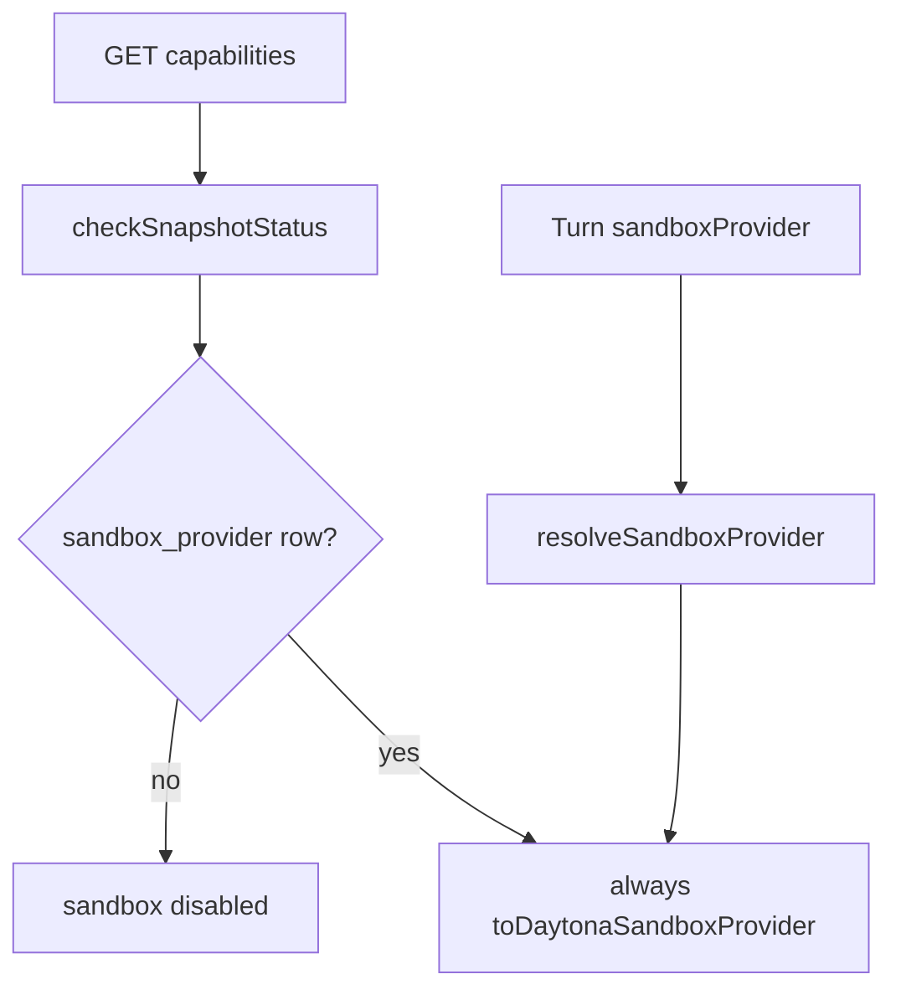

# Local sandbox server integration

## Product rules (locked)

- **Local only when `STANDALONE=true`** (from [`packages/trueforge/src/config.ts`](packages/trueforge/src/config.ts)). When `STANDALONE=false`, there is no local fallback path — only a Daytona DB row can enable sandbox (same as today).
- **No DB upsert for local.** The `sandbox_provider` table stays empty until the user configures Daytona. Local is an **in-memory runtime fallback** when there is no row and the host supports it.
- **GET settings does not return local** — no row → **404** as today. Local is invisible on the settings API.
- **Capabilities:** when local fallback applies, report sandbox (and skills) **enabled** even with no DB row.
- **PUT stays Daytona-only.** First Daytona PUT upgrades off implicit local.
- **Session continuity:** persisted `sandbox_id` uses `v1:provider_type:raw_id`. When starting a turn, if the id is `v1:`-prefixed and `provider_type` ≠ current provider → **do not carry forward** (create fresh). If `v1:` is absent (legacy) → carry forward as today. Same-type missing remote/local root → recreate (below).

## Current gaps



- Manifest/schema/catalog are Daytona-only ([`sandboxProvider.ts`](packages/trueforge/src/schemas/sandboxProvider.ts), [`sandbox-catalog.yaml`](packages/trueforge/catalog/sandbox-catalog.yaml)).
- [`resolveSandboxProvider`](packages/trueforge/src/runtime/sessionResources.ts) always builds Daytona.
- [`LocalSandboxProvider.createSandbox`](packages/local-sandbox/src/provider/LocalSandboxProvider.ts) returns an absolute path as `sandboxId`. Tenant-prefix ownership checks are not needed for local (or Daytona session reattach): ids are not client-supplied.
- Settings UI already maps GET 404 → empty list and shows Available when `providers.length === 0`. Keep that: capabilities-on + empty settings must still show Daytona in Available so users can upgrade. UI work is a regression test, not a new hide/show rule.

## Design — interface / method surface

### Move `@truefoundry/local-sandbox` into `packages/trueforge`

Local sandbox is server-only (standalone). **Copy first, delete later.** Copy the **current** `packages/local-sandbox` tree (already has `build:gen` / `sandboxScripts.gen.ts`, `mcp_client_local.py`, `getClientInstall`) — not an older snapshot.

1. **Copy** sources into [`packages/trueforge/src/sandbox/local/`](packages/trueforge/src/sandbox/local/) (provider, core, schemas, local Python client, codegen). Unit/contract tests → [`packages/trueforge/tests/unit/sandbox/local/`](packages/trueforge/tests/unit/sandbox/local/) so [`jest.unit.config.cjs`](packages/trueforge/jest.unit.config.cjs) (`tests/unit/**/*.test.ts`) picks them up. Smoke/lima/probe stay as **scripts** on `@truefoundry/trueforge` (`smoke:local`, `smoke:local:lima`) — do not put `smoke.test.ts` on the unit Jest run.
2. Add `@anthropic-ai/sandbox-runtime` (and any other local-sandbox deps) to [`packages/trueforge/package.json`](packages/trueforge/package.json). Wire local script codegen into trueforge `build:gen` (or a sibling `build:gen:local-sandbox` that `build` / `typecheck` / `test` invoke). Gitignore the generated `sandboxScripts.gen.ts` under trueforge (same as today’s local-sandbox gitignore).
3. Wire resolve / capabilities / main to the **trueforge copy**. Prove green: trueforge typecheck + unit tests + local smoke via the new scripts; standalone fallback works.
4. **Stop and ask the developer** before deleting `packages/local-sandbox`. Do **not** remove the top-level package until explicitly confirmed.
5. After confirmation: remove `packages/local-sandbox`, drop the root [`package.json`](package.json) `typecheck` filter for `@truefoundry/local-sandbox`, refresh the lockfile, and drop any remaining `@truefoundry/local-sandbox` imports. `local-sandbox` is not on the CI test matrix today (only root typecheck); after the fold, unit tests run as part of the `trueforge` package job.

Do not delete the top-level package in the same step as the first copy — keep it until the in-server path is verified **and** the developer approves removal.

Local UDS `mcp_client` stays under `packages/trueforge/src/sandbox/local/` (tightly coupled); not merged with product NATS `mcp_client.py`.

### New: sandbox ref helpers — [`packages/trueforge-core/src/core/sandbox/sandboxRef.ts`](packages/trueforge-core/src/core/sandbox/sandboxRef.ts) (name OK to adjust)

```ts
export interface SandboxRefParts {
  /** Provider kind from `SandboxProvider.type` (e.g. `daytona`, `local`) — plain string, not a closed union. */
  providerType: string;
  rawId: string;
}

/** `v1:type:raw` — raw may contain `:` (split only on first two colons after version). */
export function formatSandboxId(parts: SandboxRefParts): string;

/**
 * Parse fancy id. No `v1:` prefix → `{ kind: 'legacy', rawId: fullString }`.
 * Malformed `v1:` (too few segments) → `{ kind: 'legacy', rawId: fullString }` so carry-forward stays safe.
 */
export function parseSandboxId(
  sandboxId: string,
): { kind: 'v1'; parts: SandboxRefParts } | { kind: 'legacy'; rawId: string };

/** Carry-forward gate for turn admit / download. */
export function existingSandboxIdForProvider(params: {
  existingSandboxId: string | undefined;
  currentProviderType: string;
}): string | undefined;
```

Export from [`packages/trueforge-core/src/core/index.ts`](packages/trueforge-core/src/core/index.ts).

### [`SandboxProvider`](packages/trueforge-core/src/core/sandbox/provider/Provider.ts)

```ts
export interface SandboxProvider {
  /** Stable provider kind used in fancy sandbox ids and carry-forward (plain string). */
  readonly type: string;
  // ...existing methods unchanged; createSandbox still returns raw id only
}
```

- [`DaytonaSandboxProvider`](packages/trueforge-core/src/core/sandbox/provider/DaytonaProvider.ts): `readonly type = 'daytona'`
- [`LocalSandboxProvider`](packages/trueforge/src/sandbox/local/provider/LocalSandboxProvider.ts): `readonly type = 'local'`
- [`TFYSandboxProvider`](packages/trueforge-core/src/core/sandbox/provider/TFYSandboxProvider.ts) must set `type` as well

`createSandbox(): Promise<{ sandboxId: string }>` still returns **raw** id only.

### [`Sandbox` / `SandboxOptions`](packages/trueforge-core/src/core/sandbox/Sandbox.ts)

No separate `providerType` / `providerName` on options — read `provider.type`.

Behavior changes (methods unchanged externally):

- Constructor: drop `validateSandboxOwnedByTenant`; if `existingSandboxId` set, store fancy or legacy as session id; compute **raw** via `parseSandboxId` for provider calls.
- `ensureSandboxCreated`: on create, `formatSandboxId({ providerType: provider.type, rawId })` before `SANDBOX_CREATED` / `SandboxInfo`.
- All `provider.*` calls use **raw** id only.
- Same-type missing: on `SandboxNotAvailableError` from provider while reattaching, clear existing, `createSandbox()`, emit new fancy id (recreate path). This path does **not** exist today — `ensureSandboxCreated` just reuses `existingSandboxInfo`.

Remove dead: ownership-only `tenantName` usage (keep `TFY_TENANT_NAME` in `execExtraEnv` only if still needed for Daytona/agent env).

### Server resolve / build

[`resolveSandboxProvider`](packages/trueforge/src/runtime/sessionResources.ts) return type becomes:

```ts
Promise<SandboxProvider | undefined>;
// provider.type discriminates daytona vs local
```

- DB Daytona row → `DaytonaSandboxProvider` (`type: 'daytona'`)
- No row + `STANDALONE` + cached support probe is supported → `LocalSandboxProvider` (`type: 'local'`, no store write)
- Else → `undefined`

**Cache `LocalSandboxProvider.isSupported()` once** (process start or first use). The probe inits SRT and creates a temp sandbox — do not call it on every GET `/capabilities`, `validateAgentSpec`, or turn.

[`buildTurnSandbox`](packages/trueforge/src/runtime/sessionResources.ts):

```ts
export function buildTurnSandbox(input: {
  provider: SandboxProvider;
  logger: Logger;
  gitSkills: readonly GitSkill[];
  fileDownloadEnabled: boolean;
  existingSandboxId?: string | undefined; // gate with existingSandboxIdForProvider({ ..., currentProviderType: provider.type })
  tracing: AgentTracing;
  tenantName: string; // DaytonaSandboxProvider construction / optional TFY_TENANT_NAME for Daytona only
}): Sandbox;
```

Call sites ([`turns.ts`](packages/trueforge/src/apis/turns.ts) factory + download):

- `existingSandboxIdForProvider({ existingSandboxId, currentProviderType: provider.type })` before `buildTurnSandbox`.
- Download: `parseSandboxId` → raw → `provider.downloadFile({ sandboxId: raw, path })`.

### Schemas — [`sandboxProvider.ts`](packages/trueforge/src/schemas/sandboxProvider.ts)

- **No `type: 'local'` on the wire.** GET/PUT/catalog stay Daytona-only (current schemas).
- Local exists only as runtime `SandboxProvider.type === 'local'`, not as a settings manifest.

### Settings / capabilities / status helpers

- [`sandboxProviders.ts` GET](packages/trueforge/src/apis/sandboxProviders.ts): **unchanged** — no row → 404 (do **not** synthesize local).
- PUT: Daytona-only; first PUT inserts Daytona row (upgrades off implicit local).
- [`capabilities.ts`](packages/trueforge/src/apis/capabilities.ts) / status helper: no row + `STANDALONE` + cached support → sandbox/skills **enabled** (`ready`) without Daytona SDK or store write.
- [`validateAgentSpec`](packages/trueforge/src/runtime/sessionResources.ts): sandbox/skills OK when resolve would return a provider (row **or** local fallback). Existing unit tests that require a DB row must be updated for the standalone+supported case.

### Config + process lifecycle

[`config.ts`](packages/trueforge/src/config.ts) — **derived only** (no new user-facing env vars). Fields live on **`StandaloneServerConfiguration` only** (local fallback is `STANDALONE=true`-only):

- `LOCAL_SANDBOX_ROOT_PARENT` = `join(envPaths('trueforge', { suffix: '' }).data, 'sandboxes')` — same `{ suffix: '' }` as `SQLITE_PATH` so sandboxes sit next to the DB, not under `trueforge-nodejs`.
- `CODE_MODE_SOCKET_PARENT` = `join(os.tmpdir(), 'tf_cms')`

Reads go through `configuration`, not `process.env`.

[`main.ts`](packages/trueforge/src/main.ts) (standalone only):

- `prepareCodeModeSocketParent()` at **every** standalone startup (including `tsx watch` restarts): exists → warn; `rm` + `mkdir 0700`. This is the reliability path for leftover sockets.
- `mkdir` sandboxes parent as needed (no delete on shutdown).
- Shutdown `rm` of `tf_cms` only in the **existing** production drain hook (`NODE_ENV !== 'development'`). Do **not** add a special watch-mode shutdown — watch already skips drain so `tsx` can restart; the next start’s `prepare` cleans leftovers.

Probe cache: run `LocalSandboxProvider.isSupported()` once during standalone boot (after socket-parent prepare) and pass the result into resolve/capabilities. If unsupported, local fallback is off (capabilities stay disabled until a Daytona row exists).

### Local provider (in trueforge)

[`LocalSandboxProvider`](packages/trueforge/src/sandbox/local/provider/LocalSandboxProvider.ts) (after move):

- `readonly type = 'local'`.
- Options unchanged shape (no `tenantName`); construct with derived paths + cached `support`.
- **New work:** ops on a missing/nonexistent root must throw `SandboxNotAvailableError` (today they become `SandboxFileNotFoundError` or generic errors). That is what enables Sandbox recreate.
- `createSandbox` still returns absolute path raw id.
- No separate `@truefoundry/local-sandbox` dependency after the copy is the runtime path.

### UI / adapter

Adapter already maps GET 404 → `[]` ([`sandboxProviderCatalog.ts`](packages/trueforge-ui/src/plugins/trueforge-agent-server-adapter/catalogs/sandboxProviderCatalog.ts)); Available stays visible when the list is empty.

- Settings GET 404 + capabilities `sandbox.enabled` → no configured provider row; **Daytona stays in Available**.
- After Daytona PUT → normal Daytona configured UI.
- No adapter mapping for `type: 'local'` settings payload (none returned).
- Composer/agent UI already keys off capabilities for sandbox/skills enablement.
- Add a UI test for empty settings + capabilities on → Daytona Available; after Daytona → configured.

### Removals — delete `validateSandboxOwnedByTenant` from the codebase

Full delete (no shim, no “Daytona-only” keep):

| Location | Action |
|---|---|
| [`SandboxErrors.ts`](packages/trueforge-core/src/core/sandbox/SandboxErrors.ts) | Delete `validateSandboxOwnedByTenant` and `SandboxTenantMismatchError` |
| [`core/index.ts`](packages/trueforge-core/src/core/index.ts) | Remove export |
| [`Sandbox.ts`](packages/trueforge-core/src/core/sandbox/Sandbox.ts) constructor | Remove call + import |
| [`Sandbox.ts`](packages/trueforge-core/src/core/sandbox/Sandbox.ts) `ensureSandboxCreated` | Remove call after `createSandbox` |
| [`turns.ts`](packages/trueforge/src/apis/turns.ts) download handler | Remove call + import |
| [`turnRoutes.ts`](packages/trueforge/src/routes/turnRoutes.ts) download 403 description | Drop “sandbox belongs to another tenant” wording |

Rationale: `sandbox_id` is never client-supplied; download already authorizes via session tenant + `checkTurnAccess` + turn loaded through that session.

### Changeset

Published-package change (`trueforge-core`, `trueforge`, and `trueforge-ui` if the adapter/test lands there). Add a `.changeset/*.md` via `pnpm changeset`.

## Tests

- Assert no remaining references to `validateSandboxOwnedByTenant` / `SandboxTenantMismatchError`.
- Empty store + standalone + cached support → capabilities sandbox/skills **enabled**; GET settings still **404**; store still empty.
- PUT Daytona on empty works; GET then Daytona; capabilities still enabled via row.
- Fancy id helpers + Sandbox wrap/unwrap; carry-forward drops on type mismatch; legacy non-`v1:` still carried.
- Same-type missing → recreate + new id in snapshot (`SandboxNotAvailableError` from provider).
- Download unwraps fancy id to raw before `provider.downloadFile` (import helpers).
- UI: empty settings + capabilities on → Daytona Available; after Daytona → configured.
- Local contract tests under `packages/trueforge/tests/unit/sandbox/local/`. Smoke stays on `pnpm --filter @truefoundry/trueforge smoke:local` (not unit Jest).

## Out of scope

- Merging product NATS `mcp_client.py` with the local UDS client — keep the local Python client **under** `packages/trueforge/src/sandbox/local/` (tightly coupled to UDS transport); do not unify modules.
- Multi-provider rows (still singleton per tenant).
- Persisting or returning `type: 'local'` on settings/catalog API.
- Local upsert / local PUT / synthetic local GET.
- Removing `packages/local-sandbox` without an explicit developer go-ahead after the trueforge copy is green.
- Special-casing watch-mode shutdown for `tf_cms` (startup `prepare` covers leftovers).
