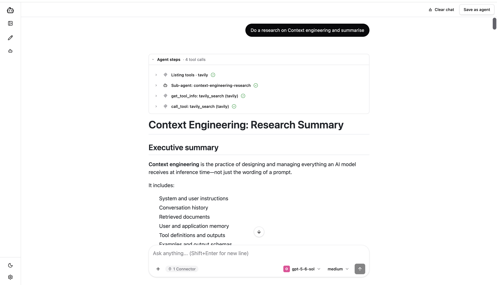
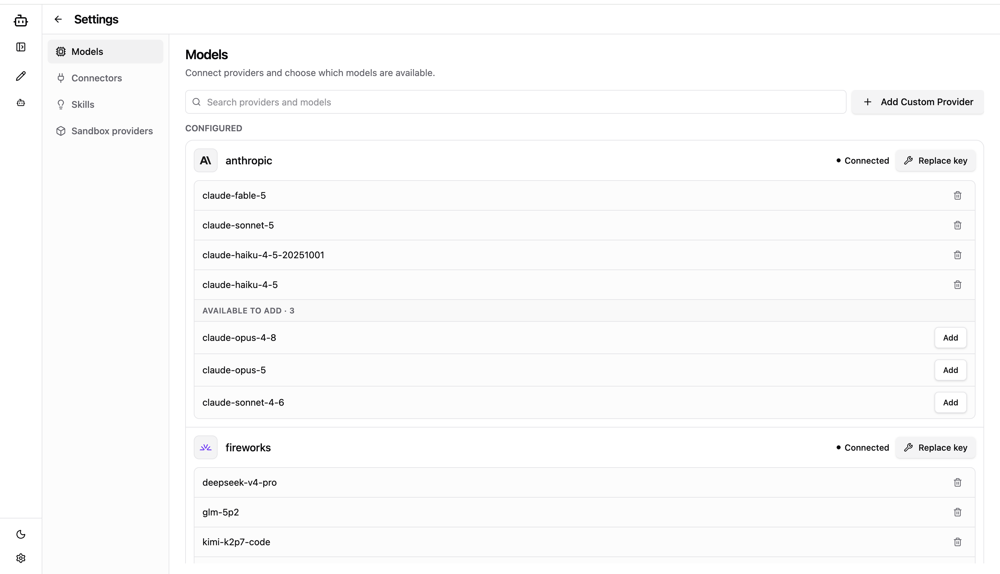
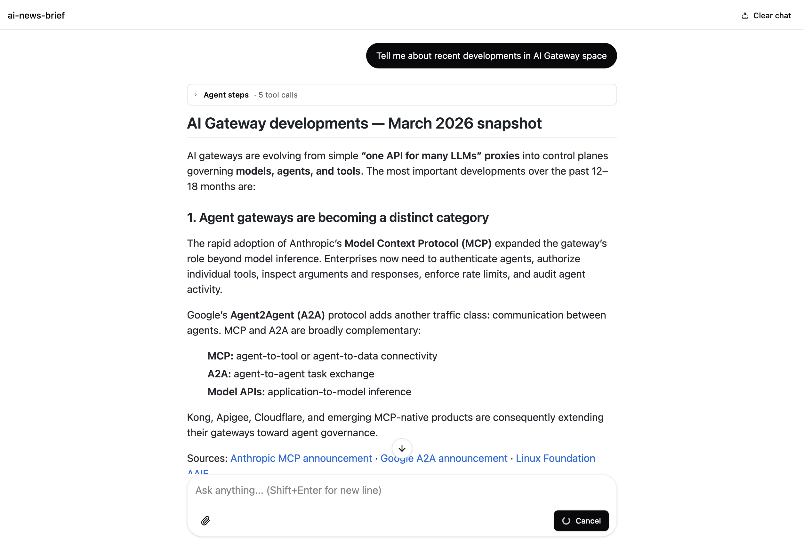
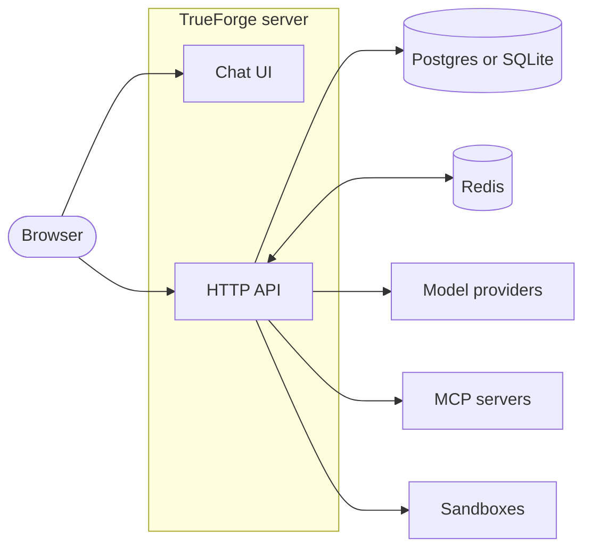

# TrueForge

**The open-source agent harness — the runtime layer that turns an LLM into a working agent.**

TrueForge runs the agent execution loop for you — model calls, tool use, context management, and session state — and exposes the result three ways: a chat UI, an HTTP API, and a TypeScript library.

[](LICENSE)
[](https://nodejs.org)

<!-- TODO: replace placeholder links below with real URLs -->

[Documentation](#) · [Quickstart Guide](#) · [API Reference](#) · [Community](#)

<!-- TODO: hero screenshot of the chat UI -->



## Why TrueForge?

Building an agent is easy. Running one in production is not — you need streaming, session persistence, tool servers, sandboxing, approvals, and a UI. TrueForge gives you all of that out of the box:

- **Multi-turn sessions with streaming** — resumable turn streams that survive reconnects and server restarts.
- **MCP tool servers** — connect any [Model Context Protocol](https://modelcontextprotocol.io) server, including ones that require OAuth.
- **Any model provider** — OpenAI, Anthropic, Google, and OpenAI-compatible endpoints, configured from the UI or the API.
- **Skills** — reusable instruction packs the agent loads on demand.
- **Sandboxed code execution** — run agent-generated code in isolated sandboxes.
- **Human-in-the-loop approvals** — pause the agent and wait for a person before sensitive tool calls.
- **Subagents** — agents that delegate work to other agents.
- **Chat UI, HTTP API, and TypeScript library** — use whichever surface fits your product.

It scales down and up: run it as a single process backed by SQLite, or run multiple replicas backed by Postgres and Redis.

## Quick start

### Option 1: npx (fastest)

Requires [Node.js](https://nodejs.org) 22.13 or newer. One command, no other infrastructure — data is stored in a local SQLite file:

```bash
npx @truefoundry/trueforge
```

Then open [http://localhost:8790](http://localhost:8790), add a model provider under **Settings**, and start chatting.

### Option 2: From source (pnpm)

Runs the standalone (SQLite) topology from a clone of this repo — no Docker, no Postgres, no Redis. Requires [Node.js](https://nodejs.org) 22.13+ and [pnpm](https://pnpm.io) (`corepack enable` installs the pinned version):

```bash
git clone <REPO_URL> trueforge && cd trueforge   # TODO: repo URL
pnpm install
cp packages/server/.env.example packages/server/.env
pnpm standalone:dev
```

Then open [http://localhost:3000](http://localhost:3000) — Vite serves the UI with live reload and proxies API calls to the server on port 8790. See [CONTRIBUTING.md](CONTRIBUTING.md) for the full development guide, including the Postgres + Redis dev topology.

### Option 3: Docker Compose

Runs the full production topology on your machine: the server (UI + API), Postgres, and Redis. Clone the repo first:

```bash
git clone <REPO_URL> trueforge && cd trueforge   # TODO: repo URL
cp packages/server/.env.example packages/server/.env
docker compose up --build
```

Then open [http://localhost:8791](http://localhost:8791).

| Configuration                                               | Default                 | Description                                                           |
| ----------------------------------------------------------- | ----------------------- | --------------------------------------------------------------------- |
| `POSTGRES_USER` / `POSTGRES_PASSWORD` / `POSTGRES_DB`       | `harness` (from `.env`) | Postgres credentials, read from `packages/server/.env`.               |
| `PUBLIC_BASE_URL`                                           | `http://localhost:8791` | Public origin, used for MCP OAuth callbacks.                          |
| Host ports                                                  | `8791`, `5433`, `6380`  | App, Postgres, and Redis — offset so they don't clash with local dev. |
| `OIDC_ISSUER_URL` / `OIDC_CLIENT_ID` / `OIDC_CLIENT_SECRET` | unset                   | Optional: connect an identity provider. Unset = local admin identity. |

Every environment variable is documented in [`packages/server/.env.example`](packages/server/.env.example).

### Option 4: Kubernetes (Helm)

The [`charts/trueforge`](charts/trueforge) Helm chart deploys the server with bundled Postgres and Redis (or point it at your own):

```bash
# TODO: replace <HELM_REPO> with the published Helm repo URL
helm install trueforge oci://<HELM_REPO>/trueforge \
  --version <x.y.z> \
  --set server.publicBaseUrl=https://trueforge.example.com
```

| Configuration          | Default      | Description                                                                   |
| ---------------------- | ------------ | ----------------------------------------------------------------------------- |
| `server.publicBaseUrl` | — (required) | Public origin for MCP OAuth callbacks.                                        |
| `replicaCount`         | `1`          | Number of server replicas (turn cancel/streaming peers over Redis).           |
| `postgresql.enabled`   | `true`       | Bundle Postgres; set `false` and fill `externalPostgres.*` to bring your own. |
| `redis.enabled`        | `true`       | Bundle Redis; set `false` and set `externalRedis.url` to bring your own.      |
| `autoscaling.enabled`  | `false`      | Enable a HorizontalPodAutoscaler.                                             |

See the [chart README](charts/trueforge/README.md) for external databases, ingress via `extraObjects`, and the full values reference.

## Getting started walkthrough

<!-- TODO: replace with real screenshots -->

1. **Add a model provider** — open **Settings → Model Providers**, pick a provider from the catalog, and paste your API key.

   

2. **(Optional) Connect tools** — add MCP servers, skills, and a sandbox provider under **Settings**.

   

3. **Start a session** — create a chat and talk to your agent. Streaming, tool calls, and approvals all show up live in the UI.

   

Interactive API docs are served by your running instance at `/api/v1/docs`. For everything else, see the [documentation](#). <!-- TODO: docs link -->

## Components

TrueForge is a single container image (or `npx` process) plus a database — and Redis when you run more than one replica.



| Component             | What it does                                                                                        |
| --------------------- | --------------------------------------------------------------------------------------------------- |
| **UI**                | React chat interface, bundled into the server image and served on the same port as the API.         |
| **Backend**           | Node.js (Hono) server: the agent execution loop, sessions, streaming, settings, and OpenAPI docs.   |
| **Postgres / SQLite** | Session and settings storage. SQLite in standalone mode; Postgres for multi-replica deployments.    |
| **Redis**             | Cross-replica peering (turn cancellation and stream handoff). Only needed when running > 1 replica. |

### Deployment modes

|             | Standalone                       | Multi-replica                        |
| ----------- | -------------------------------- | ------------------------------------ |
| Best for    | Trying it out, single-user, edge | Production, teams, high availability |
| Processes   | One                              | One or more, peered over Redis       |
| Database    | SQLite                           | Postgres                             |
| Extra infra | None                             | Postgres + Redis                     |
| How to run  | `npx @truefoundry/trueforge`     | Docker Compose or the Helm chart     |

## Documentation

<!-- TODO: replace placeholder links with real URLs -->

- [Introduction](#)
- [Quickstart](#)
- [Configuration reference](#)
- [API reference](#)
- [Deploying to Kubernetes](#)

## Contributing

We love contributions! Whether it's a bug report, a new feature, or a docs fix — see [CONTRIBUTING.md](CONTRIBUTING.md) for how to set up a development environment and open a pull request. Please also read our [Code of Conduct](CODE_OF_CONDUCT.md).

To report a security vulnerability, please follow [SECURITY.md](SECURITY.md) instead of opening a public issue.

## License

TrueForge is released under the [MIT License](LICENSE).
