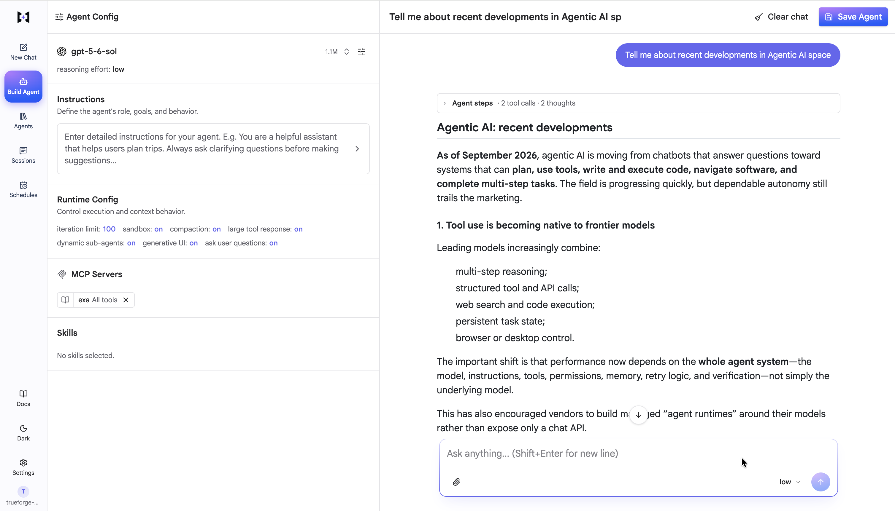
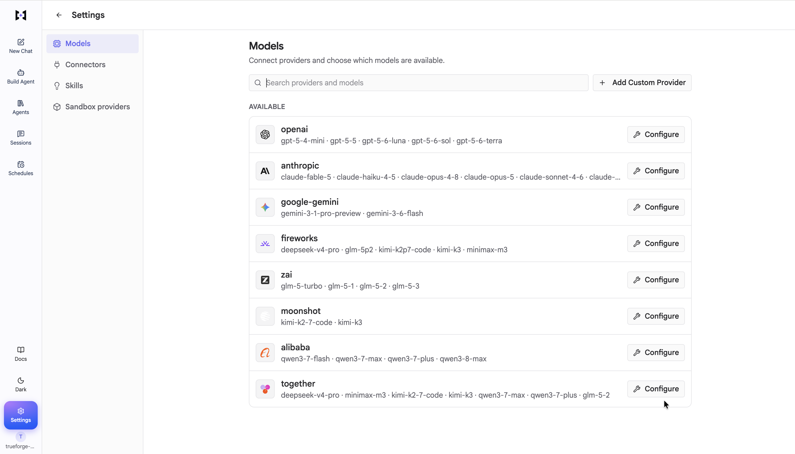
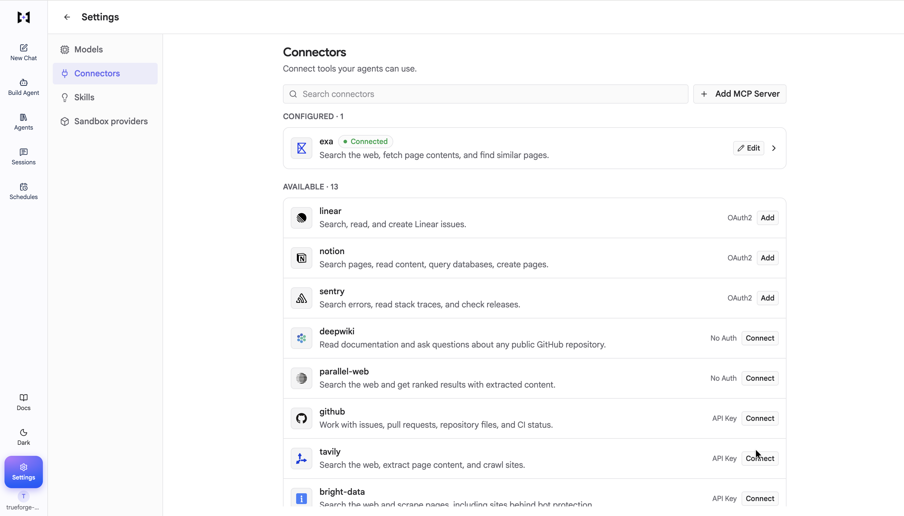
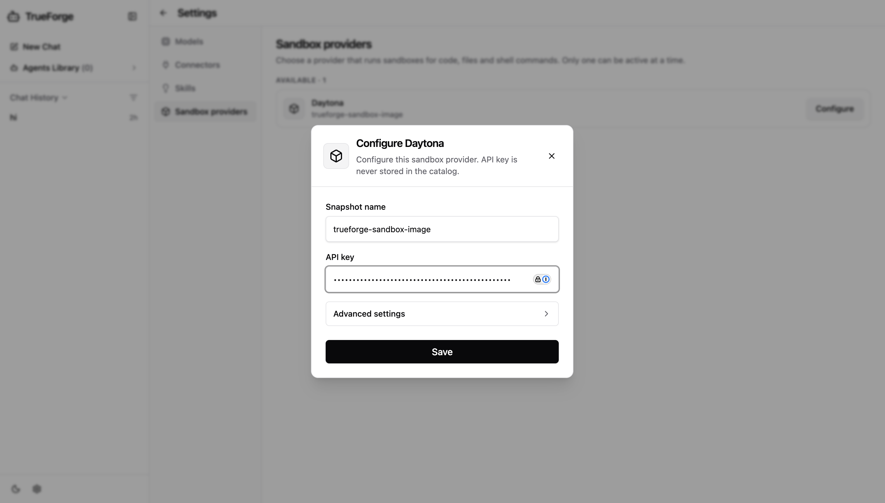
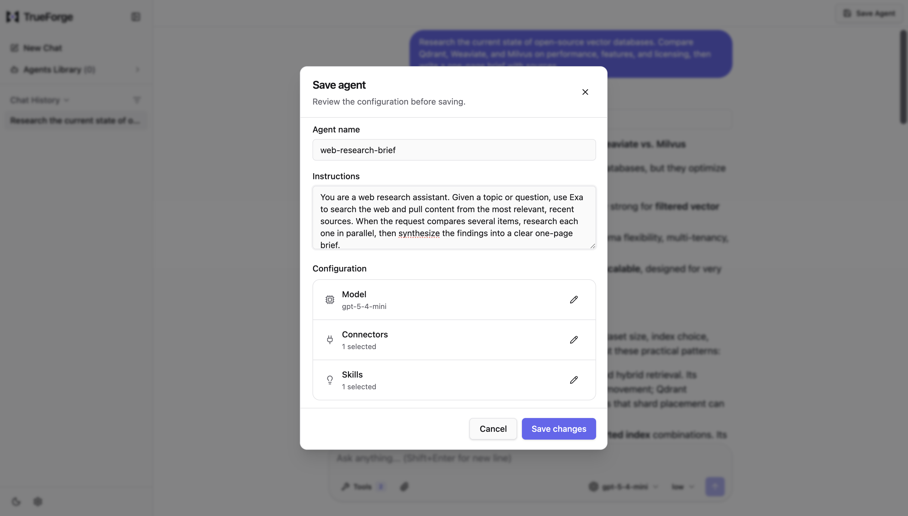
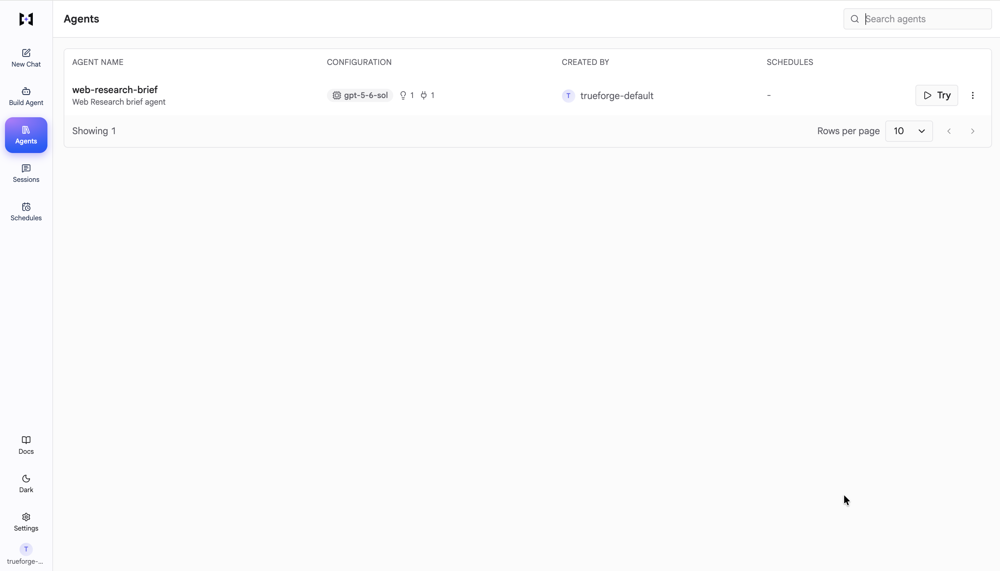
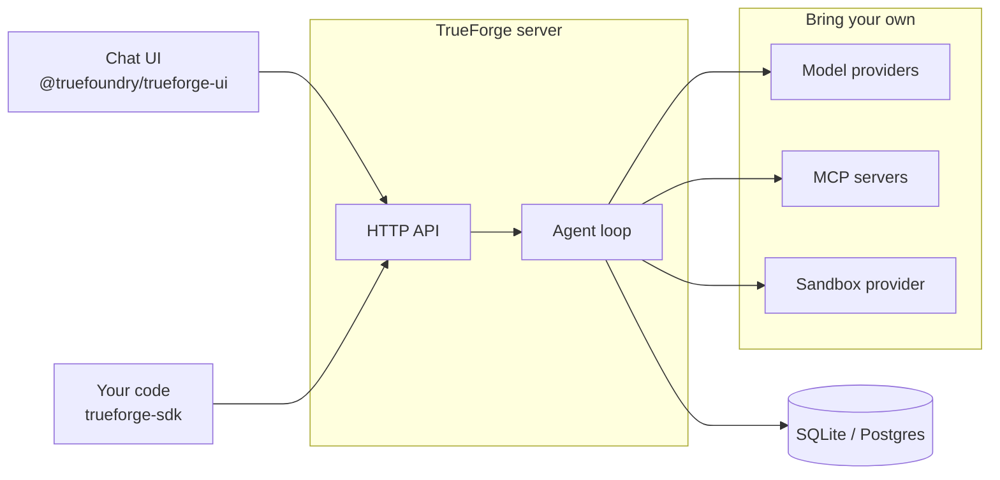

<p align="center">
  <a href="https://trueforge.dev">
    <picture>
      <source srcset="./docs/assets/trueforge-black.svg" media="(prefers-color-scheme: light)">
      <source srcset="./docs/assets/trueforge-white.svg" media="(prefers-color-scheme: dark)">
      
    </picture>
  </a>
</p>
<p align="center">The open-source agent harness - the runtime layer that turns an LLM into a working agent</p>

<p align="center">
  <a href="https://github.com/truefoundry/trueforge/blob/main/LICENSE">
    
  </a>
  <a href="https://nodejs.org">
    = 22.13">
  </a>
  <a href="https://trueforge.dev">
    
  </a>
  <a href="https://trueforge.dev/quickstart">
    
  </a>
  <a href="https://trueforge.dev/api/overview">
    
  </a>
</p>

# TrueForge

TrueForge runs the agent execution loop for you - model calls, MCP tools, skills, sandboxing, approvals, context management, and session state - and exposes it three ways: a **chat UI**, an **HTTP API** with a TypeScript **SDK**, and an embeddable **UI SDK**.



## Why TrueForge?

Building an agent is easy. Running one well is not - you need streaming, session persistence, tool servers, sandboxing, approvals, and a UI. TrueForge gives you that out of the box:

- **Initial setup from catalogs** - configure [models](https://trueforge.dev/models), [MCP servers](https://trueforge.dev/mcp-servers), [skills](https://trueforge.dev/skills), and a [sandbox](https://trueforge.dev/sandbox) once; agents pick from what you connected. Presets come from shipped YAML catalogs you can customize.
- **Any model provider** - OpenAI, Anthropic, Google Gemini, and other catalog providers, or any OpenAI-compatible endpoint.
- **MCP tools** - remote MCP servers with header auth or OAuth, including in-chat authorization.
- **Skills** - git-backed `SKILL.md` instruction packs, loaded on demand in the sandbox.
- **Sandbox as a tool** - isolated code/file execution (Daytona today; more providers planned), provisioned only when needed. Secrets stay in the harness.
- **Human checkpoints** - tool approval, ask-user-questions, and Generative UI in chat.
- **Context engineering** - subagents, deferred tool loading, Code Mode, large-result offloading, and compaction.
- **Chat UI + SDK** - use the bundled UI, automate with `@truefoundry/trueforge-sdk`, or embed `@truefoundry/trueforge-ui`.

It scales down and up: **local mode** (one process, SQLite) or **hosted mode** (Postgres + Redis, Docker Compose or Helm).

## Quick start

### Local mode (npx)

Requires [Node.js](https://nodejs.org) 22.13 or newer. One command, no other infrastructure - UI and backend run locally; data is stored in SQLite:

```bash
npx @truefoundry/trueforge@rc
```

Then open [http://localhost:8790](http://localhost:8790).

### From source (pnpm)

Standalone (SQLite) topology from a clone - no Docker. Requires Node.js 22.13+ and [pnpm](https://pnpm.io):

```bash
git clone https://github.com/truefoundry/trueforge.git
cd trueforge
cp packages/server/.env.example packages/server/.env
pnpm standalone:dev
```

Then open [http://localhost:3000](http://localhost:3000) - Vite serves the UI with live reload and proxies API calls to the server on port 8790. See [CONTRIBUTING.md](CONTRIBUTING.md) for the full development guide (including Postgres + Redis).

### Hosted mode (Docker Compose)

Server (UI + API), Postgres, and Redis:

```bash
git clone https://github.com/truefoundry/trueforge.git
cd trueforge
cp packages/server/.env.example packages/server/.env
docker compose up --build
```

Then open [http://localhost:8791](http://localhost:8791).

| Configuration                                         | Default                | Description                                    |
| ----------------------------------------------------- | ---------------------- | ---------------------------------------------- |
| `POSTGRES_USER` / `POSTGRES_PASSWORD` / `POSTGRES_DB` | from `.env`            | Postgres credentials (`packages/server/.env`). |
| Host ports                                            | `8791`, `5433`, `6380` | App, Postgres, and Redis.                      |

Every environment variable is documented in [`packages/server/.env.example`](packages/server/.env.example).

### Hosted mode (Kubernetes)

The [`charts/trueforge`](charts/trueforge) Helm chart deploys hosted mode with bundled Postgres and Redis (or your own):

```bash
helm install trueforge oci://tfy.jfrog.io/tfy-helm/trueforge \
  --version <x.y.z>
```

See the [chart README](charts/trueforge/README.md) (including [`configs.oidc`](charts/trueforge/README.md#oidc)) and [Quickstart](https://trueforge.dev/quickstart) for values and details.

## Build your first agent

Full walkthrough: [Quickstart](https://trueforge.dev/quickstart).

1. **Setup models** - **Settings → Models**, pick a catalog provider, paste your API key.

   

2. **Setup connectors & skills** (optional) - **Settings → Connectors** / **Skills**. Skills need a sandbox.

   

3. **Setup sandbox** (optional) - **Settings → Sandbox providers**. Daytona is the only provider supported today.

   

4. **Create an agent** - pick a model, attach connectors/skills, write instructions, then **Save as agent**.

   

5. **Find it in the Agent Library** - open **Agents Library**, then **Try** or **Edit**. In hosted mode with login enabled, agents created by anyone are visible to everyone - see [Agent Library](https://trueforge.dev/agent-library).

   

## Architecture



| Mode   | Best for                    | Storage  | Extra infra      | How to run                   |
| ------ | --------------------------- | -------- | ---------------- | ---------------------------- |
| Local  | Personal use, trying it out | SQLite   | None             | `npx @truefoundry/trueforge` |
| Hosted | Teams, multi-replica        | Postgres | Postgres + Redis | Docker Compose or Helm       |

## Documentation

| Section                                                        | What you'll find                                                  |
| -------------------------------------------------------------- | ----------------------------------------------------------------- |
| [Introduction](https://trueforge.dev/introduction)             | What an agent harness is and how TrueForge fits together          |
| [Quickstart](https://trueforge.dev/quickstart)                 | Run local or hosted, build your first agent                       |
| [Initial Setup](https://trueforge.dev/harness/initial-setup)   | Models, MCP, skills, sandbox - catalogs and overrides             |
| [Create an Agent](https://trueforge.dev/create-agent/overview) | Select resources; tool approval, questions, Generative UI         |
| [Key Features](https://trueforge.dev/key-features/overview)    | Sandbox-as-tool, subagents, deferred tools, Code Mode, compaction |
| [Benchmarking](https://trueforge.dev/benchmarking)             | Cost/accuracy vs Claude Managed Agents and deepagents             |
| [Setup Login](https://trueforge.dev/authentication/overview)   | Optional OIDC for shared deployments                              |
| [SDK](https://trueforge.dev/api/overview)                      | TypeScript client: sessions, turns, events                        |
| [Chat UI](https://trueforge.dev/chat-ui)                       | Bundled UI and embedding `@truefoundry/trueforge-ui`              |
| [API Reference](https://trueforge.dev/api-reference)           | OpenAPI paths and schemas                                         |

## Benchmarks

We compare TrueForge against Claude Managed Agents and deepagents on the same tasks, tools, and model - same accuracy, lower cost. Reproduce it from [`benchmark/`](benchmark/). Write-up: [Benchmarking](https://trueforge.dev/benchmarking).

## Contributing

We love contributions - bug reports, features, and docs fixes. See [CONTRIBUTING.md](CONTRIBUTING.md) and our [Code of Conduct](CODE_OF_CONDUCT.md).

To report a security vulnerability, follow [SECURITY.md](SECURITY.md) instead of opening a public issue.

## License

TrueForge is released under the [MIT License](LICENSE).
