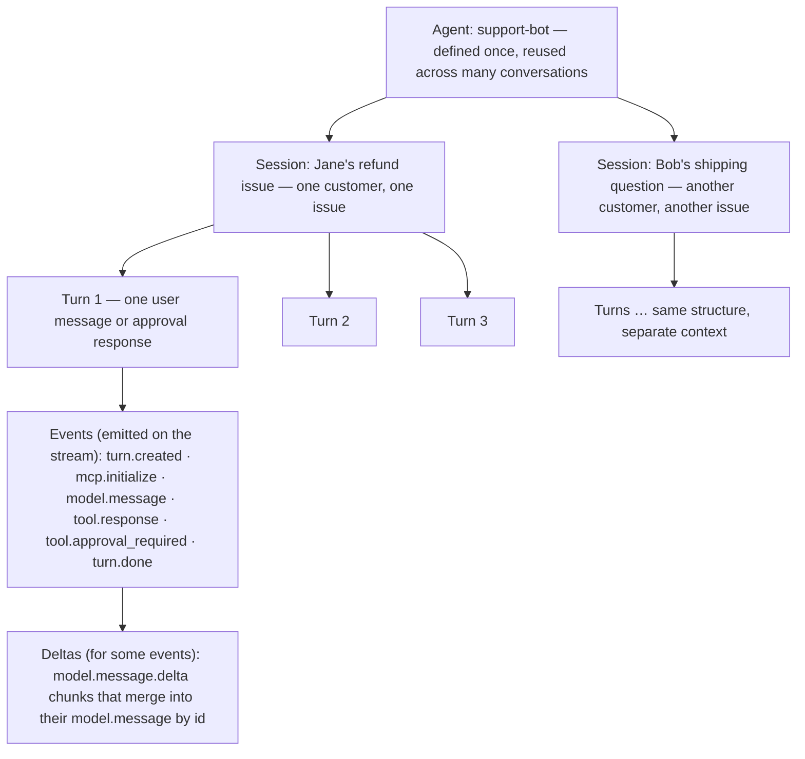
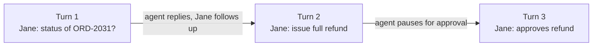
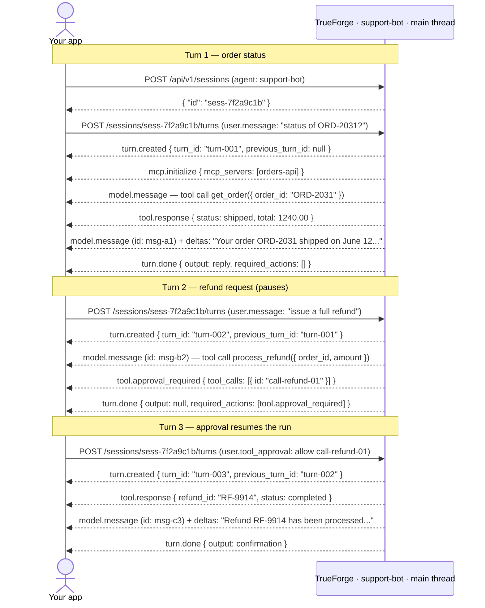

Everything the chat UI does goes through the HTTP API, so anything you can do in the UI you can automate. The API is served under `/api/v1`, documented interactively at `/api/v1/docs` (OpenAPI 3.1 at `/api/v1/openapi.json`). A generated TypeScript client, [`trueforge-sdk`](https://www.npmjs.com/package/trueforge-sdk), wraps the same API. For a full SDK cookbook (streaming, approvals, reconnects, threads), see [Use an agent](/api/use-agent).

## Core concepts

Interaction with an agent follows a strict hierarchy: **one Agent → many Sessions → many Turns → many Events → some Deltas**. The sections below walk through each layer using a single running example — a customer support agent named **`support-bot`**.

{/* Mermaid source for regenerating the image below:



*/}

<Frame caption="One agent serves many sessions; each session has many turns; each turn emits events; some events stream as deltas">
  
</Frame>

### Agent

An **agent** is a definition, not a running process. You define it once — model, instructions, tools, config — and any number of conversations can use it. For `support-bot`, a customer support assistant that looks up orders and processes refunds via an MCP server, the [AgentSpec](/api/agent-spec) looks like this:

```json support-bot — AgentSpec
{
  "model": {
    "name": "anthropic/claude-sonnet-4-6",
    "params": { "max_tokens": 4096 }
  },
  "instructions": "You help customers with orders. Look up order details before taking action. Always confirm before processing refunds.",
  "mcp_servers": [
    {
      "name": "orders-api",
      "enable_tools": ["get_order", "process_refund"],
      "require_approval_for_tools": ["process_refund"]
    }
  ],
  "config": { "iteration_limit": 25 }
}
```

You can save this spec as a named agent (`POST /api/v1/agents`) and reference it by id in every session, or pass it inline when creating a session. See the [agent spec reference](/api/agent-spec) for every field.

### Session

A **session** is **one issue** worked through with the agent. It is the conversation context: all turns on that issue chain together, and the agent remembers what happened earlier in the same session. Each new issue — whether from the same customer or a different one — gets its own session.

| Session         | Issue                            | How it starts                              |
| --------------- | -------------------------------- | ------------------------------------------ |
| `sess-7f2a9c1b` | Jane — refund for order ORD-2031 | _"What's the status of order ORD-2031?"_   |
| `sess-9d4e2a88` | Bob — shipping question          | A different customer starts their own chat |

Jane's follow-up messages about the refund stay in `sess-7f2a9c1b`. Bob's question runs in a separate session, so the two conversations never share context.

```json Session for Jane's refund issue
{
  "id": "sess-7f2a9c1b",
  "agent": { "type": "ref", "agent_id": "agent-support-bot" },
  "title": "Refund for ORD-2031",
  "created_by": "trueforge-default",
  "created_at": "2026-06-24T10:00:00Z",
  "updated_at": "2026-06-24T10:00:00Z"
}
```

Persist the session `id` so Jane can return tomorrow and pick up where she left off. Only one turn runs inside a session at a time.

### Turn

A **turn** is one request in the conversation — a single back-and-forth boundary between your app and the agent. Each time Jane sends a message (or your app sends an approval), you create a new turn. Turns inside a session **chain automatically** (`previous_turn_id` defaults to `"auto"`): the agent sees every earlier turn without you resending history.



| Turn       | Who sends it            | Input                                          | What happens                                                    |
| ---------- | ----------------------- | ---------------------------------------------- | --------------------------------------------------------------- |
| **Turn 1** | Jane (via your app)     | `"What's the status of order ORD-2031?"`       | Agent looks up the order and replies with shipping status.      |
| **Turn 2** | Jane                    | `"Please issue a full refund for that order."` | Agent prepares a refund, hits an approval gate, and **pauses**. |
| **Turn 3** | Jane (or a support rep) | Approval: allow `process_refund`               | Agent runs the refund and sends a confirmation.                 |

<Note>
  A turn can also end paused when the agent asks a clarifying question ([`tool.response_required`](/ask-user-questions))
  or needs MCP OAuth ([`mcp.auth_required`](/mcp-servers#in-chat-authentication)). You resume with a new turn, just like
  Turn 3 above.
</Note>

### Event

While a turn runs, the agent emits **events** over Server-Sent Events (SSE) — one JSON object at a time. Events tell your app what the agent is doing: calling a tool, getting a result, writing a reply, or finishing.

**Events during Turn 1** (Jane asks for order status):

| Order | Event type            | What your app learns                                |
| ----- | --------------------- | --------------------------------------------------- |
| 1     | `turn.created`        | Turn started — carries `turn_id`                    |
| 2     | `mcp.initialize`      | Agent connected to `orders-api`                     |
| 3     | `model.message`       | Agent decided to call `get_order`                   |
| 4     | `tool.response`       | Order data: shipped, $1,240.00                      |
| 5     | `model.message`       | Agent starts composing the reply (empty shell)      |
| 6–8   | `model.message.delta` | Reply text arriving in chunks — see [Delta](#delta) |
| 9     | `turn.done`           | Turn finished — final reply in `state.output`       |

Sample payloads:

```json turn.created
{
  "type": "turn.created",
  "id": "01jc...",
  "turn_id": "turn-001",
  "previous_turn_id": null,
  "state": { "status": "running" },
  "thread_id": null,
  "created_at": "2026-06-24T10:00:01Z"
}
```

```json tool.response
{
  "type": "tool.response",
  "id": "01jc...",
  "thread_id": "main",
  "tool_call_id": "call-get-order-01",
  "content": "{\"order_id\":\"ORD-2031\",\"status\":\"shipped\",\"total\":1240.00}",
  "created_at": "2026-06-24T10:00:04Z"
}
```

```json turn.done
{
  "type": "turn.done",
  "id": "01jc...",
  "thread_id": null,
  "created_at": "2026-06-24T10:00:09Z",
  "state": {
    "status": "done",
    "output": {
      "type": "model.message",
      "content": "Your order ORD-2031 shipped on June 12. Total: $1,240.00."
    },
    "required_actions": [],
    "completed_at": "2026-06-24T10:00:09Z"
  }
}
```

Every event carries an `id` and a `thread_id` (`"main"` for the root agent, a generated id for [subagents](/context-engineering/subagents), or `null` for run-level events). The SSE message's `id:` field carries a per-stream **sequence number** used for [resuming after a disconnect](#non-streaming-reconnects-and-cancellation). The stream always opens with `turn.created` and closes with `turn.done`.

For field-level schemas of every event type, see the [turn events reference](/api/turn-events).

### Delta

Most events arrive as a complete payload. **Model output is different** — the LLM streams token by token, so the harness sends a base `model.message` event first, then a series of `model.message.delta` fragments that you merge into it. All deltas share the base event's `id`.

The agent's full reply in Turn 1 is: _"Your order ORD-2031 shipped on June 12. Total: $1,240.00."_ Your client receives:

```json Base event (empty shell)
{ "type": "model.message", "id": "msg-a1", "thread_id": "main", "content": "" }
```

```json Deltas (merge into msg-a1 as they arrive)
{ "type": "model.message.delta", "id": "msg-a1", "thread_id": "main", "content": "Your order ORD-2031" }
{ "type": "model.message.delta", "id": "msg-a1", "thread_id": "main", "content": " shipped on June 12." }
{ "type": "model.message.delta", "id": "msg-a1", "thread_id": "main", "content": " Total: $1,240.00.", "finish_reason": "stop" }
```

Append each delta's `content` to the event with the matching `id` and re-render on every chunk — that's how the chat UI shows the reply word by word:

```text
Your order ORD-2031
Your order ORD-2031 shipped on June 12.
Your order ORD-2031 shipped on June 12. Total: $1,240.00.
```

Deltas only exist on the live stream. When you list a turn's events afterwards (`GET .../events`), you get one pre-merged `model.message` — no deltas to handle on replay.

<Note>
  **Thread** is a related concept: an execution context inside a turn. The root agent runs on `thread_id: "main"`;
  [subagents](/context-engineering/subagents) get their own thread ids, announced by `thread.created` / `thread.done`
  events. Events carry `thread_id` so you can partition a single turn stream when subagents run in parallel.
</Note>

## The three turns, end to end

Here is Jane's whole refund session against the API — solid arrows are HTTP requests you make; dashed arrows are SSE events streamed back.

{/* Mermaid source for regenerating the image below:



*/}

<Frame caption="Three chained turns in one session: HTTP requests (solid) from your app and SSE events (dashed) streamed back from TrueForge, annotated with real payloads">
  
</Frame>

<Tabs>
<Tab title="Turn 1 — Order status">

**Input:** `"What's the status of order ORD-2031?"`

| #   | Event                    | Summary                                  |
| --- | ------------------------ | ---------------------------------------- |
| 1   | `turn.created`           | Turn starts                              |
| 2   | `mcp.initialize`         | Connected to `orders-api`                |
| 3   | `model.message` + deltas | Agent calls `get_order`                  |
| 4   | `tool.response`          | `{ status: shipped, total: 1240.00 }`    |
| 5   | `model.message` + deltas | Streams the reply to Jane's UI           |
| 6   | `turn.done`              | Done — `state.output` has the full reply |

</Tab>
<Tab title="Turn 2 — Refund (pauses)">

**Input:** `"Please issue a full refund for that order."`

| #   | Event                    | Summary                                           |
| --- | ------------------------ | ------------------------------------------------- |
| 1   | `turn.created`           | Chains from Turn 1                                |
| 2   | `model.message`          | Agent calls `process_refund`                      |
| 3   | `tool.approval_required` | Paused — Jane must approve                        |
| 4   | `turn.done`              | `state.required_actions` populated, `output` null |

</Tab>
<Tab title="Turn 3 — Approve (resume)">

**Input:** `{ "type": "user.tool_approval", "approval": { "status": "allow" } }`

| #   | Event                    | Summary                  |
| --- | ------------------------ | ------------------------ |
| 1   | `turn.created`           | Chains from Turn 2       |
| 2   | `tool.response`          | Refund processed         |
| 3   | `model.message` + deltas | Streams the confirmation |
| 4   | `turn.done`              | Issue resolved           |

</Tab>
</Tabs>

| Turn | Jane's action         | Ends with                | What your app does next               |
| ---- | --------------------- | ------------------------ | ------------------------------------- |
| 1    | Asks for order status | Reply in `output`        | Show reply, wait for the next message |
| 2    | Requests refund       | `tool.approval_required` | Show approval UI → Turn 3             |
| 3    | Approves refund       | Confirmation in `output` | Show confirmation, issue closed       |

A separate issue — Bob's shipping question, or even Jane's next problem — runs in its own session, where Turn 1 starts fresh with no refund history carried over.

## Run it

### 1. Create a session

Pass an inline agent spec (`{ "spec": ... }`), or reference a saved agent by name (`{ "name": "..." }`):

<Tabs>
<Tab title="curl">

```bash
curl -X POST http://localhost:8790/api/v1/sessions \
  -H 'Content-Type: application/json' \
  -d '{
    "agent": {
      "spec": {
        "model": { "name": "anthropic/claude-sonnet-4-6" },
        "instructions": "You help customers with orders. Always confirm before processing refunds.",
        "mcp_servers": [
          { "name": "orders-api", "require_approval_for_tools": ["process_refund"] }
        ]
      }
    }
  }'
```

</Tab>
<Tab title="TypeScript">

```typescript
import { TrueForge } from 'trueforge-sdk';

const client = new TrueForge({ baseUrl: 'http://localhost:8790' });

const { data: session } = await client.sessions.create({
  agent: {
    spec: {
      model: { name: 'anthropic/claude-sonnet-4-6' },
      instructions: 'You help customers with orders. Always confirm before processing refunds.',
      mcp_servers: [{ name: 'orders-api', require_approval_for_tools: ['process_refund'] }],
    },
  },
});
```

</Tab>
</Tabs>

### 2. Run a turn and stream events

<Tabs>
<Tab title="curl">

```bash
curl -N -X POST http://localhost:8790/api/v1/sessions/sess-7f2a9c1b/turns \
  -H 'Content-Type: application/json' \
  -d '{
    "input": [
      { "type": "user.message", "content": "What is the status of order ORD-2031?" }
    ]
  }'
```

</Tab>
<Tab title="TypeScript">

```typescript
const stream = await client.sessions.createTurnStream(session.id, {
  input: [{ type: 'user.message', content: 'What is the status of order ORD-2031?' }],
});

for await (const { data: event } of stream.withMetadata()) {
  switch (event.type) {
    case 'model.message.delta':
      process.stdout.write(event.content ?? '');
      break;
    case 'turn.done':
      console.log('\nstate:', event.state.status);
      break;
  }
}
```

See [Use an agent](/api/use-agent) for delta merging, approvals, reconnects, and more.

</Tab>
</Tabs>

The `input` field accepts three item types:

| `type`               | Purpose                                                                                     |
| -------------------- | ------------------------------------------------------------------------------------------- |
| `user.message`       | A message. `content` is a string or an array of `text` / `file` parts (files as data URIs). |
| `user.tool_approval` | An [approval decision](/human-in-the-loop) for a paused tool call.                          |
| `user.tool_response` | An [answer](/ask-user-questions) for a paused client-side tool call.                        |

A single turn cannot mix `user.message` items with approval or tool-response items.

### 3. Chain the next turn

`previous_turn_id` defaults to `"auto"`, which chains to the session's last turn — you never resend history. Use `"none"` to start a fresh root turn in the same session, or pass an explicit turn id to branch from a specific point.

### 4. Handle a pause (approvals and questions)

`process_refund` requires approval, so Turn 2 ends paused: the stream carries `tool.approval_required`, and `turn.done` arrives with `state.output: null` and the pending action in `state.required_actions`:

```json turn.done (paused)
{
  "type": "turn.done",
  "state": {
    "status": "done",
    "output": null,
    "required_actions": [
      {
        "type": "tool.approval_required",
        "thread_id": "main",
        "tool_calls": [{ "id": "call-refund-01", "source_event_id": "msg-b2" }]
      }
    ]
  }
}
```

Resume with a new turn carrying the decision:

```bash
curl -N -X POST http://localhost:8790/api/v1/sessions/sess-7f2a9c1b/turns \
  -H 'Content-Type: application/json' \
  -d '{
    "input": [{
      "type": "user.tool_approval",
      "thread_id": "main",
      "tool_call_id": "call-refund-01",
      "approval": { "status": "allow" }
    }]
  }'
```

The same pattern applies to [`tool.response_required`](/ask-user-questions) (resume with `user.tool_response`) and [`mcp.auth_required`](/mcp-servers#in-chat-authentication) (resume after the user completes OAuth).

## Non-streaming, reconnects, and cancellation

**Fire and poll.** Pass `"stream": false` to `POST .../turns` to get the running turn back immediately, then poll `GET .../turns/{turn_id}` until `state.status` is terminal.

**Reconnect to a live turn.** If your SSE connection drops, resume from where you left off — pass the last sequence number you saw (the SSE `id:` field) as `after_sequence_number` or a `Last-Event-Id` header:

```text
GET /api/v1/sessions/{session_id}/turns/{turn_id}/subscribe?after_sequence_number=N
```

**Cancel.** `POST /api/v1/sessions/{session_id}/cancel` cancels the session's running turn. The stream ends with `turn.done` and `state.status: "cancelled"`.

**Replay history.** `GET .../sessions/{session_id}/events` lists the persisted event timeline (deltas pre-merged), which is how the chat UI restores a conversation.

## Endpoint summary

| Method         | Path                                              | Purpose                                                                          |
| -------------- | ------------------------------------------------- | -------------------------------------------------------------------------------- |
| `POST`         | `/api/v1/sessions`                                | Create a session                                                                 |
| `GET`          | `/api/v1/sessions`                                | List sessions                                                                    |
| `GET`          | `/api/v1/sessions/{id}`                           | Get a session                                                                    |
| `DELETE`       | `/api/v1/sessions/{id}`                           | Delete a session and its turns/events                                            |
| `POST`         | `/api/v1/sessions/{id}/cancel`                    | Cancel the running turn                                                          |
| `GET`          | `/api/v1/sessions/{id}/events`                    | List the session's event timeline                                                |
| `POST`         | `/api/v1/sessions/{id}/turns`                     | Create and execute a turn (SSE by default)                                       |
| `GET`          | `/api/v1/sessions/{id}/turns/{turn_id}`           | Get a turn and its state                                                         |
| `GET`          | `/api/v1/sessions/{id}/turns/{turn_id}/events`    | List a turn's events                                                             |
| `GET`          | `/api/v1/sessions/{id}/turns/{turn_id}/subscribe` | Reconnect to a live turn's stream                                                |
| `GET`          | `/api/v1/sessions/{id}/turns/{turn_id}/download`  | Download a sandbox file                                                          |
| `POST` / `GET` | `/api/v1/agents`                                  | Save / list named agents                                                         |
| `GET` / `PUT`  | `/api/v1/settings/...`                            | Model providers, MCP servers, skills, sandbox providers (each with a `/catalog`) |
| `GET`          | `/api/v1/models`                                  | All models across configured providers                                           |
| `GET`          | `/api/v1/capabilities`                            | Which optional capabilities are configured                                       |

The complete request/response schemas are in the interactive docs at `/api/v1/docs` on your running instance.
