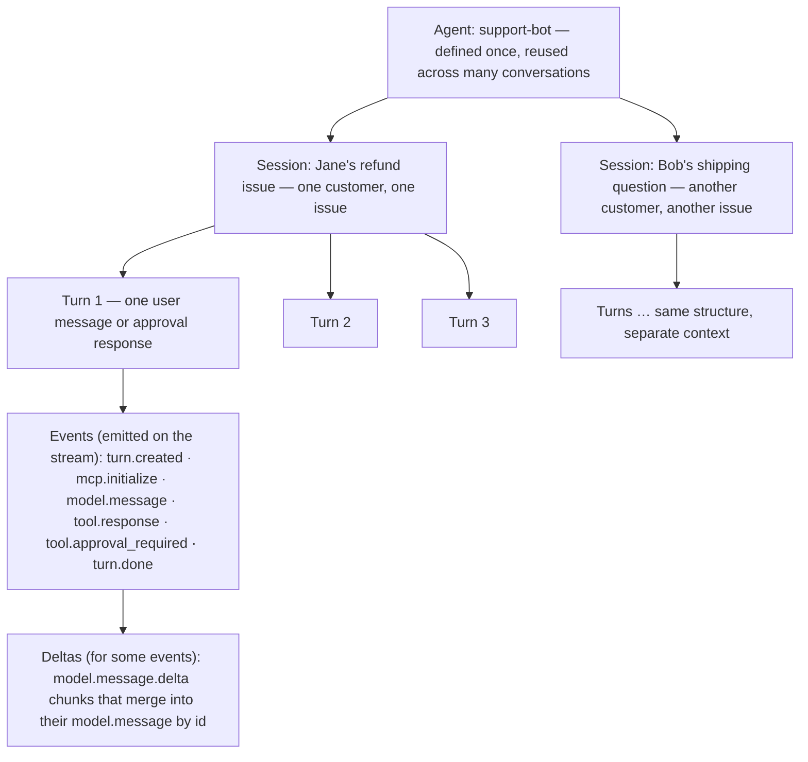
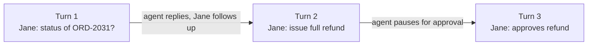
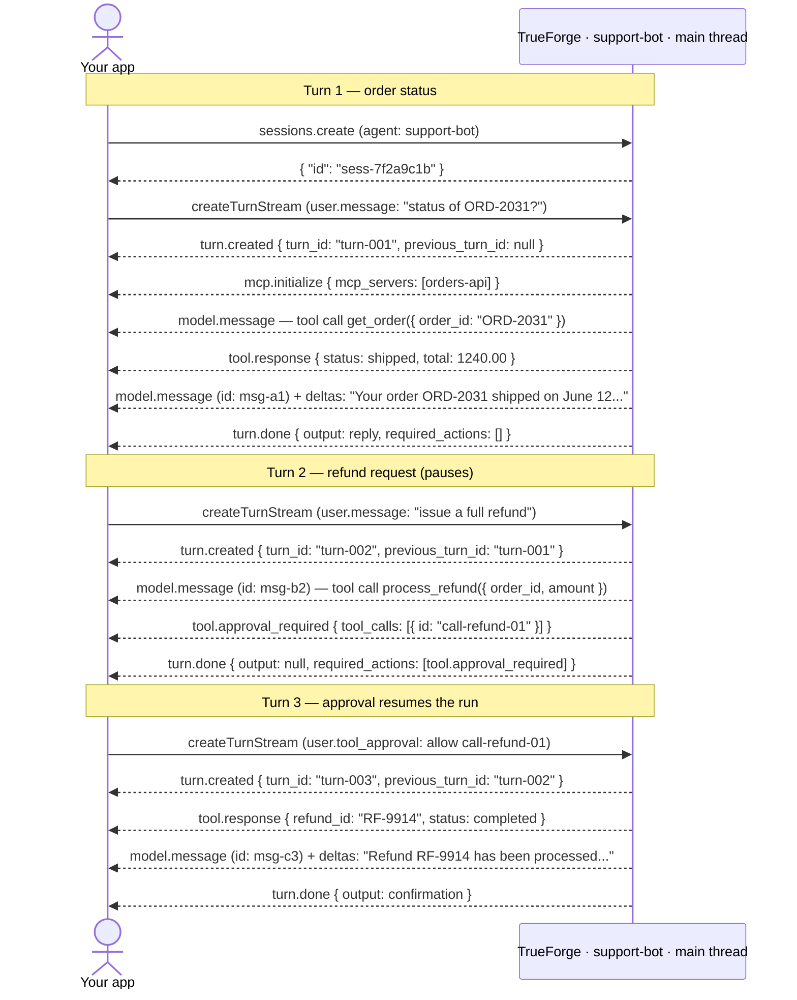

Already running? Jump to the [SDK Quickstart](/api/quickstart) to install and stream your first turn. This page is the mental model behind that code: how an [agent](#agent), a [session](#session), a [turn](#turn), an [event](#event), and a [delta](#delta) fit together. Once it clicks, [Use an agent](/api/use-agent) is the runnable cookbook, and the **API Reference** tab has the raw HTTP schemas.

## Core concepts

Talking to an agent follows one hierarchy: **one Agent → many Sessions → many Turns → many Events → some Deltas**. The sections below walk through each layer with one running example: a customer support agent named **`support-bot`**.

{/* Mermaid source for regenerating the image below:



*/}

<Frame caption="One agent serves many sessions; each session has many turns; each turn emits events; some events stream as deltas">
  
</Frame>

### Agent

An **agent** is a definition, not a running process. You define it once (the model, instructions, tools, and config), and any number of conversations can use it. `support-bot` is a support assistant that looks up orders and processes refunds through an MCP server. Its [AgentSpec](/create-agent/overview#create-an-agent-via-the-api) looks like this:

```json support-bot AgentSpec wrap
{
  "model": {
    "name": "anthropic/claude-sonnet-4-6",
    "params": { "max_tokens": 4096 }
  },
  "instructions": "You help customers with orders. Look up order details before taking action. Always confirm before processing refunds.",
  "mcp_servers": [
    {
      "name": "orders-api",
      "enable_tools": ["get_order", "process_refund"],
      "require_approval_for_tools": ["process_refund"]
    }
  ],
  "config": { "iteration_limit": 25 }
}
```

Save this spec as a named agent and reference it by name in every session, or pass it inline when you create a session. The [agent spec reference](/create-agent/overview#create-an-agent-via-the-api) lists every field.

### Session

A **session** is one issue worked through with the agent. It holds the conversation context: every turn on that issue chains together, and the agent remembers what happened earlier in the same session. Each new issue gets its own session, whether it comes from the same customer or a different one.

| Session         | Issue                            | How it starts                              |
| --------------- | -------------------------------- | ------------------------------------------ |
| `sess-7f2a9c1b` | Jane, refund for order ORD-2031  | _"What's the status of order ORD-2031?"_   |
| `sess-9d4e2a88` | Bob, shipping question           | A different customer starts their own chat |

Jane's follow-ups about the refund stay in `sess-7f2a9c1b`. Bob's question runs in a separate session, so the two conversations never share context.

```json Session for Jane's refund issue wrap
{
  "id": "sess-7f2a9c1b",
  "agent": { "type": "reference", "id": "agt_01jc...", "name": "support-bot" },
  "title": "Refund for ORD-2031",
  "created_by": "trueforge-default",
  "created_at": "2026-06-24T10:00:00Z",
  "updated_at": "2026-06-24T10:00:00Z"
}
```

Persist the session `id` so Jane can come back tomorrow and pick up where she left off. Only one turn runs in a session at a time.

### Turn

A **turn** is one request in the conversation: a single back-and-forth between your app and the agent. Each time Jane sends a message (or your app sends an approval), you create a new turn. Turns in a session **chain automatically** (`previous_turn_id` defaults to `"auto"`), so the agent sees every earlier turn without you resending history.



| Turn       | Who sends it            | Input                                          | What happens                                                    |
| ---------- | ----------------------- | ---------------------------------------------- | --------------------------------------------------------------- |
| **Turn 1** | Jane (via your app)     | `"What's the status of order ORD-2031?"`       | Agent looks up the order and replies with shipping status.      |
| **Turn 2** | Jane                    | `"Please issue a full refund for that order."` | Agent prepares a refund, hits an approval gate, and **pauses**. |
| **Turn 3** | Jane (or a support rep) | Approval: allow `process_refund`               | Agent runs the refund and sends a confirmation.                 |

<Note>
  A turn can also pause when the agent asks a clarifying question ([`tool.response_required`](/create-agent/overview#whats-in-an-agent))
  or needs MCP OAuth ([`mcp.auth_required`](/mcp-servers#in-chat-authentication)). You resume with a new turn, just like
  Turn 3 above.
</Note>

### Event

While a turn runs, the agent emits **events** on the SDK stream, one JSON object at a time. Each event tells your app what the agent is doing: calling a tool, getting a result, writing a reply, or finishing.

**Events during Turn 1** (Jane asks for order status):

| Order | Event type            | What your app learns                             |
| ----- | --------------------- | ------------------------------------------------ |
| 1     | `turn.created`        | Turn started; carries `turn_id`                  |
| 2     | `mcp.initialize`      | Agent connected to `orders-api`                  |
| 3     | `model.message`       | Agent decided to call `get_order`                |
| 4     | `tool.response`       | Order data: shipped, $1,240.00                   |
| 5     | `model.message`       | Agent starts composing the reply (empty shell)   |
| 6–8   | `model.message.delta` | Reply text arriving in chunks (see [Delta](#delta)) |
| 9     | `turn.done`           | Turn finished; final reply in `state.output`     |

Sample payload:

```json turn.done wrap
{
  "type": "turn.done",
  "id": "01jc...",
  "thread_id": null,
  "created_at": "2026-06-24T10:00:09Z",
  "state": {
    "status": "done",
    "output": {
      "type": "model.message",
      "content": "Your order ORD-2031 shipped on June 12. Total: $1,240.00."
    },
    "required_actions": [],
    "completed_at": "2026-06-24T10:00:09Z"
  }
}
```

Every event carries an `id` and a `thread_id` (`"main"` for the root agent, a generated id for [subagents](/key-features/subagents), or `null` for run-level events), plus a **sequence number** used for [resuming after a disconnect](/api/use-agent). The stream always opens with `turn.created` and closes with `turn.done`. Field-level schemas for every event type are in the [turn events reference](/api/use-agent#turn-events-reference).

### Delta

Most events arrive as a complete payload. Model output is the exception: the LLM streams token by token, so the harness sends a base `model.message` event first, then a series of `model.message.delta` fragments that you merge into it. All deltas share the base event's `id`.

The agent's full reply in Turn 1 is _"Your order ORD-2031 shipped on June 12. Total: $1,240.00."_ Your client receives:

```json Base event (empty shell) wrap
{ "type": "model.message", "id": "msg-a1", "thread_id": "main", "content": "" }
```

```json Deltas (merge into msg-a1 as they arrive) wrap
{ "type": "model.message.delta", "id": "msg-a1", "thread_id": "main", "content": "Your order ORD-2031" }
{ "type": "model.message.delta", "id": "msg-a1", "thread_id": "main", "content": " shipped on June 12." }
{ "type": "model.message.delta", "id": "msg-a1", "thread_id": "main", "content": " Total: $1,240.00.", "finish_reason": "stop" }
```

Append each delta's `content` to the event with the matching `id` and re-render on every chunk. That's how the chat UI shows the reply word by word:

```text wrap
Your order ORD-2031
Your order ORD-2031 shipped on June 12.
Your order ORD-2031 shipped on June 12. Total: $1,240.00.
```

Deltas only exist on the live stream. When you list a turn's events afterwards (`GET .../events`), each `model.message` is already merged, so you use it directly.

<Note>
  A **thread** is a related idea: an execution context inside a turn. The root agent runs on `thread_id: "main"`, and
  [subagents](/key-features/subagents) get their own thread ids, announced by `thread.created` / `thread.done`
  events. Events carry `thread_id` so you can separate a single turn stream when subagents run in parallel.
</Note>

## The three turns, end to end

Here is Jane's whole refund session: your app opens a session, runs turns, and reads the streamed events.

{/* Mermaid source for regenerating the image below:



*/}

<Frame caption="Three chained turns in one session: your app creates the session and turns; TrueForge streams events back">
  
</Frame>

| Turn | Jane's action         | Ends with                | What your app does next               |
| ---- | --------------------- | ------------------------ | ------------------------------------- |
| 1    | Asks for order status | Reply in `output`        | Show reply, wait for the next message |
| 2    | Requests refund       | `tool.approval_required` | Show approval UI → Turn 3             |
| 3    | Approves refund       | Confirmation in `output` | Show confirmation, issue closed       |

A separate issue (Bob's shipping question, or Jane's next problem) runs in its own session, where Turn 1 starts fresh with no refund history.

## Next steps

- [SDK Quickstart](/api/quickstart) installs the SDK, connects with a token, and streams your first turn.
- [Use an agent](/api/use-agent) is the full cookbook: streaming, approvals, questions, threads, and reconnects.
- The **API Reference** tab has the raw HTTP endpoints and OpenAPI schemas.
