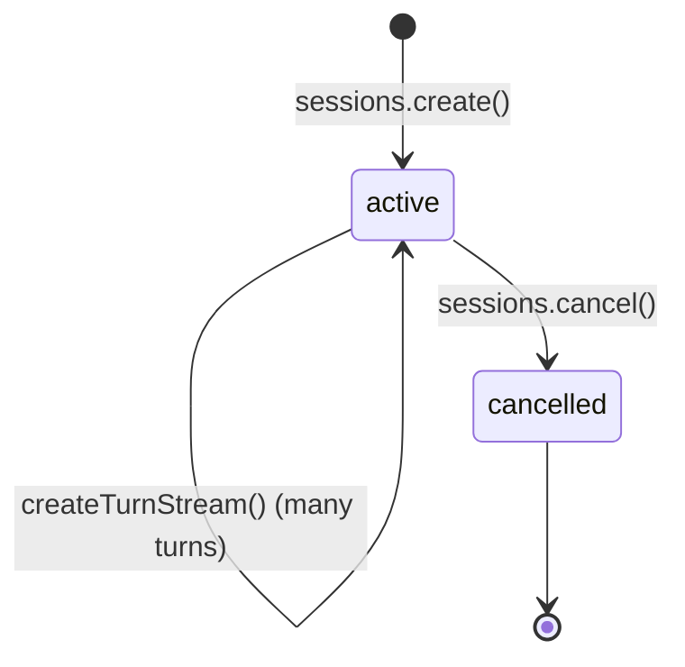
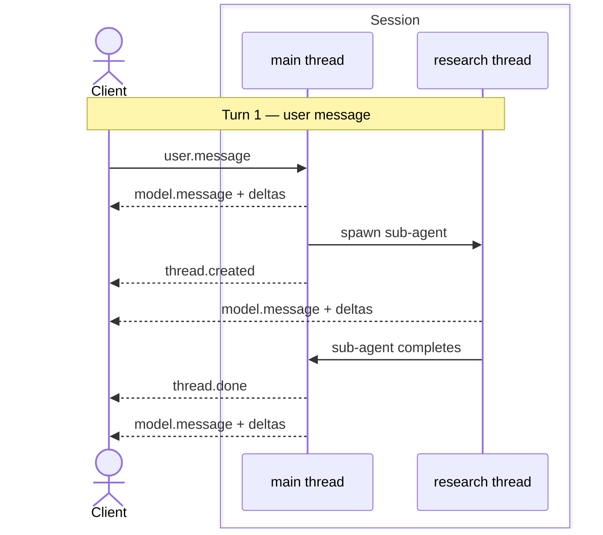

The recipe book for running an agent with [`@truefoundry/trueforge-sdk`](https://www.npmjs.com/package/@truefoundry/trueforge-sdk). New here? Install and stream your first turn in the [SDK Quickstart](/api/quickstart) first. For the mental model (Agent → Session → Turn → Event → Delta), see [Concepts](/api/overview); for every event field, see the [turn events reference](#turn-events-reference) at the bottom of this page.

<Note>
Prerequisite: a named agent in the registry, or an inline [agent spec](/create-agent/overview#create-an-agent-via-the-api) you pass when creating the session. The examples below run the **`web-research-brief`** agent from the [Quickstart](/quickstart); build it there first, or swap in your own agent name / inline spec.
</Note>

Every snippet is self-contained and runnable. They all use the `client` from [Install and connect](#install-and-connect).

## Install and connect

```bash wrap
npm i @truefoundry/trueforge-sdk
```

```typescript wrap
import { TrueForge } from '@truefoundry/trueforge-sdk';

const client = new TrueForge({
  baseUrl: process.env.TRUEFORGE_BASE_URL ?? 'http://localhost:8790',
  timeoutInSeconds: 600, // raise for long-running SSE turns (default 60s)
  // token: process.env.TRUEFORGE_TOKEN, // ID token when OIDC login is enabled
});
```

Point `baseUrl` at your running TrueForge server; `http://localhost:8790` is the Quickstart default. When [OIDC login](/authentication/overview) is enabled, pass `token` (an ID token from your IdP; see [Get a token and connect](/api/quickstart#get-a-token-and-connect)). When login is off, omit it.

## Quick Start

The [Concepts](/api/overview) page explains the model with a conceptual `support-bot`; here is a real agent you can run. In the [Quickstart](/quickstart) you built **`web-research-brief`**, an agent with Exa web search and the web-artifacts-builder skill. Here it is from the SDK: open a session on that agent, stream one research turn, and print the brief as it arrives. It fans out to [subagents](/key-features/subagents), so you'll see their threads in the same stream. It has no approval gate, so it runs end to end without pausing; for the approval and question pauses, see [Handle pauses](#handle-pauses).

```typescript wrap
import { TrueForge } from '@truefoundry/trueforge-sdk';

const client = new TrueForge({
  baseUrl: process.env.TRUEFORGE_BASE_URL ?? 'http://localhost:8790',
  timeoutInSeconds: 600,
});

// The agent you saved in the Quickstart.
const { data: session } = await client.sessions.create({ agent: { name: 'web-research-brief' } });

const stream = await client.sessions.createTurnStream(session.id, {
  input: [
    {
      type: 'user.message',
      content:
        'Compare Qdrant, Weaviate, and Milvus on performance, features, and licensing, then write a one-page brief with sources.',
    },
  ],
});

for await (const { data: event } of stream.withMetadata()) {
  if (event.type === 'thread.created') console.log(`\n↳ subagent: ${event.title}`);
  if (event.type === 'model.message.delta' && event.threadId === 'main') {
    process.stdout.write(event.content ?? ''); // the root agent's reply, streaming in
  }
  if (event.type === 'turn.done' && event.state.status === 'done') {
    console.log('\n\n--- brief ---\n', event.state.output?.content ?? '');
  }
}
```

That's the core loop: open a session, stream a turn, print the reply as it arrives, and read the final `turn.done`. This version writes each delta straight to stdout. The [next section](#create-and-stream-a-turn) keeps an id-keyed event index, the pattern the pause recipes build on. The rest of the page is a reference for each piece, plus the pauses (approvals, questions, MCP auth) a real agent runs into.

## Sessions

A **session** is the conversation context for one issue; it persists across turns. Persist `session.id` to resume later.



### Open a session

```typescript wrap
import { TrueForge } from '@truefoundry/trueforge-sdk';

const client = new TrueForge({ baseUrl: process.env.TRUEFORGE_BASE_URL ?? 'http://localhost:8790' });

// By saved agent name:
const { data: session } = await client.sessions.create({ agent: { name: 'web-research-brief' } });

// …or with an inline spec (no saved agent needed):
const { data: inlineSession } = await client.sessions.create({
  agent: {
    spec: {
      model: { name: 'anthropic/claude-sonnet-4-6' },
      instructions: 'You are a concise research assistant.',
    },
  },
});
```

### List sessions

Newest-first; filter with `agentId`. The returned `Page` is an async iterable and auto-paginates.

```typescript wrap
import { TrueForge } from '@truefoundry/trueforge-sdk';

const client = new TrueForge({ baseUrl: process.env.TRUEFORGE_BASE_URL ?? 'http://localhost:8790' });

for await (const session of await client.sessions.list()) {
  console.log(session.id, session.createdAt);
}
```

## Turns

A **turn** is one request/response cycle: send input, the agent runs until it finishes or pauses, then the stream closes. Turns chain automatically (`previousTurnId` defaults to `"auto"`), so you never resend history.

<Note>
Creating a new turn in a session automatically cancels any turn still running in that session.
</Note>

### Create and stream a turn

`createTurnStream` returns a stream of [turn events](#turn-events-reference). `stream.withMetadata()` yields `{ data, id }`, where `data` is the parsed event and `id` is the per-stream sequence number used to [resume after a disconnect](#resume-a-stream). The stream opens with `turn.created` and closes with `turn.done`; read the terminal result from `turn.done.state`.

Keep an **`id`-keyed event index**. Model output streams as an empty `model.message` base followed by `model.message.delta` fragments that share the base's `id`; store each non-delta event under its `id`, and merge each delta into the base with `isEventDelta` / `mergeEventDelta`. (Deltas appear only while streaming; [`listTurnEvents`](#replay-a-finished-turn) returns them already merged.) The pause handlers below reuse this index to look up the `model.message` that emitted a tool call.

```typescript wrap
import { TrueForge, TrueForgeApi, isEventDelta, mergeEventDelta } from '@truefoundry/trueforge-sdk';

const client = new TrueForge({
  baseUrl: process.env.TRUEFORGE_BASE_URL ?? 'http://localhost:8790',
  timeoutInSeconds: 600,
});
const { data: session } = await client.sessions.create({ agent: { name: 'web-research-brief' } });

const events = new Map<string, TrueForgeApi.TurnStreamingEvent>();
let turnId: string | undefined;
let lastSequenceNumber = 0;

const stream = await client.sessions.createTurnStream(session.id, {
  input: [{ type: 'user.message', content: 'Summarize the current state of open-source vector databases.' }],
});
for await (const { data: event, id } of stream.withMetadata()) {
  if (id != null) lastSequenceNumber = Number(id);
  if (event.type === 'turn.created') turnId = event.turnId;
  if (isEventDelta(event)) {
    const base = events.get(event.id);
    if (base) mergeEventDelta(base, event);
  } else {
    events.set(event.id, event);
  }
  if (event.type === 'turn.done') console.log('status:', event.state.status);
}
```

Turn `input` accepts three item types (a single turn can't mix a `user.message` with approval or response items):

| `type` | Purpose |
| --- | --- |
| `user.message` | A message. `content` is a string, or an array of `text` / `file` parts (files as data URIs). |
| `user.tool_approval` | An [approval decision](/create-agent/overview#whats-in-an-agent) for a paused tool call. |
| `user.tool_response` | An [answer](/create-agent/overview#whats-in-an-agent) for a paused client-side tool call. |

### Non-streaming turn

If you don't need live events, `sessions.createTurn` (`stream: false`) returns immediately with `state.status: "running"` and runs in the background. Poll `getTurn` until the status is terminal (`done`, `cancelled`, `error`).

```typescript wrap
import { TrueForge } from '@truefoundry/trueforge-sdk';

const client = new TrueForge({ baseUrl: process.env.TRUEFORGE_BASE_URL ?? 'http://localhost:8790' });
const { data: session } = await client.sessions.create({ agent: { name: 'web-research-brief' } });

const { data: created } = await client.sessions.createTurn(session.id, {
  input: [{ type: 'user.message', content: 'Give me a one-paragraph summary of the Qdrant licensing model.' }],
});

let turn = created;
while (turn.state.status === 'running') {
  await new Promise((resolve) => setTimeout(resolve, 500));
  ({ data: turn } = await client.sessions.getTurn(session.id, created.id));
}
console.log(turn.state); // done → state.output / required_actions; else reason / message
```

### List turns

Oldest-first; each turn exposes its `input` and `state`. A `done` turn's `state.requiredActions` lists any pauses it surfaced.

```typescript wrap
import { TrueForge } from '@truefoundry/trueforge-sdk';

const client = new TrueForge({ baseUrl: process.env.TRUEFORGE_BASE_URL ?? 'http://localhost:8790' });

for await (const turn of await client.sessions.listTurns('sess-abc123')) {
  console.log(turn.id, turn.state.status);
  if (turn.state.status === 'done' && turn.state.output != null) {
    console.log(turn.state.output.content);
  }
}
```

### Attach images or files

A `user.message`'s `content` can be an array of parts: text plus one or more files as [data URIs](https://developer.mozilla.org/en-US/docs/Web/HTTP/Basics_of_HTTP/Data_URLs) (`data:<mime>;base64,<payload>`).

```typescript wrap
import { readFileSync } from 'node:fs';
import { TrueForge } from '@truefoundry/trueforge-sdk';

const client = new TrueForge({
  baseUrl: process.env.TRUEFORGE_BASE_URL ?? 'http://localhost:8790',
  timeoutInSeconds: 600,
});
const { data: session } = await client.sessions.create({ agent: { name: 'web-research-brief' } });

const toDataUri = (path: string, mime: string) => `data:${mime};base64,${readFileSync(path).toString('base64')}`;

const stream = await client.sessions.createTurnStream(session.id, {
  input: [
    {
      type: 'user.message',
      content: [
        { type: 'text', text: 'Use this chart in the brief.' },
        { type: 'file', name: 'benchmarks.png', data: toDataUri('benchmarks.png', 'image/png') },
      ],
    },
  ],
});
for await (const { data: event } of stream.withMetadata()) console.log(event.type);
```

<Note>
Whether a file is understood depends on the agent's model, so send images only to a vision-capable model. Non-image files (e.g. PDFs) need the [sandbox](/sandbox) enabled on the agent; the harness uses it to process the document.
</Note>

### Cancel a turn

`sessions.cancel(sessionId)` stops the running turn: it aborts the in-flight model request, waits for running MCP tool calls to finish, and force-stops any sandbox the turn provisioned. It's idempotent, and the backend closes the SSE stream gracefully (a terminal `turn.done`, then it ends, so don't `break`). Continue by creating a new turn, which chains on the cancelled turn's history.

```typescript wrap
import { TrueForge } from '@truefoundry/trueforge-sdk';

const client = new TrueForge({
  baseUrl: process.env.TRUEFORGE_BASE_URL ?? 'http://localhost:8790',
  timeoutInSeconds: 600,
});
const { data: session } = await client.sessions.create({ agent: { name: 'web-research-brief' } });

const stream = await client.sessions.createTurnStream(session.id, {
  input: [{ type: 'user.message', content: 'Run a deep comparison across a dozen vector databases.' }],
});
let i = 0;
for await (const { data: event } of stream.withMetadata()) {
  if (i++ === 5) await client.sessions.cancel(session.id); // stream ends itself after the terminal turn.done
}
```

## Handle pauses

A turn ends **paused** when it needs something from you. Each pause populates `turn.done.state.requiredActions`; you resume by creating a **new turn** with the matching response item(s). A single turn can surface more than one pending item (e.g. parallel threads each hit a gate), so collect them all.

For approvals and questions, each pending ref carries the `sourceEventId` of the [`model.message`](#model-message) that made the call. Look it up in the [event index](#create-and-stream-a-turn) to read the tool's name and arguments.

<Note>
`web-research-brief` won't pause on its own; it has no gated tool or clarifying-question step. The snippets below are **illustrative**: point them at an agent that has a `require_approval_for_tools` tool, uses `ask_user_question`, or connects to an MCP server needing OAuth.
</Note>

### Tool approvals

A gated tool ([human approval](/create-agent/overview#whats-in-an-agent)) emits [`tool.approval_required`](#tool-approval-required). Collect the pending events while streaming, then resume with one `user.tool_approval` per pending call, either allowing it or denying it with a reason.

```typescript wrap
import { TrueForge, TrueForgeApi, isEventDelta, mergeEventDelta } from '@truefoundry/trueforge-sdk';

const client = new TrueForge({
  baseUrl: process.env.TRUEFORGE_BASE_URL ?? 'http://localhost:8790',
  timeoutInSeconds: 600,
});
const { data: session } = await client.sessions.create({ agent: { name: 'ops-bot' } });

const events = new Map<string, TrueForgeApi.TurnStreamingEvent>();
const pendingApprovals: TrueForgeApi.ToolApprovalRequiredEvent[] = [];

const stream = await client.sessions.createTurnStream(session.id, {
  input: [{ type: 'user.message', content: 'Restart the billing service.' }],
});
for await (const { data: event } of stream.withMetadata()) {
  if (isEventDelta(event)) {
    const base = events.get(event.id);
    if (base) mergeEventDelta(base, event);
  } else {
    events.set(event.id, event);
  }
  if (event.type === 'tool.approval_required') pendingApprovals.push(event);
}

const approvals: TrueForgeApi.UserToolApprovalEvent[] = [];
for (const pending of pendingApprovals) {
  for (const ref of pending.toolCalls) {
    const msg = events.get(ref.sourceEventId);
    if (msg?.type !== 'model.message') continue;
    const call = msg.toolCalls?.find((tc) => tc.id === ref.id);
    if (!call) continue;
    console.log(`approve ${call.toolInfo.name}? args: ${call.function.arguments}`);
    approvals.push({
      type: 'user.tool_approval',
      threadId: pending.threadId,
      toolCallId: ref.id,
      approval: { status: 'allow' }, // or { status: 'deny', reason: 'denied by user' }
    });
  }
}

const resume = await client.sessions.createTurnStream(session.id, { input: approvals });
for await (const { data: event } of resume.withMetadata()) console.log(event.type);
```

### Agent questions

When the agent uses the built-in [`ask_user_question`](/create-agent/overview#whats-in-an-agent) tool, it emits [`tool.response_required`](#tool-response-required); the pending call's `arguments` carry the `question` and `options`. Resume with one `user.tool_response` per pending call.

```typescript wrap
import { TrueForge, TrueForgeApi, isEventDelta, mergeEventDelta } from '@truefoundry/trueforge-sdk';

const client = new TrueForge({
  baseUrl: process.env.TRUEFORGE_BASE_URL ?? 'http://localhost:8790',
  timeoutInSeconds: 600,
});
const { data: session } = await client.sessions.create({ agent: { name: 'ops-bot' } });

const events = new Map<string, TrueForgeApi.TurnStreamingEvent>();
const pendingQuestions: TrueForgeApi.ToolResponseRequiredEvent[] = [];

const stream = await client.sessions.createTurnStream(session.id, {
  input: [{ type: 'user.message', content: 'Create a new environment called testing-1.' }],
});
for await (const { data: event } of stream.withMetadata()) {
  if (isEventDelta(event)) {
    const base = events.get(event.id);
    if (base) mergeEventDelta(base, event);
  } else {
    events.set(event.id, event);
  }
  if (event.type === 'tool.response_required') pendingQuestions.push(event);
}

const responses: TrueForgeApi.UserToolResponseEvent[] = [];
for (const pending of pendingQuestions) {
  for (const ref of pending.toolCalls) {
    const msg = events.get(ref.sourceEventId);
    if (msg?.type !== 'model.message') continue;
    const call = msg.toolCalls?.find((tc) => tc.id === ref.id);
    // tool.response_required covers any client-side tool; handle ask_user_question here.
    if (call?.toolInfo.type !== 'truefoundry-system' || call.toolInfo.name !== 'ask_user_question') continue;
    const { question, options } = JSON.parse(call.function.arguments || '{}') as { question?: string; options?: string[] };
    console.log(question, options);
    responses.push({
      type: 'user.tool_response',
      threadId: pending.threadId,
      toolCallId: ref.id,
      content: 'the chosen option, or any text', // free-form answer
    });
  }
}

const resume = await client.sessions.createTurnStream(session.id, { input: responses });
for await (const { data: event } of resume.withMetadata()) console.log(event.type);
```

### MCP outbound auth

When a tool needs a server's OAuth, the turn ends with [`mcp.auth_required`](#mcp-auth-required), listing each server and its `authUrl`. Send the user there, then resume. See [In-chat authentication](/mcp-servers#in-chat-authentication).

<Note>
After `mcp.auth_required`, the resuming turn must **not** include a `user.message`; resume with empty `input` (or omit it).
</Note>

```typescript wrap
import { TrueForge, TrueForgeApi } from '@truefoundry/trueforge-sdk';

const client = new TrueForge({
  baseUrl: process.env.TRUEFORGE_BASE_URL ?? 'http://localhost:8790',
  timeoutInSeconds: 600,
});
const { data: session } = await client.sessions.create({ agent: { name: 'github-bot' } });

let pendingAuth: TrueForgeApi.McpAuthRequiredEvent | undefined;
const stream = await client.sessions.createTurnStream(session.id, {
  input: [{ type: 'user.message', content: 'Summarize my latest GitHub issues.' }],
});
for await (const { data: event } of stream.withMetadata()) {
  if (event.type === 'mcp.auth_required') pendingAuth = event;
}

if (pendingAuth != null) {
  for (const server of pendingAuth.mcpServers) {
    console.log(`Authorize ${server.name}: ${server.authUrl}`);
  }
  // …wait for the user to authorize the server(s)…
}

// Resume with empty input; the agent continues the interrupted work.
const resume = await client.sessions.createTurnStream(session.id, {});
for await (const { data: event } of resume.withMetadata()) console.log(event.type);
```

## Resilience and threads

### Resume a stream

If you lose the `createTurnStream` connection (e.g. a process restart), persist `session.id`, `turnId`, and `lastSequenceNumber`. To resume: call `getTurn` → if still `running`, reconnect with `subscribeToTurn` and `afterSequenceNumber` to skip events you already saw; if finished, rebuild from `listTurnEvents`.

```typescript wrap
import { TrueForge, TrueForgeApi, isEventDelta, mergeEventDelta } from '@truefoundry/trueforge-sdk';

const client = new TrueForge({
  baseUrl: process.env.TRUEFORGE_BASE_URL ?? 'http://localhost:8790',
  timeoutInSeconds: 600,
});
const { data: session } = await client.sessions.create({ agent: { name: 'web-research-brief' } });

const events = new Map<string, TrueForgeApi.TurnStreamingEvent>();
let turnId: string | undefined;
let lastSequenceNumber = 0;

const stream = await client.sessions.createTurnStream(session.id, {
  input: [{ type: 'user.message', content: 'Compare Qdrant, Weaviate, and Milvus.' }],
});
for await (const { data: event, id } of stream.withMetadata()) {
  if (id != null) lastSequenceNumber = Number(id);
  if (event.type === 'turn.created') turnId = event.turnId;
  if (isEventDelta(event)) {
    const base = events.get(event.id);
    if (base) mergeEventDelta(base, event);
  } else {
    events.set(event.id, event);
  }
}

// …after a disconnect, with session.id / turnId / lastSequenceNumber restored:
const { data: turn } = await client.sessions.getTurn(session.id, turnId!);
if (turn.state.status === 'running') {
  const resume = await client.sessions.subscribeToTurn(
    session.id,
    turnId!,
    { afterSequenceNumber: lastSequenceNumber },
    { timeoutInSeconds: 600 },
  );
  for await (const { data: event, id } of resume.withMetadata()) {
    if (id != null) lastSequenceNumber = Number(id);
    if (isEventDelta(event)) {
      const base = events.get(event.id);
      if (base) mergeEventDelta(base, event);
    } else {
      events.set(event.id, event);
    }
  }
} else {
  // Already finished: rebuild from the stored log (deltas already merged).
  for await (const event of await client.sessions.listTurnEvents(session.id, turnId!)) {
    events.set(event.id, event);
  }
}
```

<Tip>
`createTurn` + `subscribeToTurn` is resilient: the SDK reconnects with `Last-Event-ID` on transient drops. Persist the sequence number from `.withMetadata()` so you can call `subscribeToTurn({ afterSequenceNumber })` again after a restart.
</Tip>

### Subagent threads

A turn stream interleaves the root agent and any parallel [subagents](/key-features/subagents), exactly what the [Quick Start](#quick-start) above does. Every event carries a `threadId`:

- `"main"`: the root agent.
- A unique id: a subagent thread. [`thread.created`](#thread-created) and [`thread.done`](#thread-done) bracket its lifecycle.
- `null`: a turn-level event, such as [`turn.created`](#turn-created), [`turn.done`](#turn-done), [`sandbox.created`](#sandbox-created), and [`mcp.auth_required`](#mcp-auth-required).

Keep a **per-thread** index (`Map<threadId, Map<id, event>>`) and merge deltas within the matching thread's bucket.



```typescript wrap
import { TrueForge, TrueForgeApi, isEventDelta, mergeEventDelta } from '@truefoundry/trueforge-sdk';

const client = new TrueForge({
  baseUrl: process.env.TRUEFORGE_BASE_URL ?? 'http://localhost:8790',
  timeoutInSeconds: 600,
});
const { data: session } = await client.sessions.create({ agent: { name: 'web-research-brief' } });

const threads = new Map<string, Map<string, TrueForgeApi.TurnStreamingEvent>>();

const stream = await client.sessions.createTurnStream(session.id, {
  input: [{ type: 'user.message', content: 'Compare Qdrant, Weaviate, and Milvus in parallel.' }],
});
for await (const { data: event } of stream.withMetadata()) {
  if (event.threadId == null) {
    console.log('turn-level event:', event.type);
    continue;
  }
  let bucket = threads.get(event.threadId);
  if (!bucket) threads.set(event.threadId, (bucket = new Map()));

  if (isEventDelta(event)) {
    const base = bucket.get(event.id);
    if (base) mergeEventDelta(base, event);
  } else {
    bucket.set(event.id, event);
  }
  if (event.type === 'thread.done') {
    console.log(`${event.threadId} done: ${event.title} (${bucket.size} events)`);
    threads.delete(event.threadId);
  }
}
```

### Replay a finished turn

`sessions.listTurnEvents()` yields a finished turn's [events](#turn-events-reference) in order (auto-paginates; `order: "asc"` default, or `"desc"`). Events are **already merged**, so you can use each one directly.

<Note>
Only available for completed turns; a running turn has no stored log yet, so stream it with `createTurnStream` or `subscribeToTurn` instead.
</Note>

```typescript wrap
import { TrueForge } from '@truefoundry/trueforge-sdk';

const client = new TrueForge({ baseUrl: process.env.TRUEFORGE_BASE_URL ?? 'http://localhost:8790' });

for await (const turn of await client.sessions.listTurns('sess-abc123')) {
  if (turn.state.status === 'running') continue;
  for await (const event of await client.sessions.listTurnEvents('sess-abc123', turn.id, { order: 'asc' })) {
    console.log(event.type);
  }
}
```

## Turn events reference

Field-level schemas for every event streamed while a turn runs. The recipes above link here for the exact shape of each event they handle.

<Note>
  Field names in this reference use the HTTP/JSON wire format (snake_case, e.g. `turn_id`, `source_event_id`). The TypeScript SDK returns the same fields camelCased (`turnId`, `sourceEventId`) — so a field you see here maps directly to its camelCase form in SDK code.
</Note>

Every event carries:

| Field        | Description                                                                                                                                                                                                        |
| ------------ | ------------------------------------------------------------------------------------------------------------------------------------------------------------------------------------------------------------------ |
| `type`       | The event type — one of the types below.                                                                                                                                                                           |
| `id`         | Unique event id (monotonic ULID — sortable by creation order).                                                                                                                                                     |
| `created_at` | ISO 8601 timestamp.                                                                                                                                                                                                |
| `thread_id`  | Which execution thread emitted it: `"main"` for the root agent, a generated id for [subagents](/key-features/subagents), or `null` for run-level events (`turn.*`, `sandbox.created`, `mcp.auth_required`). |

A stream always opens with `turn.created` and closes with `turn.done`. When you list persisted session events afterwards, you get the same events with deltas pre-merged into their `model.message`.

### Lifecycle events

#### `turn.created`

First event on every stream.

| Field              | Description                                               |
| ------------------ | --------------------------------------------------------- |
| `turn_id`          | Id of this turn.                                          |
| `previous_turn_id` | The turn this one chains from, or `null` for a root turn. |
| `input`            | The turn's input items, echoed back.                      |
| `state`            | `{ "status": "running" }`                                 |

#### `turn.done`

Last event on every stream. `state.status` is one of:

- **`done`** — carries `output` (the final `model.message`, or `null` when the turn ended paused), `required_actions` (pending `tool.approval_required` / `tool.response_required` / `mcp.auth_required` events, empty when none), `completed_at`, and optional `metrics`.
- **`cancelled`** — carries a `reason`: `client-cancelled`, `server-execution-timeout`, `cancelled-for-next-turn`, or `abandoned`.
- **`error`** — carries a `message`.

`metrics`, when present, aggregates the whole turn: `total_input_tokens`, `total_output_tokens`, `total_tokens`, `total_cache_read_tokens`, `total_cache_write_tokens`, `total_reasoning_tokens`, and `total_cost_in_usd`.

```json turn.done — paused for approval wrap
{
  "type": "turn.done",
  "id": "01jc...",
  "thread_id": null,
  "created_at": "2026-06-24T10:01:12Z",
  "state": {
    "status": "done",
    "output": null,
    "required_actions": [
      {
        "type": "tool.approval_required",
        "thread_id": "main",
        "tool_calls": [{ "id": "call-refund-01", "source_event_id": "msg-b2" }]
      }
    ],
    "completed_at": "2026-06-24T10:01:12Z",
    "metrics": { "total_tokens": 2451, "total_cost_in_usd": 0.011 }
  }
}
```

### Model output

#### `model.message`

An assistant message — text content and/or tool calls. On a live stream the base event arrives first and fills in via deltas; the merged event carries:

| Field           | Description                                                                                                                                                                                    |
| --------------- | ---------------------------------------------------------------------------------------------------------------------------------------------------------------------------------------------- |
| `content`       | Assistant text (may be empty when the message is only tool calls).                                                                                                                             |
| `tool_calls`    | Tool invocations, each with an `id` and `function` (`name`, `arguments`).                                                                                                                      |
| `finish_reason` | Why generation stopped (`stop`, `tool_calls`, ...), `null` mid-stream.                                                                                                                         |
| `usage`         | Token usage for this model call: `input_tokens`, `output_tokens`, optional cache counters, and `input_tokens_breakdown` (`harness`, `skills`, `instructions`, `tool_definitions`, `messages`). |

#### `model.message.delta`

An incremental fragment of a `model.message` — text and/or tool-call chunks. All deltas share the base event's `id`; append `content` chunks and merge tool-call fragments by index. The most frequent event on a live stream. Not present when listing persisted events.

### Tool activity

#### `tool.response`

The result of a tool the harness executed, linked to its call by `tool_call_id`:

```json wrap
{
  "type": "tool.response",
  "id": "01jc...",
  "thread_id": "main",
  "tool_call_id": "call-get-order-01",
  "content": "{\"order_id\":\"ORD-2031\",\"status\":\"shipped\",\"total\":1240.0}",
  "created_at": "2026-06-24T10:00:04Z"
}
```

#### `tool.approval_required`

A tool call needs [human approval](/create-agent/overview#whats-in-an-agent) before it can run. The turn ends after this event; resume with a `user.tool_approval` input.

| Field        | Description                                                                                                                                       |
| ------------ | ------------------------------------------------------------------------------------------------------------------------------------------------- |
| `tool_calls` | Pending calls: each `{ id, source_event_id }`, where `source_event_id` points at the `model.message` that contains the call's name and arguments. |

#### `tool.response_required`

A client-side tool (e.g. [`ask_user_question`](/create-agent/overview#whats-in-an-agent)) needs a result from your app. Same shape as `tool.approval_required`; resume with a `user.tool_response` input.

### Subagent thread events

#### `thread.created`

A [subagent](/key-features/subagents) started. Subsequent events with this `thread_id` belong to it.

| Field        | Description                                                                            |
| ------------ | -------------------------------------------------------------------------------------- |
| `thread_id`  | The new thread's id.                                                                   |
| `title`      | Human-readable subagent name.                                                          |
| `parent`     | `{ thread_id, tool_call_id }` — the spawning thread and tool call.                     |
| `agent_info` | `{ type: "dynamic", name, input }` — the generated instructions the subagent received. |

#### `thread.done`

The subagent finished. `state` is `{ status: "done", output: <model.message> }` or `{ status: "error", error, output? }`. Does not close the turn stream — the root agent continues.

### Environment events

#### `mcp.initialize`

MCP server connections were initialized for a thread. `mcp_servers` lists each server: `{ id, name, session_id?, transport_type? }` (`streamable-http` or `sse`).

#### `mcp.auth_required`

One or more MCP servers need [OAuth authorization](/mcp-servers#in-chat-authentication) before the agent can proceed. `mcp_servers` lists `{ id, name, auth_url }` — send the user to `auth_url`, then start the next turn. The turn ends after this event.

#### `sandbox.created`

A [sandbox](/sandbox) was provisioned, carrying its `sandbox_id`. Emitted once per session — subsequent turns reuse the same sandbox and emit no new event.

### User input events

These are not streamed — they are the input items **you send** when creating a turn, listed here for completeness:

| Type                 | Fields                                                                                                                                   | Purpose                                    |
| -------------------- | ---------------------------------------------------------------------------------------------------------------------------------------- | ------------------------------------------ |
| `user.message`       | `content` — string, or array of `{ type: "text", text }` / `{ type: "file", name, data }` parts (files as `data:<mime>;base64,...` URIs) | A user message.                            |
| `user.tool_approval` | `thread_id`, `tool_call_id`, `approval` — `{ status: "allow" }` or `{ status: "deny", reason? }`                                         | Decision for a paused tool call.           |
| `user.tool_response` | `thread_id`, `tool_call_id`, `content`                                                                                                   | Answer for a paused client-side tool call. |

A turn's `input` cannot mix `user.message` items with approval or tool-response items.
