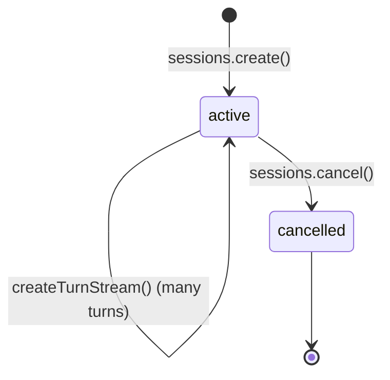
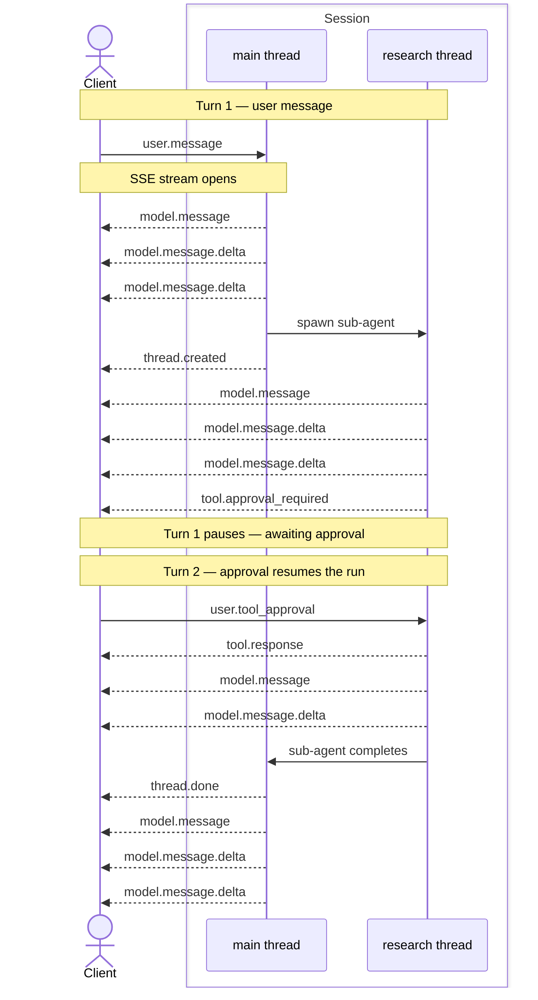

This guide covers everything you need to **run** an agent with [`trueforge-sdk`](https://www.npmjs.com/package/trueforge-sdk): open a session, send turns, consume the event stream, and handle pauses, threads, and disconnects.

For the conceptual hierarchy (Agent → Session → Turn → Event → Delta) and a short end-to-end walkthrough, see [SDK Overview](/api/overview). For every event field, see [Turn events](/api/turn-events).

<Note>
Prerequisite: a named agent in the registry, or an inline [agent spec](/api/agent-spec) you pass when creating the session. The quickest path to a named agent is the [Quickstart](/quickstart) UI.
</Note>

## Install and connect

```bash
npm i -s trueforge-sdk
```

```typescript
import { TrueForge } from 'trueforge-sdk';

const client = new TrueForge({
  baseUrl: process.env.TRUEFORGE_BASE_URL ?? 'http://localhost:8790',
  // Raise for long-running SSE turns (default is 60s).
  timeoutInSeconds: 600,
  // Optional: ID token when auth is enabled on the server.
  // token: process.env.TRUEFORGE_TOKEN,
});
```

When auth is enabled, pass `token` (Bearer ID token). When auth is disabled, omit it.

## Create a session

A **session** is the conversation context for one issue with an agent. It persists across many turns; persist `session.id` to resume later.



### Open a session

Create a session by agent name, or pass an inline [agent spec](/api/agent-spec):

```typescript
import { TrueForge } from 'trueforge-sdk';

const client = new TrueForge({
  baseUrl: process.env.TRUEFORGE_BASE_URL ?? 'http://localhost:8790',
  timeoutInSeconds: 600,
});

// Reference a saved agent by name.
const { data: session } = await client.sessions.create({
  agent: { name: 'support-bot' },
});

// Or pass an inline spec:
// const { data: session } = await client.sessions.create({
//   agent: {
//     spec: {
//       model: { name: 'anthropic/claude-sonnet-4-6' },
//       instructions: 'You help customers with orders.',
//     },
//   },
// });

console.log('session id:', session.id);
```

### List sessions

List your sessions with `sessions.list()`. Newest-first by default; filter with `agentId` when you only want sessions for one saved agent. The returned `Page` is an async iterable and auto-paginates.

```typescript
import { TrueForge } from 'trueforge-sdk';

const client = new TrueForge({
  baseUrl: process.env.TRUEFORGE_BASE_URL ?? 'http://localhost:8790',
});

for await (const session of await client.sessions.list({ agentId: 'agent-support-bot' })) {
  console.log('session id:', session.id);
  console.log('created at:', session.createdAt);
}
```

## Create a turn

A **turn** is one request/response cycle. Send input, the agent runs until it finishes or pauses, then the stream closes. Create another turn on the same session to continue — turns chain automatically (`previousTurnId` defaults to `"auto"`).

### Create and stream a turn

`sessions.createTurnStream` creates the turn and returns a stream of [turn events](/api/turn-events). The first event is always `turn.created` (carrying `turnId`); the stream closes with `turn.done`.

`stream.withMetadata()` yields each SSE message as `{ data, id }`: `data` is the parsed event, and `id` is the per-stream sequence number used to [resume after a disconnect](#resume-streaming).

Read the terminal state from the final `turn.done` event (or call `sessions.getTurn` afterward). To continue the conversation, create another turn on the same session — each turn sees the history of the ones before it.

<Note>
Creating a new turn in a session automatically cancels any other turn that is still running in that session.
</Note>

```typescript
import { TrueForge } from 'trueforge-sdk';

const client = new TrueForge({
  baseUrl: process.env.TRUEFORGE_BASE_URL ?? 'http://localhost:8790',
  timeoutInSeconds: 600,
});
const { data: session } = await client.sessions.create({
  agent: { name: 'support-bot' },
});

const stream = await client.sessions.createTurnStream(session.id, {
  input: [{ type: 'user.message', content: 'I would like to file a support ticket.' }],
});

let turnId: string | undefined;
let lastSequenceNumber = 0;
for await (const { data: event, id } of stream.withMetadata()) {
  if (id != null) {
    lastSequenceNumber = Number(id);
  }
  console.log(event.type);
  if (event.type === 'turn.created') {
    turnId = event.turnId;
  }
  if (event.type === 'turn.done') {
    console.log('final status:', event.state.status);
  }
}

// Create another turn on the same session. Turns are chained automatically.
const next = await client.sessions.createTurnStream(session.id, {
  input: [{ type: 'user.message', content: 'Use my last order, ORD-2031.' }],
});
for await (const { data: event, id } of next.withMetadata()) {
  if (id != null) {
    lastSequenceNumber = Number(id);
  }
  console.log(event.type);
}
```
### List turns

List turns in a session with `sessions.listTurns()`. Turns are returned oldest-first. Each turn exposes its `input` and `state`.

```typescript
import { TrueForge } from 'trueforge-sdk';

const client = new TrueForge({
  baseUrl: process.env.TRUEFORGE_BASE_URL ?? 'http://localhost:8790',
});

for await (const turn of await client.sessions.listTurns('sess-abc123')) {
  console.log('turn id:', turn.id);
  console.log('input:', turn.input);

  const turnState = turn.state;
  if (turnState.status === 'running') {
    console.log('status: running (no output yet)');
  } else if (turnState.status === 'done') {
    console.log('status: done');
    if (turnState.output != null) {
      console.log('output:', turnState.output.content);
    }
    // requiredActions lists any pause events the turn surfaced
    // (tool.approval_required, tool.response_required, mcp.auth_required).
    for (const item of turnState.requiredActions) {
      console.log('required action:', item);
    }
  } else if (turnState.status === 'cancelled') {
    console.log('status: cancelled', turnState.reason);
  } else if (turnState.status === 'error') {
    console.log('status: error', turnState.message);
  }
}
```

### Non-streaming turn

If you don't need live events on the create call, use `sessions.createTurn` (sets `stream: false`). It returns the turn immediately with `state.status: "running"` while execution continues in the background. Poll `sessions.getTurn` until `state.status` is terminal (`done`, `cancelled`, or `error`).

```typescript
import { TrueForge } from 'trueforge-sdk';

const client = new TrueForge({
  baseUrl: process.env.TRUEFORGE_BASE_URL ?? 'http://localhost:8790',
});
const { data: session } = await client.sessions.create({
  agent: { name: 'support-bot' },
});

const { data: created } = await client.sessions.createTurn(session.id, {
  input: [{ type: 'user.message', content: 'Summarize my last order.' }],
});

let turn = created;
while (turn.state.status === 'running') {
  await new Promise((resolve) => setTimeout(resolve, 500));
  ({ data: turn } = await client.sessions.getTurn(session.id, created.id));
}

const turnState = turn.state;
if (turnState.status === 'done') {
  if (turnState.output != null) {
    console.log(turnState.output.content);
  } else {
    console.log('required actions:', turnState.requiredActions);
  }
} else if (turnState.status === 'cancelled') {
  console.log('cancelled:', turnState.reason);
} else if (turnState.status === 'error') {
  console.log('error:', turnState.message);
}
```

### Attach images or files to a turn

A `user.message`'s `content` can be a plain string or a list of content parts. Use content parts to send text alongside one or more file uploads (images, PDFs, and other documents). Each file is passed as a [data URI](https://developer.mozilla.org/en-US/docs/Web/HTTP/Basics_of_HTTP/Data_URLs) of the form `data:<mime>;base64,<payload>`.

```typescript
import { readFileSync } from 'node:fs';
import { TrueForge } from 'trueforge-sdk';

const client = new TrueForge({
  baseUrl: process.env.TRUEFORGE_BASE_URL ?? 'http://localhost:8790',
  timeoutInSeconds: 600,
});
const { data: session } = await client.sessions.create({
  agent: { name: 'support-bot' },
});

function toDataUri(path: string, mime: string): string {
  return `data:${mime};base64,${readFileSync(path).toString('base64')}`;
}

const imageUri = toDataUri('invoice.png', 'image/png');
const docUri = toDataUri('notes.txt', 'text/plain');

const stream = await client.sessions.createTurnStream(session.id, {
  input: [
    {
      type: 'user.message',
      content: [
        { type: 'text', text: 'Does the invoice total match the notes?' },
        { type: 'file', name: 'invoice.png', data: imageUri },
        { type: 'file', name: 'notes.txt', data: docUri },
      ],
    },
  ],
});
for await (const { data: event, id } of stream.withMetadata()) {
  console.log(event.type, id);
}
```

<Note>
Whether an attached file is understood depends on the agent's model. Send images only to a vision-capable model; document handling (for example, PDFs) likewise depends on model and agent configuration.
</Note>

<Note>
Non-image files such as PDFs require the [sandbox](/sandbox) to be enabled on the agent — the harness uses it to process the document.
</Note>

### Cancel a turn

To stop the currently running turn, call `sessions.cancel(sessionId)`. Cancelling aborts any in-flight model request, waits for running MCP tool calls to finish, and force-stops any sandbox the turn provisioned. Cancellation is idempotent. You can continue by creating a new turn, which chains on the cancelled turn's history.

```typescript
import { TrueForge } from 'trueforge-sdk';

const client = new TrueForge({
  baseUrl: process.env.TRUEFORGE_BASE_URL ?? 'http://localhost:8790',
  timeoutInSeconds: 600,
});
const { data: session } = await client.sessions.create({
  agent: { name: 'support-bot' },
});

const stream = await client.sessions.createTurnStream(session.id, {
  input: [{ type: 'user.message', content: 'Run a long research task.' }],
});

let i = 0;
let turnId: string | undefined;
let lastSequenceNumber = 0;
for await (const { data: event, id } of stream.withMetadata()) {
  if (id != null) {
    lastSequenceNumber = Number(id);
  }
  console.log(event.type);
  if (event.type === 'turn.created') {
    turnId = event.turnId;
  }
  if (i === 5) {
    // Don't break here. After cancel(), the backend closes the SSE stream
    // gracefully: it emits a terminal turn.done event and then ends the
    // stream, which closes this iterator on its own.
    await client.sessions.cancel(session.id);
  }
  i += 1;
}

// A cancelled turn is terminal, so its event log is stored and can be replayed.
if (turnId != null) {
  for await (const event of await client.sessions.listTurnEvents(session.id, turnId, { order: 'asc' })) {
    console.log(event);
  }
}

// Continue the conversation: a new turn chains on the cancelled turn's history.
const next = await client.sessions.createTurnStream(session.id, {
  input: [{ type: 'user.message', content: 'Actually, just give me a quick summary instead.' }],
});
for await (const { data: event, id } of next.withMetadata()) {
  if (id != null) {
    lastSequenceNumber = Number(id);
  }
  console.log(event.type);
}
```

### Handle MCP outbound auth

When the agent needs to call a tool on an MCP server that requires a separate outbound authentication, it emits an [`mcp.auth_required`](/api/turn-events#mcp-auth-required) event and the turn ends. The event lists each server that needs authentication along with an `authUrl`. Send the user to that URL to complete authentication, then resume by creating a new turn. See [In-chat authentication](/mcp-servers#in-chat-authentication).

<Note>
When the previous turn ended with `mcp.auth_required`, passing a `user.message` in the resuming turn is not allowed. Resume with an empty `input` (or omit `input`).
</Note>

```typescript
import { createInterface } from 'node:readline/promises';
import { stdin, stdout } from 'node:process';
import { TrueForge, TrueForgeApi } from 'trueforge-sdk';

const client = new TrueForge({
  baseUrl: process.env.TRUEFORGE_BASE_URL ?? 'http://localhost:8790',
  timeoutInSeconds: 600,
});
const { data: session } = await client.sessions.create({
  agent: { name: 'support-bot' },
});
const rl = createInterface({ input: stdin, output: stdout });

let pendingAuth: TrueForgeApi.McpAuthRequiredEvent | undefined;
const stream = await client.sessions.createTurnStream(session.id, {
  input: [{ type: 'user.message', content: 'Summarize my latest GitHub issues.' }],
});
for await (const { data: event } of stream.withMetadata()) {
  console.log(event);
  if (event.type === 'mcp.auth_required') {
    pendingAuth = event;
  }
}

if (pendingAuth != null) {
  for (const server of pendingAuth.mcpServers) {
    console.log(`Authorize ${server.name}: ${server.authUrl}`);
  }
  await rl.question('Press Enter once you have authorized the server(s)...');
}

// Resume — the agent continues the interrupted work.
const resume = await client.sessions.createTurnStream(session.id, {});
for await (const { data: event } of resume.withMetadata()) {
  console.log(event);
}
rl.close();
```

### Handle tool approvals

When a tool call is configured to require [human approval](/create-agent/tool-approval), the agent emits a [`tool.approval_required`](/api/turn-events#tool-approval-required) event and the turn ends. Each event carries a `threadId` and the `toolCalls` awaiting a decision — a single turn can emit more than one (for example, when parallel threads each call a gated tool), so collect all of them. Resume by creating a new turn with one `user.tool_approval` item per pending tool call — allow it, or deny it with an optional reason.

Each pending tool-call ref carries the `sourceEventId` of the [`model.message`](/api/turn-events#model-message) that emitted the tool call. Keep the same `id`-keyed [event index](#handling-event-delta-while-streaming) you build while streaming, then look up `events.get(sourceEventId)` to read the tool's name and arguments.

```typescript
import { createInterface } from 'node:readline/promises';
import { stdin, stdout } from 'node:process';
import {
  TrueForge,
  TrueForgeApi,
  isEventDelta,
  mergeEventDelta,
} from 'trueforge-sdk';

const client = new TrueForge({
  baseUrl: process.env.TRUEFORGE_BASE_URL ?? 'http://localhost:8790',
  timeoutInSeconds: 600,
});
const { data: session } = await client.sessions.create({
  agent: { name: 'support-bot' },
});
const rl = createInterface({ input: stdin, output: stdout });

const events = new Map<string, TrueForgeApi.TurnStreamingEvent>();
const pendingApprovals: TrueForgeApi.ToolApprovalRequiredEvent[] = [];

const stream = await client.sessions.createTurnStream(session.id, {
  input: [{ type: 'user.message', content: 'Restart the billing service.' }],
});
for await (const { data: message } of stream.withMetadata()) {
  if (isEventDelta(message)) {
    const base = events.get(message.id);
    if (base) mergeEventDelta(base, message);
  } else {
    events.set(message.id, message);
  }
  if (message.type === 'tool.approval_required') {
    pendingApprovals.push(message);
  }
}

const approvals: TrueForgeApi.UserToolApprovalEvent[] = [];
for (const pending of pendingApprovals) {
  for (const ref of pending.toolCalls) {
    const modelMessage = events.get(ref.sourceEventId);
    if (modelMessage?.type !== 'model.message') continue;
    const toolCall = modelMessage.toolCalls?.find((tc) => tc.id === ref.id);
    if (toolCall == null) continue;
    console.log(`\napproval needed: ${toolCall.toolInfo.name}`);
    console.log(`  arguments: ${toolCall.function.arguments}`);
    const answer = (await rl.question('allow? [y/n] ')).trim().toLowerCase();
    approvals.push({
      type: 'user.tool_approval',
      threadId: pending.threadId,
      toolCallId: ref.id,
      approval: answer === 'y' ? { status: 'allow' } : { status: 'deny', reason: 'denied by user' },
    });
  }
}

const resume = await client.sessions.createTurnStream(session.id, { input: approvals });
for await (const { data: event } of resume.withMetadata()) {
  console.log(event);
}
rl.close();
```

### Answer agent questions

When the agent needs input it cannot safely assume, it can ask the user a structured question via the built-in client-side [`ask_user_question`](/create-agent/ask-user-questions) tool. Since the tool runs on your side, the agent emits a [`tool.response_required`](/api/turn-events#tool-response-required) event and the turn ends. The pending tool call's `arguments` carry the `question` and its `options`. Collect the user's answer and resume by creating a new turn with one `user.tool_response` item per pending tool call.

```typescript
import { createInterface } from 'node:readline/promises';
import { stdin, stdout } from 'node:process';
import {
  TrueForge,
  TrueForgeApi,
  isEventDelta,
  mergeEventDelta,
} from 'trueforge-sdk';

const client = new TrueForge({
  baseUrl: process.env.TRUEFORGE_BASE_URL ?? 'http://localhost:8790',
  timeoutInSeconds: 600,
});
const { data: session } = await client.sessions.create({
  agent: { name: 'support-bot' },
});
const rl = createInterface({ input: stdin, output: stdout });

const events = new Map<string, TrueForgeApi.TurnStreamingEvent>();
const pendingQuestions: TrueForgeApi.ToolResponseRequiredEvent[] = [];

const stream = await client.sessions.createTurnStream(session.id, {
  input: [{ type: 'user.message', content: 'Create a new environment called testing-1.' }],
});
for await (const { data: message } of stream.withMetadata()) {
  if (isEventDelta(message)) {
    const base = events.get(message.id);
    if (base) mergeEventDelta(base, message);
  } else {
    events.set(message.id, message);
  }
  if (message.type === 'tool.response_required') {
    pendingQuestions.push(message);
  }
}

const responses: TrueForgeApi.UserToolResponseEvent[] = [];
for (const pending of pendingQuestions) {
  for (const ref of pending.toolCalls) {
    const modelMessage = events.get(ref.sourceEventId);
    if (modelMessage?.type !== 'model.message') continue;
    const toolCall = modelMessage.toolCalls?.find((tc) => tc.id === ref.id);
    if (toolCall == null) continue;
    // tool.response_required covers any client-side tool; handle ask_user_question here.
    if (!(toolCall.toolInfo.type === 'truefoundry-system' && toolCall.toolInfo.name === 'ask_user_question')) {
      continue;
    }
    const args = JSON.parse(toolCall.function.arguments || '{}') as {
      question?: string;
      options?: string[];
    };
    console.log(`\n${args.question ?? ''}`);
    (args.options ?? []).forEach((option, idx) => {
      console.log(`  ${idx + 1}. ${option}`);
    });
    const answer = (await rl.question('your answer: ')).trim();
    responses.push({
      type: 'user.tool_response',
      threadId: pending.threadId,
      toolCallId: ref.id,
      // content is a free-form string — the chosen option, or any text.
      content: answer,
    });
  }
}

const resume = await client.sessions.createTurnStream(session.id, { input: responses });
for await (const { data: event } of resume.withMetadata()) {
  console.log(event);
}
rl.close();
```

## Subscribe to events

Every turn emits a stream of **events** over SSE. The stream opens with [`turn.created`](/api/turn-events#turn-created) and closes with [`turn.done`](/api/turn-events#turn-done). See the [turn events reference](/api/turn-events) for every event type.

### Handling event delta while streaming

Most events in a turn are complete on their own — a single payload you can use directly. Some updates are streamed instead: the base event arrives first, followed by a series of deltas — incremental fragments that you merge into the base. All deltas for one update share the base event's `id`.

```json
// Base assembled event arrives first
{ "type": "model.message", "id": "0f3a9c2b-7d41-4e8a-b2c6-1a5f9e3d2b48", "content": "" }

// Deltas follow: same id, each merged into the base
{ "type": "model.message.delta", "id": "0f3a9c2b-7d41-4e8a-b2c6-1a5f9e3d2b48", "content": "Hel" }
{ "type": "model.message.delta", "id": "0f3a9c2b-7d41-4e8a-b2c6-1a5f9e3d2b48", "content": "lo" }
{ "type": "model.message.delta", "id": "0f3a9c2b-7d41-4e8a-b2c6-1a5f9e3d2b48", "content": "!", "finish_reason": "stop" }

// After merging every delta, the base holds the full message
{ "type": "model.message", "id": "0f3a9c2b-7d41-4e8a-b2c6-1a5f9e3d2b48", "content": "Hello!", "finish_reason": "stop" }
```

Because every delta carries the base event's `id`, keep an `id`-keyed index of assembled events: store each non-delta event under its `id`, and merge each delta into the base with the same `id`. The `id` is unique per message, so deltas from concurrently streaming threads (the main agent and any subagents) always merge into the right base.

The SDK exports `isEventDelta` and `mergeEventDelta` for this:

```typescript
import { TrueForge, TrueForgeApi, isEventDelta, mergeEventDelta } from 'trueforge-sdk';

const client = new TrueForge({
  baseUrl: process.env.TRUEFORGE_BASE_URL ?? 'http://localhost:8790',
  timeoutInSeconds: 600,
});
const { data: session } = await client.sessions.create({
  agent: { name: 'support-bot' },
});

const events = new Map<string, TrueForgeApi.TurnStreamingEvent>();

const stream = await client.sessions.createTurnStream(session.id, {
  input: [{ type: 'user.message', content: 'Summarize my last order.' }],
});
for await (const { data: message } of stream.withMetadata()) {
  if (isEventDelta(message)) {
    const base = events.get(message.id);
    if (base) mergeEventDelta(base, message);
  } else {
    events.set(message.id, message);
  }
}
```

<Note>
Event deltas appear only while streaming. When you [list turn events](#listing-events) via the events API, the deltas are already merged into a single assembled event.
</Note>

### Resume streaming

When you lose the original `createTurnStream` connection (for example, after a process restart), call `sessions.getTurn`, then check `turn.state`. If it is still running, reconnect with `sessions.subscribeToTurn` and pass `afterSequenceNumber` to continue after a known point; if it has already finished, rebuild the index from `sessions.listTurnEvents` instead.

```typescript
import { TrueForge, TrueForgeApi, isEventDelta, mergeEventDelta } from 'trueforge-sdk';

const client = new TrueForge({
  baseUrl: process.env.TRUEFORGE_BASE_URL ?? 'http://localhost:8790',
  timeoutInSeconds: 600,
});
const { data: session } = await client.sessions.create({
  agent: { name: 'support-bot' },
});

const stream = await client.sessions.createTurnStream(session.id, {
  input: [{ type: 'user.message', content: 'Summarize my last order.' }],
});

let turnId: string | undefined;
let lastSequenceNumber = 0;
const events = new Map<string, TrueForgeApi.TurnStreamingEvent>();

for await (const { data: message, id } of stream.withMetadata()) {
  if (id != null) {
    lastSequenceNumber = Number(id);
  }
  if (message.type === 'turn.created') {
    turnId = message.turnId;
  }
  if (isEventDelta(message)) {
    const base = events.get(message.id);
    if (base) mergeEventDelta(base, message);
  } else {
    events.set(message.id, message);
  }
}

// Persist session.id, turnId, lastSequenceNumber (and optionally `events`) so you
// can resume after a process restart. After a disconnect:

const { data: turn } = await client.sessions.getTurn(session.id, turnId!);

if (turn.state.status === 'running') {
  // Still running: reconnect. afterSequenceNumber skips events you've already processed.
  const resume = await client.sessions.subscribeToTurn(
    session.id,
    turnId!,
    { afterSequenceNumber: lastSequenceNumber },
    { timeoutInSeconds: 600 },
  );
  for await (const { data: message, id } of resume.withMetadata()) {
    if (id != null) {
      lastSequenceNumber = Number(id);
    }
    if (isEventDelta(message)) {
      const base = events.get(message.id);
      if (base) mergeEventDelta(base, message);
    } else {
      events.set(message.id, message);
    }
  }
} else {
  // Already finished: rebuild from the stored event log (deltas already merged).
  for await (const event of await client.sessions.listTurnEvents(session.id, turnId!)) {
    events.set(event.id, event);
  }
}
```

<Tip>
`sessions.createTurn` followed by `sessions.subscribeToTurn` is resumable: the SDK reconnects with `Last-Event-ID` on transient drops. Persist the sequence number from `.withMetadata()` so you can call `subscribeToTurn({ afterSequenceNumber })` again after a process restart.
</Tip>

### Handle threads

A single turn stream interleaves events from the root agent and any [subagents](/key-features/subagents) that run in parallel. Every event carries a `threadId`:

- `"main"` — the root agent.
- A unique id — a subagent thread. [`thread.created`](/api/turn-events#thread-created) and [`thread.done`](/api/turn-events#thread-done) mark subagent thread lifecycle; they are not emitted for the main thread.
- `null` — a turn-level event, not tied to any thread: [`turn.created`](/api/turn-events#turn-created) and [`turn.done`](/api/turn-events#turn-done) (first and last on the stream), [`sandbox.created`](/api/turn-events#sandbox-created), and [`mcp.auth_required`](/api/turn-events#mcp-auth-required).

The sequence below shows a turn where the root agent spawns a **research** subagent. Events interleave across two threads (`main` and the subagent), and the run pauses for an approval before a second turn resumes it.



```typescript
import { TrueForge, TrueForgeApi, isEventDelta, mergeEventDelta } from 'trueforge-sdk';

const client = new TrueForge({
  baseUrl: process.env.TRUEFORGE_BASE_URL ?? 'http://localhost:8790',
  timeoutInSeconds: 600,
});
const { data: session } = await client.sessions.create({
  agent: { name: 'support-bot' },
});

const threads = new Map<string, Map<string, TrueForgeApi.TurnStreamingEvent>>();

const stream = await client.sessions.createTurnStream(session.id, {
  input: [{ type: 'user.message', content: 'Summarize my last order.' }],
});
for await (const { data: message } of stream.withMetadata()) {
  if (message.threadId == null) {
    console.log('turn level event:', message);
    continue;
  }

  if (message.type === 'model.message' || message.type === 'model.message.delta') {
    for (const toolCall of message.toolCalls ?? []) {
      if (toolCall.toolInfo?.type === 'truefoundry-system' && toolCall.toolInfo.name === 'create_sub_agent') {
        console.log('sub agent is getting initialized');
      }
    }
  }
  if (message.type === 'thread.created') {
    console.log(`${message.threadId} created: ${message.title}`);
  }

  if (isEventDelta(message)) {
    const base = threads.get(message.threadId)?.get(message.id);
    if (base) mergeEventDelta(base, message);
  } else {
    let bucket = threads.get(message.threadId);
    if (!bucket) {
      bucket = new Map();
      threads.set(message.threadId, bucket);
    }
    bucket.set(message.id, message);
  }

  if (message.type === 'thread.done') {
    const eventsForThread = threads.get(message.threadId) ?? new Map();
    threads.delete(message.threadId);
    console.log(`${message.threadId} done: ${message.title} (${eventsForThread.size} events)`);
  }
}
```
### Listing events

Fetch the full event log of a finished turn with `sessions.listTurnEvents()`. It yields the turn's [events](/api/turn-events) in order and auto-paginates. Pass `order: "asc"` (default, oldest-first) or `order: "desc"`.

Unlike `createTurnStream` and `subscribeToTurn`, `listTurnEvents` returns already-merged events: each model message arrives as a single assembled `model.message`, never as a base plus deltas. There is nothing to merge — you can use each event directly.

For example, a model message that the live stream delivers as a base event followed by deltas:

```json
// On the live stream: a base event plus its deltas, all sharing one id
{ "type": "model.message",       "id": "0f3a...", "content": "" }
{ "type": "model.message.delta", "id": "0f3a...", "content": "Hel" }
{ "type": "model.message.delta", "id": "0f3a...", "content": "lo!", "finish_reason": "stop" }
```

is returned by `listTurnEvents` as one fully-merged event:

```json
// On listTurnEvents: the same message, already assembled
{ "type": "model.message", "id": "0f3a...", "content": "Hello!", "finish_reason": "stop" }
```

<Note>
`listTurnEvents` is only available for turns that have completed. A running turn has no stored event log yet — use `createTurnStream` or `subscribeToTurn` for live delivery instead.
</Note>

```typescript
import { TrueForge } from 'trueforge-sdk';

const client = new TrueForge({
  baseUrl: process.env.TRUEFORGE_BASE_URL ?? 'http://localhost:8790',
});

// Turns are returned oldest-first; walk them and skip any still running.
for await (const turn of await client.sessions.listTurns('sess-abc123')) {
  if (turn.state.status === 'running') {
    continue;
  }
  for await (const event of await client.sessions.listTurnEvents('sess-abc123', turn.id, {
    order: 'asc',
  })) {
    console.log(event);
  }
}
```
