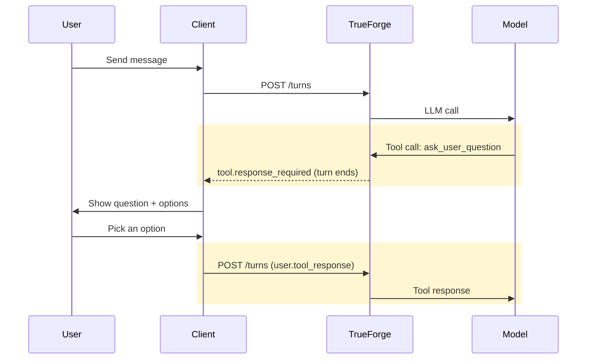

Agents often hit decision points where they cannot make a safe assumption — which environment to deploy to, which of three matching resources the user meant, what an ambiguous required field should be set to. Without a way to ask, the agent either guesses (and gets it wrong) or stalls with a free-form question the UI cannot render as a first-class action.

Ask User Questions lets the harness pause the agent, surface a structured multiple-choice prompt to the user, and resume the run with the chosen answer. It is **enabled by default**.

## How it works

TrueForge registers `ask_user_question` as a **client-side tool** — the server never executes it. When the agent calls it, the harness emits `tool.response_required`, finishes the turn (with the pending question in `state.required_actions`), and waits for your application to collect the user's choice and resume with a new turn containing a `user.tool_response` input.



The user selects one of the listed options or types a free-form answer. The agent receives the response as a regular tool result and continues from where it paused. The bundled chat UI renders questions and options natively.

<Frame caption="The chat UI renders the question and its options as a selectable card.">
  
</Frame>

<Note>
  Only the root agent can call `ask_user_question`. [Subagents](/context-engineering/subagents) must resolve ambiguity
  from the context the root agent provides them.
</Note>

## Example

A user asks the agent to _"create a new environment called `testing-1`"_, but the underlying tool requires fields the user never specified. Instead of inventing values, the agent asks:

```json ask_user_question — tool call
{
  "question": "Should this environment be a production environment?",
  "options": ["Yes — mark it as Production", "No — keep it as Non-production"]
}
```

Once the user answers, the agent asks the next required field or proceeds to the actual tool call — turning an ambiguous request into a deterministic, auditable sequence of decisions.

## Handling questions from the API

The `tool.response_required` event references the pending tool call:

```json
{
  "type": "tool.response_required",
  "thread_id": "main",
  "tool_calls": [{ "id": "call-q-01", "source_event_id": "msg-a4" }]
}
```

The question and options are in the tool call's arguments on the referenced `model.message` event (`source_event_id`). Resume with the answer:

```json
{
  "input": [
    {
      "type": "user.tool_response",
      "thread_id": "main",
      "tool_call_id": "call-q-01",
      "content": "No — keep it as Non-production"
    }
  ]
}
```

Turns in the same session chain automatically (`previous_turn_id` defaults to `"auto"`), so the agent picks up exactly where it paused.

## When to use it

Use `ask_user_question` when the agent genuinely cannot proceed without a user decision and the answer comes from a small, enumerable set:

- Choosing a target environment, cluster, account, or workspace
- Disambiguating between multiple matches ("I found 3 services named `api`, which one?")
- Resolving required tool-call fields the user did not specify (booleans, enums, modes)
- Picking between alternative strategies before a destructive or expensive operation

<Note>
  Skip it for decisions the agent can confidently infer from context, conversation history, or sensible defaults. Asking
  too often turns the agent into a form and breaks autonomy.
</Note>

## Disabling

Set `config.ask_user_questions.enabled: false` on the agent. See [`config.ask_user_questions`](/api/agent-spec#config) in the agent spec reference.
