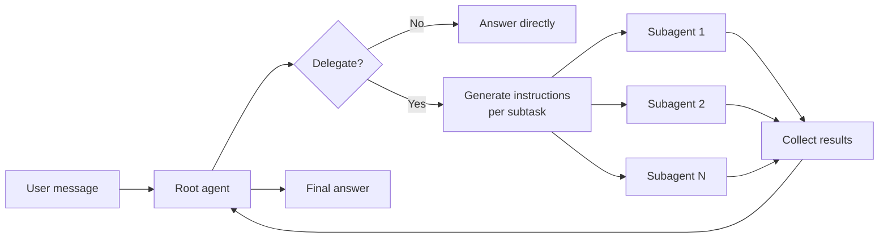

When a task involves gathering or processing information from multiple sources, a single agent can quickly fill its context window with intermediate tool calls and results. TrueForge solves this with **subagents** — lightweight, isolated agent runs that handle focused subtasks in parallel and return only their final results to the root agent. Dynamic subagents are **enabled by default**.

The root agent stays focused on high-level coordination. Subagents do the heavy lifting.

## Why subagents?

Subagents solve the **context bloat problem**. When an agent uses tools with large outputs — API responses, search results, file contents — the context window fills up with intermediate data that is only needed temporarily. As the context grows, the agent becomes slower, more expensive, and more prone to errors.

Consider a task: _"Summarize the recent pull requests for every member of my team."_

<Tabs>
  <Tab title="Without subagents">
    1. The agent looks up members of the team.
    2. It works on each member **one by one**, fetching pull requests and summarizing each.
    3. All intermediate tool calls and results stay in the context window.
    4. The agent has to reason over a large, cluttered context to produce the final answer.
    5. The bloat carries over to future turns in the session.
  </Tab>
  <Tab title="With subagents">
    1. The agent looks up members of the team.
    2. It creates a subagent **per team member** — they run in parallel.
    3. Each subagent fetches pull requests and produces a summary independently.
    4. Subagents return only their summaries to the root agent.
    5. The root agent combines the summaries — the raw data never enters its context.
  </Tab>
</Tabs>

**When subagents help most:**

- Multi-step research across several entities (users, repos, services) that can run in parallel
- Tasks where intermediate tool output is large but the final answer is a summary
- Work that benefits from isolation — each subtask gets a clean context to reason in

## How it works

The root agent decides at runtime whether to delegate. When it does, it calls the built-in `create_sub_agent` tool with focused, generated instructions for each subtask, spawns the subagents, and waits for their results.



<Note>
  - **Shared tools and sandbox** — subagents have access to the same MCP tools and sandbox environment as the root
  agent. - **No user interaction** — subagents cannot ask the user questions. Only the root agent talks to the user.
  Subagent tool calls that require [approval](/human-in-the-loop) still pause for the user, though. - **No nesting** —
  subagents cannot create other subagents. Delegation is one level deep. - **Parallel execution** — multiple subagents
  run concurrently. The root agent waits for all of them before continuing.
</Note>

## Following subagents in the event stream

Every execution — root and subagent — runs in its own **thread**, identified by a `thread_id` on each event. The root agent is always `"main"`. Subagent lifecycle is marked by two events:

```json thread.created
{
  "type": "thread.created",
  "thread_id": "th-9f31",
  "title": "bob-prs",
  "parent": { "thread_id": "main", "tool_call_id": "call-sub-01" },
  "agent_info": { "type": "dynamic", "name": "bob-prs", "input": "Search for pull requests merged by..." }
}
```

```json thread.done
{
  "type": "thread.done",
  "thread_id": "th-9f31",
  "title": "bob-prs",
  "state": { "status": "done", "output": { "type": "model.message", "content": "Bob merged 2 PRs..." } }
}
```

Between the two, the subagent's own `model.message`, `tool.response`, and other events stream with its `thread_id` — so a client can render each subagent as its own collapsible trace while the root agent's events keep flowing on `"main"`. The bundled chat UI does exactly this.

<Frame caption="The chat UI renders each subagent as its own collapsible trace as they run in parallel.">
  
</Frame>

See [Turn events](/api/turn-events#thread-created) for the full schemas.

## Disabling

Set `config.dynamic_sub_agents.enabled: false` on the agent. See [`config.dynamic_sub_agents`](/api/agent-spec#config) in the agent spec reference.
