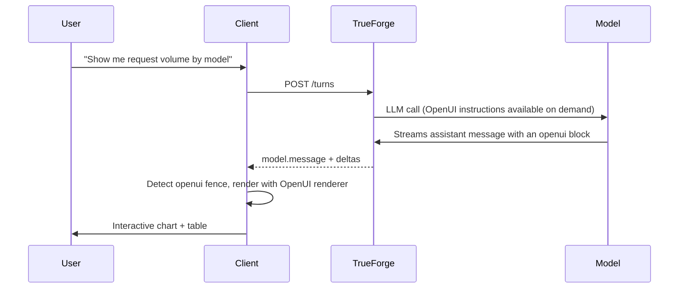

Plain text and markdown work for short answers, but they fall flat the moment an agent needs to show a dashboard, compare metrics, render a sortable table, or guide a user through a form. Users end up squinting at walls of numbers when a single chart would have told the story in seconds.

**Generative UI** lets your agent respond with real, interactive components — charts, tables, cards, forms, layouts — that the client renders as actual React UI. The agent decides _what_ to show; the harness ships it in a standard format your renderer turns into pixels. It is **enabled by default**, and the bundled chat UI renders it out of the box.

## How it works

Generative UI is **not** a separate tool call. The agent writes a small, streaming-friendly snippet inside its normal assistant message, and the client renders it on the fly as tokens arrive.

Under the hood, this uses [OpenUI](https://www.openui.com/) — an open standard for agent-generated UI:

- **OpenUI Lang** — a compact, streaming-first language for describing UI, far more token-efficient than equivalent JSON.
- **Component library** — built-in charts, tables, forms, cards, and layouts, extensible with your own design system.
- **Streaming renderer** — parses and renders UI progressively in React as the response streams in.
- **Safe by default** — no arbitrary code execution. The agent can only emit components the renderer has registered.

When `config.generative_ui.enabled` is true, the harness exposes the OpenUI authoring instructions to the agent (loaded on demand via a `get_openui_instructions` tool, so they cost no context until the agent decides to render UI). The stream uses normal [`model.message`](/api/turn-events#model-message) events and deltas — the only difference is that some message content contains an ` ```openui ` fenced block that the client extracts and renders as React components.



## Example

<Steps>
<Step title="User" noAnchor>
  Show me a dashboard comparing request volume and error rate across my three production models.
</Step>

<Step title="Assistant" noAnchor>
  I will summarize the model traffic visually.

```openui
root = Stack([title, cards, chart, table])
title = TextContent("Production Model Health", "large-heavy")
cards = Stack([totalCard, errorCard], "row", "m", "stretch")
totalCard = Card([TextContent("Total requests", "small"), TextContent("2,630", "large-heavy")])
errorCard = Card([TextContent("Average error rate", "small"), TextContent("1.8%", "large-heavy")])
chart = BarChart(models, [requests], "grouped", "Model", "Requests")
table = Table([Col("Model", models), Col("Requests", requestValues, "number"), Col("Error rate", errorRates)])
models = ["gpt-4.1", "claude-sonnet", "llama-3.1"]
requestValues = [1240, 980, 410]
errorRates = ["1.2%", "2.1%", "2.5%"]
requests = Series("Requests", requestValues)
```

The highest traffic is on `gpt-4.1`, while `llama-3.1` has the highest error rate despite lower volume.

</Step>
</Steps>

The renderer turns the snippet above into a full dashboard — summary cards on top, a grouped bar chart in the middle, and a sortable data table at the bottom — all real React components, not markdown.

## Available components

The OpenUI built-in library covers the patterns most agents need:

| Category   | Components                                    |
| ---------- | --------------------------------------------- |
| **Layout** | `Stack`, `Card`, `Tabs`, `Accordion`          |
| **Text**   | `TextContent`, `Markdown`                     |
| **Data**   | `Table`, `Col`                                |
| **Charts** | `BarChart`, `LineChart`, `PieChart`, `Series` |
| **Input**  | `TextInput`, `Select`, `Button`, `Form`       |
| **Media**  | `Image`, `Link`                               |

Building your own client? Register custom components with `defineComponent` and `createLibrary` from `@openuidev/react-lang`. The agent will only ever emit components that are registered — it cannot generate arbitrary HTML or code.

## When to use it

| Use case            | What the agent renders                                          |
| ------------------- | --------------------------------------------------------------- |
| **Dashboards**      | KPI cards, charts, and tables for metrics and comparisons       |
| **Tables**          | Sortable structured data — logs, resources, results to scan     |
| **Charts**          | Bar, line, and pie charts that show patterns faster than prose  |
| **Cards & layouts** | Summary panels, multi-section reports, side-by-side comparisons |
| **Forms**           | Inputs, dropdowns, and selections that guide the next action    |

<Note>
  Skip Generative UI for simple answers where markdown is enough — a short explanation, a bullet list, a code block.
  Generative UI is also not a replacement for server-side actions: if a UI button needs to trigger a follow-up, the
  client sends that back as a normal user message in the next turn.
</Note>

## Disabling

Set `config.generative_ui.enabled: false` on the agent. See [`config.generative_ui`](/api/agent-spec#config) in the agent spec reference.
