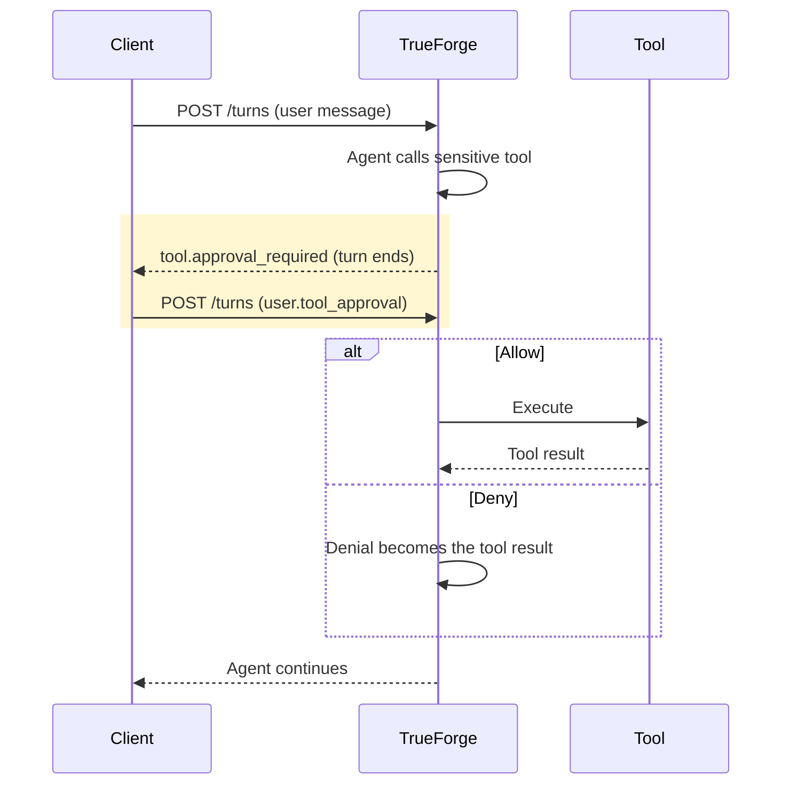

Some agent actions — deploying to production, restarting a service, deleting data — should not happen without explicit user consent. Human in the Loop lets the harness pause the agent before a sensitive tool call, surface the tool name and arguments to the user, and resume only after an approval decision.

This keeps the agent autonomous for safe operations while giving users a checkpoint before anything destructive or irreversible runs.

## Which tools require approval

Approval policy is set per MCP server on the agent spec via [`require_approval_for_tools`](/api/agent-spec#mcp_servers). The default is `["@write", "@destructive"]` — any tool that the MCP server does not mark as read-only, or marks as destructive, pauses for approval out of the box. You can also list literal tool names, or use `@all` to gate every tool.

```json
{
  "mcp_servers": [
    {
      "name": "orders-api",
      "require_approval_for_tools": ["process_refund"]
    }
  ]
}
```

## How it works

When the agent requests a tool call that requires approval, the harness does not execute the tool. Instead, it emits `tool.approval_required`, finishes the current turn (with the pending approval in `state.required_actions`), and waits. Resume by starting a new turn in the same session with a `user.tool_approval` input for each pending tool call.



<Info>
  Subagents can also request approval. When a subagent's tool call requires approval, the harness finishes the current
  turn and emits `tool.approval_required` with that subagent's `thread_id`. Sending a `user.tool_approval` in the next
  turn resumes the subagent from where it paused.
</Info>

## Approving or denying from the API

The `tool.approval_required` event references the pending tool calls:

```json
{
  "type": "tool.approval_required",
  "thread_id": "main",
  "tool_calls": [{ "id": "call-refund-01", "source_event_id": "msg-b2" }]
}
```

Resume with a new turn whose input carries the decision:

```json
{
  "input": [
    {
      "type": "user.tool_approval",
      "thread_id": "main",
      "tool_call_id": "call-refund-01",
      "approval": { "status": "allow" }
    }
  ]
}
```

To deny, send `{ "status": "deny", "reason": "..." }` — the agent receives the denial (and your reason) as the tool result and can adjust its plan instead of failing.

The bundled chat UI handles all of this automatically: it pauses the run, shows the tool name and request payload with **Approve / Deny** buttons, and resumes on your decision.

## When to use approvals

Use approvals for tool calls that change state, are irreversible, or affect production — mutating data, modifying infrastructure, sending external communications, or triggering expensive operations. The `@write` / `@destructive` defaults cover this when the MCP server annotates its tools correctly.

<Note>
  Skip approvals for safe read-only tools — listing resources, fetching metrics, searching docs — where confirmation
  adds friction without reducing risk. Those are excluded by default.
</Note>

<Info>
  Approvals do not replace authorization. The user still needs whatever access the underlying tool requires; approval
  only controls whether the pending tool call should proceed.
</Info>
