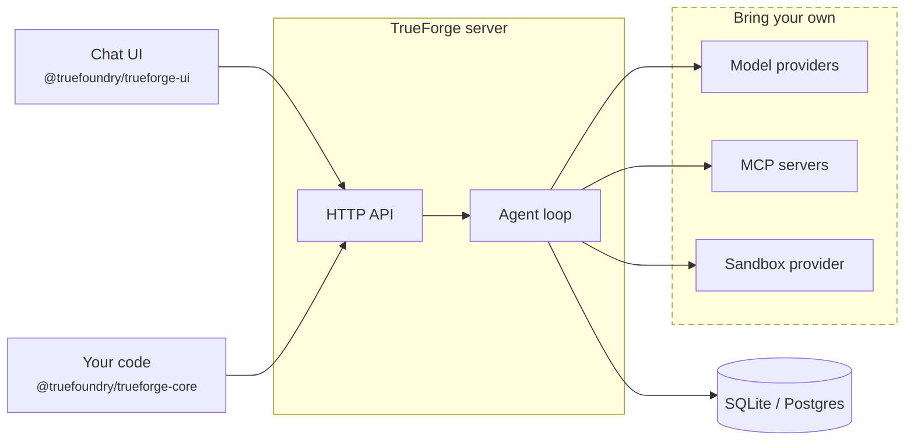

## What is an agent harness?

An agent harness is the runtime layer around an LLM that turns it into a reliable, long-running agent. Instead of only generating text, the harness runs the full execution loop — planning, tool routing and execution, context management for long tasks, security boundaries like sandboxing and human-in-the-loop approvals, and session state that survives reconnects and restarts.

<Frame caption="The harness orchestrates the agent run, connecting the model, tools, sandbox, and approvals to deliver a safe, reliable result">
  
</Frame>

## What is TrueForge?

TrueForge is an **open-source agent harness** with three parts: a **core server** that runs the agent loop, an **HTTP API** (with a TypeScript SDK) to drive it from code, and a **chat UI** (with a React UI SDK) to drive it from the browser.

<Frame caption="The bundled chat UI — streaming responses, an expandable agent-steps panel, and tool calls.">
  
</Frame>

### Key Components 

### Core server

Runs the agent loop. When a user sends a message, the server:

- Plans the turn, calls the model, and executes tools — streaming every step back
- Pauses for [human approval](/human-in-the-loop) on sensitive actions
- Keeps context lean on long tasks with [context engineering](/context-engineering/overview)
- Persists sessions, so conversations survive reconnects and restarts

The services the loop talks to — [model providers](/models), [MCP servers](/mcp-servers), the [sandbox provider](/sandbox) — are **bring your own**: you configure them, TrueForge orchestrates them.

<Note>
  Many harnesses run the agent *inside* a sandbox. TrueForge treats the **sandbox as a tool**: one is provisioned only
  when the agent actually needs to execute code. That's why one server can run many agents concurrently, and why turns
  that don't need code execution are cheaper and faster.
</Note>

### HTTP API + TypeScript SDK

Everything the server does is exposed as an API, so anything you see in the UI you can automate:

- REST + Server-Sent Events, with an OpenAPI spec and interactive docs at `/api/v1/docs`
- A TypeScript SDK (`@truefoundry/trueforge-core`) to create and call agents from your own code

See the [API overview](/api/overview).

### Chat UI + UI SDK

A ready-made interface for the agents you create:

- Browse your agents, chat with them, and manage models, MCP servers, skills, and sandbox settings
- Bundled with the server and served on the same port — nothing extra to deploy
- Also published as a customizable [UI SDK](/ui-sdk/index) (`@truefoundry/trueforge-ui`): theme it to your organization and launch your own Claude Desktop-like interface, backed by your TrueForge server

## Two ways to run it

The agent features are identical in both modes — only the backend around the server changes. The [Quickstart](/quickstart) has run instructions for each.

### Local mode — a personal productivity tool

Like Claude Desktop, but on your terms: one process on your machine, started with `npx @truefoundry/trueforge`.

- UI and backend run locally; sessions are stored in a local SQLite file
- No database server, Redis, or other infrastructure to set up

### Hosted mode — a shared deployment for your team

Like Claude's managed agents: one deployment the whole company uses, via Docker Compose or the Helm chart.

- Multiple server replicas run behind a load balancer
- **Postgres** replaces SQLite as durable storage shared by all replicas
- **Redis** peers the replicas — it hands off turn event streams and cancellation signals, so a client can reconnect to any replica and still resume a turn running on another one

## Capabilities

<CardGroup cols={3}>
  <Card title="Models" icon="brain" href="/models">
    OpenAI, Anthropic, Google Gemini, and any OpenAI-compatible provider. Configure once, switch per agent.
  </Card>
  <Card title="MCP Servers" icon="plug" href="/mcp-servers">
    Connect remote MCP servers with header auth or OAuth (dynamic client registration), including in-chat authorization.
  </Card>
  <Card title="Skills" icon="book" href="/skills">
    Git-backed `SKILL.md` instruction packs, mounted into the sandbox and loaded on demand.
  </Card>
  <Card title="Sandbox" icon="cube" href="/sandbox">
    An isolated execution environment for code, files, and shell commands — provisioned only when the agent needs one.
  </Card>
  <Card title="Context Engineering" icon="layer-group" href="/context-engineering/overview">
    Subagents, deferred tool loading, code mode, large-result offloading, and compaction — keep context lean
    automatically.
  </Card>
  <Card title="Human in the Loop" icon="shield-check" href="/human-in-the-loop">
    Pause sensitive tool calls and require explicit user approval before execution.
  </Card>
  <Card title="Ask User Questions" icon="message-question" href="/ask-user-questions">
    Let the agent request clarification or pick between options during a run.
  </Card>
  <Card title="Generative UI" icon="sparkles" href="/generative-ui">
    Stream structured UI blocks the client can render as cards, tables, and charts.
  </Card>
</CardGroup>

## Start building

<CardGroup cols={3}>
  <Card title="Quickstart" icon="rocket" href="/quickstart">
    Run TrueForge with one command, configure a model provider, and start chatting.
  </Card>
  <Card title="Use the API" icon="code" href="/api/overview">
    Create sessions, stream turn events, and integrate TrueForge into your application.
  </Card>
  <Card title="Build with the UI SDK" icon="palette" href="/ui-sdk/index">
    Embed and customize the chat experience in your own React application.
  </Card>
</CardGroup>
