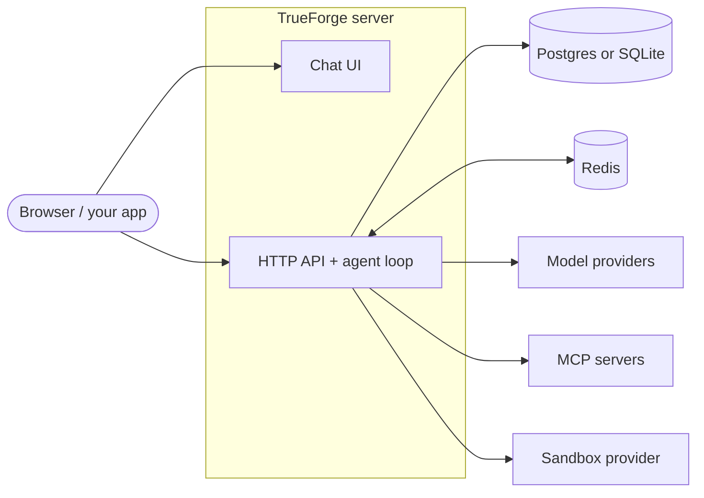

## What is an agent harness?

An agent harness is the runtime layer around an LLM that turns it into a reliable, long-running agent.

Instead of only generating text, the harness manages the full execution loop: planning, tool calling, context management, approvals, state, and streaming.

Most production harnesses include:

- An orchestration loop (`plan -> act -> observe -> continue/stop`)
- Tool routing and execution (for APIs, MCP tools, and code)
- Memory and context controls for long-running tasks
- Security boundaries (sandboxing, credentials, permissions)
- Human-in-the-loop gates for sensitive actions
- Session state that survives reconnects and restarts

<Frame caption="The harness orchestrates the agent run, connecting the model, tools, sandbox, and approvals to deliver a safe, reliable result">
  
</Frame>

## What is TrueForge?

TrueForge is an **open-source agent harness**. It runs the agent execution loop — model calls, tool use, context, and session state — and exposes the result three ways:

- A **chat UI**, bundled into the server and served on the same port
- An **HTTP API** (REST + Server-Sent Events) with an OpenAPI spec
- A **TypeScript library** (`@truefoundry/trueforge-core`) for embedding the agent core in your own application

You choose a model, connect MCP servers, add skills, and write instructions. TrueForge handles orchestration, tool execution, sandbox lifecycle, approvals, and streaming.

It scales down and up: run a single process backed by SQLite with `npx @truefoundry/trueforge`, or run multiple replicas backed by Postgres and Redis behind a load balancer.

<Frame caption="The bundled chat UI — streaming responses, an expandable agent-steps panel, and tool calls.">
  
</Frame>

## Capabilities

<CardGroup cols={2}>
  <Card title="Models" icon="brain" href="/models">
    OpenAI, Anthropic, Google Gemini, and any OpenAI-compatible provider. Configure once, switch per agent.
  </Card>
  <Card title="MCP Servers" icon="plug" href="/mcp-servers">
    Connect remote MCP servers with header auth or OAuth (dynamic client registration), including in-chat authorization.
  </Card>
  <Card title="Skills" icon="book" href="/skills">
    Git-backed `SKILL.md` instruction packs, mounted into the sandbox and loaded on demand.
  </Card>
  <Card title="Sandbox" icon="cube" href="/sandbox">
    An isolated execution environment for code, files, and shell commands — provisioned only when the agent needs one.
  </Card>
  <Card title="Context Engineering" icon="layer-group" href="/context-engineering/overview">
    Subagents, deferred tool loading, code mode, large-result offloading, and compaction — keep context lean
    automatically.
  </Card>
  <Card title="Human in the Loop" icon="shield-check" href="/human-in-the-loop">
    Pause sensitive tool calls and require explicit user approval before execution.
  </Card>
  <Card title="Ask User Questions" icon="message-question" href="/ask-user-questions">
    Let the agent request clarification or pick between options during a run.
  </Card>
  <Card title="Generative UI" icon="sparkles" href="/generative-ui">
    Stream structured UI blocks the client can render as cards, tables, and charts.
  </Card>
</CardGroup>

## Architecture

TrueForge is a single server process (or several peered replicas) plus a database — and Redis when you run more than one replica.

| Component             | Role                                                                                                |
| --------------------- | --------------------------------------------------------------------------------------------------- |
| **Chat UI**           | React chat interface, bundled into the server image and served on the same port as the API.         |
| **Server**            | Node.js server: the agent execution loop, sessions, turns, streaming, settings, and OpenAPI docs.   |
| **Postgres / SQLite** | Session, turn, and settings storage. SQLite in standalone mode; Postgres for multi-replica.         |
| **Redis**             | Cross-replica peering (turn cancellation and stream handoff). Only needed when running > 1 replica. |
| **Sandbox provider**  | Remote isolated compute for code execution and skills. Optional — enable it per agent.              |

## Core concepts

Interaction with an agent follows a strict hierarchy: **one Agent → many Sessions → many Turns → many Events**.

<Frame caption="One agent serves many sessions; each session has many turns; each turn emits many events.">
  
</Frame>

| Concept     | What it is                                                                                                            |
| ----------- | --------------------------------------------------------------------------------------------------------------------- |
| **Agent**   | A saved definition — model, instructions, MCP servers, skills, and runtime config. See [Agent spec](/api/agent-spec). |
| **Session** | One conversation with an agent. Turns in a session chain together, so the agent remembers earlier context.            |
| **Turn**    | One request/response boundary — a user message, an approval decision, or an answer to an agent question.              |
| **Event**   | A JSON object streamed while a turn runs: model output, tool responses, approval requests, subagent lifecycle.        |

See the [API overview](/api/overview) for the full lifecycle with examples.

## Start building

<CardGroup cols={2}>
  <Card title="Quickstart" icon="rocket" href="/quickstart">
    Run TrueForge with one command, configure a model provider, and start chatting.
  </Card>
  <Card title="Use the API" icon="code" href="/api/overview">
    Create sessions, stream turn events, and integrate TrueForge into your application.
  </Card>
</CardGroup>
