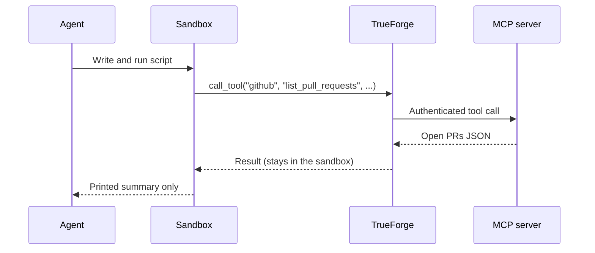

## Why Code Mode?

When an agent uses tools the standard way, every tool call is a separate round-trip with the model: the agent calls one MCP tool, the full JSON response enters the conversation, the model reasons over that JSON, then it calls the next tool — copying IDs and computing counts in prose along the way. For tasks that involve aggregating tool output, or chaining several calls together, this approach is slow, fills the context window with intermediate JSON the user doesn't care about, and is prone to small errors like miscounts and typoed IDs.

Take a common task: _"How many open PRs does each contributor have on this repo?"_ The user only cares about a small summary table, but the underlying GitHub tool returns a full record per PR — title, labels, reviewers, timestamps, and more. Without Code Mode, every one of those records lands in context and the model has to count from prose. With Code Mode, the agent calls the same tool inside a script, counts the author logins in code, and prints only the table.

## What is Code Mode?

Code Mode collapses tool round-trips into a single script. Using the [sandbox](/sandbox), the agent writes Python that calls MCP tools through an in-sandbox MCP client (`mcp_client`), processes the responses in code, and prints only what the user actually needs:

```python
import asyncio
from collections import Counter
from mcp_client import call_tool

async def main():
    result = await call_tool(
        "github",
        "list_pull_requests",
        body={"owner": "your-org", "repo": "your-repo", "state": "open"},
    )
    prs = result.get("pull_requests", [])
    counts = Counter(pr["user"]["login"] for pr in prs)

    print(f"Open PRs: {len(prs)}\n")
    for login, count in counts.most_common():
        print(f"{login:<24} {count:>4}")

asyncio.run(main())
```

The script runs in the sandbox, but the MCP tool calls are **bridged back to the harness**, which applies the stored server credentials — the sandbox never holds tokens:



Code Mode is available whenever the agent's [sandbox](/sandbox) is enabled. The agent decides at runtime whether a task is worth running in code or whether a single direct tool call is enough. Before writing a script, it can call [`get_tool_output_schema`](/key-features/deferred-tool-loading#how-it-works) so it knows the exact shape of a tool's response instead of guessing keys from raw JSON.

<Note>
  [Approval policies](/create-agent/overview#whats-in-an-agent) still apply in Code Mode — a script that calls a tool matching
  `require_approval_for_tools` pauses for user approval just like a direct tool call.
</Note>

## When the agent uses Code Mode

Code Mode wins whenever running the work in code is materially better than reasoning over raw JSON in chat:

### Aggregate or format tool output

Counts, group-bys, sums, filters, or formatted tables over a tool response.

|                 | With Code Mode                                                              | Without Code Mode                                                            |
| --------------- | --------------------------------------------------------------------------- | ---------------------------------------------------------------------------- |
| **Approach**    | Call the tool inside a script, group in code, print only the summary table. | Full tool response enters the conversation; the model counts from prose.     |
| **Cost**        | Only the summary reaches the model — minimal tokens.                        | Dozens of records sit in context even though the user only asked for counts. |
| **Reliability** | Counts are computed by code, so they are exact.                             | Group-by and count tasks are hallucination-prone when done from prose.       |

### Chain tool calls

One tool's output feeds another tool's input — for example, resolving an entity's ID before fetching its details.

|                 | With Code Mode                                      | Without Code Mode                                                          |
| --------------- | --------------------------------------------------- | -------------------------------------------------------------------------- |
| **Approach**    | Both calls in one script; IDs flow inside the code. | Call the first tool, wait for a model turn, copy IDs into the second call. |
| **Cost**        | The intermediate response stays in the sandbox.     | The full intermediate response sits in the conversation.                   |
| **Latency**     | One model turn covers both tool calls.              | Each hop needs another model call in between.                              |
| **Reliability** | No copy-paste — no typoed IDs.                      | The model can typo an ID or pick the wrong record from a long list.        |

```python
import asyncio
from mcp_client import call_tool

async def main():
    apps = await call_tool("platform", "list_applications",
                           body={"name": "my-app"})
    app = apps["data"][0]

    charts = await call_tool("platform", "list_app_metric_charts",
                             body={"application_id": app["id"]})

    print(f"{app['name']}: {len(charts['graphs'])} metric charts")
    for g in charts["graphs"]:
        print(f"- {g['name']} ({g['chartType']})")

asyncio.run(main())
```

Only the printed lines enter the agent's context — the two full JSON payloads never do.
