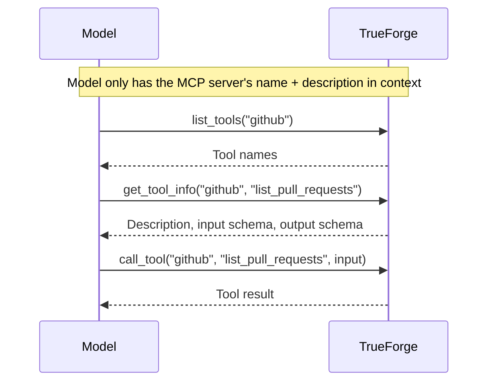

When an agent is connected to many MCP servers, each with dozens of tools, the full set of tool definitions can consume a large portion of the context window before the user even sends a message. The `preload` setting on each MCP server entry controls whether those definitions are loaded upfront or discovered on demand.

By default, **`preload` is `false`** — the agent only sees each MCP server's name and description at startup and loads individual tool schemas as needed. This keeps the context window lean while still giving the agent access to the full breadth of tools.

## Set it in the composer

Each connector in the **Save Agent** dialog has a book-icon **preload toggle** — off by default. Hover it to see the tradeoff, click to switch it on.

<Columns cols={2}>
  <Frame caption="Off (default) — tools are discovered on demand.">
    
  </Frame>
  <Frame caption="On — tool definitions load into context upfront.">
    
  </Frame>
</Columns>

## The problem

- Each tool definition — name, description, input schema, output schema — consumes tokens from the available context window.
- With many MCP servers and tools, the context window can fill up before any user interaction happens.
- Most interactions only need a small subset of the available tools.

<Frame caption="Deferring tool loading keeps the agent's context window lean">
  
</Frame>

## How it works

| `preload`         | Behavior                                                                                                     | Best for                                                     |
| ----------------- | ------------------------------------------------------------------------------------------------------------ | ------------------------------------------------------------ |
| `false` (default) | Only the server's name and description are in context. Tool schemas are discovered on demand via meta tools. | Large tool catalogs, servers used only occasionally          |
| `true`            | Full tool definitions are loaded into context at startup.                                                    | Small, frequently-used servers where every turn calls a tool |

When `preload` is off, the harness exposes four **meta tools** instead of the individual tool definitions:

| Meta tool                | Purpose                                                                                        |
| ------------------------ | ---------------------------------------------------------------------------------------------- |
| `list_tools`             | List the tool names available on an MCP server                                                 |
| `get_tool_info`          | Fetch a tool's description and input/output schema                                             |
| `get_tool_output_schema` | Fetch just the output schema — used before [Code Mode](/key-features/code-mode) scripts |
| `call_tool`              | Invoke a tool on a server by name                                                              |



The extra discovery round-trips only happen the first time a tool is needed — and they are far cheaper than carrying every schema in context on every model call.

## Selective preloading

You don't have to choose all-or-nothing. `preload_tools` eagerly loads specific tools while the rest of the server stays deferred:

```json
{
  "mcp_servers": [
    {
      "name": "github",
      "preload": false,
      "preload_tools": ["search_pull_requests"]
    }
  ]
}
```

This is useful when one or two tools are used on almost every run but the server exposes dozens more.

## Example

An agent has `internal-platform-mcp` (100+ tools, `preload: false`) and `web_search` (2 tools, `preload: true`) attached. The user asks a question that needs a platform lookup:

1. The agent calls `list_tools("internal-platform-mcp")` and gets back the tool names.
2. It calls `get_tool_info("internal-platform-mcp", "list_applications")` for the schema of the one tool it needs.
3. It calls `call_tool("internal-platform-mcp", "list_applications", {...})` and gets the result.
4. The `web_search` tools were preloaded, so it can call them directly with no discovery step.

Only the schemas the agent actually needed ever entered context.
