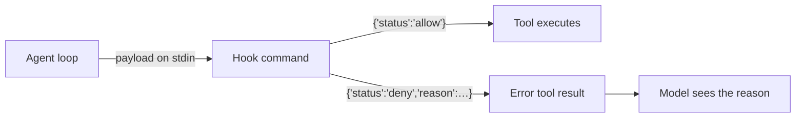

## Why

- Teams often need an **external system** in the agent loop: security scanners that inspect tool calls, policy engines that veto destructive actions, audit pipelines that record what agents did.
- [Tool approval](/create-agent/overview#whats-in-an-agent) covers the human checkpoint; hooks cover the **programmatic** one — no UI round-trip, no per-agent configuration, and the decision logic lives outside TrueForge.

Hooks are **off by default**. They are enabled by an operator-owned `hooks.json` file on the server host — not by agents, sessions, or API callers.

## How it works



At startup TrueForge reads `hooks.json` (see [Configuration](#configuration)). For each configured event, every entry runs as a **shell command**: the event payload arrives as one JSON document on stdin, and the command reports a decision on stdout. For the blocking events, entries run sequentially and the first deny wins; for the observational events, every entry runs regardless of individual outcomes.

| Event | Fires | Can block? |
| --- | --- | --- |
| `user_prompt_submit` | Before a turn is created from user text — user messages and answers to clarifying questions (client-side tools like ask_user_question) | Yes — the turn is rejected with the hook's reason |
| `pre_tool_use` | Before every tool call (MCP tools, sandbox, system tools, subagent spawns, deferred tools — both the `call_tool` meta-invocation and the resolved call by its real name — and MCP calls bridged from Code Mode scripts) | Yes — the call never executes; the model sees an error tool result with the reason |
| `post_tool_use` | After each executed tool call, with the raw result | No — observational |
| `turn_done` | After a turn reaches a terminal state (best-effort, off the response path — a slow command never delays the stream; a termination written by crash-recovery cancellation is not observed) | No — observational |

`pre_tool_use` runs on every call attempt, including the attempt that pauses for [tool approval](/create-agent/overview#whats-in-an-agent) and the re-attempt after the user approves — a hook deny overrides a user approval. A user-denied call executes nothing and is not hooked. Hooks apply to subagent threads the same as the root thread.

## Decision contract

A hook command reports its decision through its exit code and stdout:

| Outcome | Meaning |
| --- | --- |
| exit `0`, empty stdout | Allow |
| exit `0`, stdout `{"status":"allow"}` | Allow |
| exit `0`, stdout `{"status":"deny","reason":"…"}` | Deny with reason |
| exit `2` | Deny; trimmed stderr is the reason |
| any other exit, timeout, or unparseable stdout | The entry's `fail_mode`: `open` = allow (default), `closed` = deny |

## Payloads

Every payload carries `hook_event_name`, `session_id`, and `turn_id`, plus per-event fields:

```json
{
  "hook_event_name": "pre_tool_use",
  "session_id": "0199…",
  "turn_id": "01k2….local",
  "tool_name": "delete_repository",
  "tool_input": { "name": "prod-infra" }
}
```

- `user_prompt_submit` adds `prompt` (the joined user-message text — empty for a file/image-only message) and `input` (the raw input items, which carry any file parts).
- `post_tool_use` adds `tool_response` (the raw MCP result content, before any [large-response offloading](/key-features/large-tool-responses)) and `is_error`.
- `turn_done` adds `status` (`done`, `cancelled`, or `error`).

## Configuration

Hooks are configured in a JSON file read once at startup (edits require a restart). The default location follows the platform config directory — macOS `~/Library/Preferences/trueforge/hooks.json`, Linux `~/.config/trueforge/hooks.json`, Windows `%APPDATA%\trueforge\Config\hooks.json` — and `TRUEFORGE_HOOKS_PATH` overrides it. A file absent from the default location disables hooks; a missing file at an explicitly set `TRUEFORGE_HOOKS_PATH`, or an invalid file anywhere, fails startup.

```json
{
  "version": 1,
  "hooks": {
    "pre_tool_use": [
      {
        "type": "command",
        "command": "/usr/local/bin/my-policy-check",
        "timeout_ms": 30000,
        "fail_mode": "open"
      }
    ],
    "turn_done": [{ "type": "command", "command": "/usr/local/bin/my-audit-log" }]
  }
}
```

`timeout_ms` defaults to 30000; `fail_mode` defaults to `open`. On timeout the command is killed together with its process group, and even when the command itself exits in time, any descendants still holding its output pipes are reaped once the budget elapses (on Windows only the direct child can be killed; the decision still resolves per `fail_mode`).

<Warning>
Hook commands are **operator-trusted code running on the harness host** — the same trust level as the server process itself, unlike agent code, which only ever runs in the [sandbox](/sandbox). Only administrators of the machine should be able to write `hooks.json`. In hosted mode, hooks run on whichever replica owns the turn, so the command must exist on every replica image; the feature is primarily designed for [local mode](/quickstart), where the harness runs on your own machine.
</Warning>
