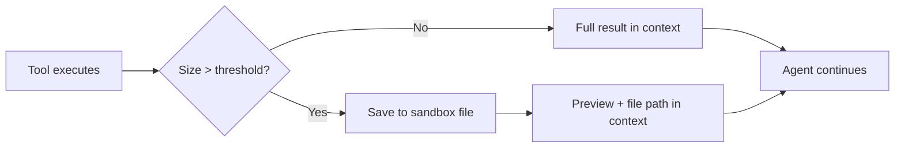

## Why

- An MCP tool call may return a large amount of data, which can quickly fill the available context window.
- The agent may not be able to control how much data a server returns by adjusting tool arguments alone. Fetching a single pull request can still return a very large `description` field.

Large tool response handling is **enabled by default** and requires the agent's [sandbox](/sandbox) to be enabled (the offloaded data is written to a sandbox file).

## How it works



Two complementary thresholds govern when tool responses are written to the sandbox instead of staying in context:

**A single tool response that's too large.** If an individual tool response exceeds the per-call threshold (default **6,000 tokens**), the full result is written to a file in the sandbox and replaced in context with a short preview (default the first and last **100 characters**) plus the file path.

**Parallel tool calls returning together.** When the agent fires several tool calls in parallel, no single response may be over the per-call threshold but their _combined_ size can still flood the context window. If the combined tool-call content exceeds the total threshold (default **10,000 tokens**), the harness offloads responses one at a time — **starting with the largest** — until the total drops below the limit. The smallest responses stay inline and the largest end up on disk.

In every case the offloaded content remains accessible — the agent can read, `grep`, or parse the saved file from the sandbox whenever it needs the original data, typically using [Code Mode](/key-features/code-mode) to extract just the fields it needs.

## Example

<Steps>

<Step title="User" icon={<svg viewBox="0 0 28 28"><rect width="28" height="28" rx="6" fill="#4f46e5"/><circle cx="14" cy="10" r="3.5" fill="#fff"/><path d="M7 23c0-3.3 3.1-6 7-6s7 2.7 7 6" fill="#fff"/></svg>} noAnchor>
  Can you please list the mcp servers I have access to
</Step>

<Step title="Assistant" icon={<svg viewBox="0 0 28 28"><rect width="28" height="28" rx="6" fill="#10b981"/><rect x="8" y="11" width="12" height="10" rx="2" fill="#fff"/><circle cx="12" cy="15" r="1.5" fill="#10b981"/><circle cx="16" cy="15" r="1.5" fill="#10b981"/><rect x="13" y="5" width="2" height="6" rx="1" fill="#fff"/><circle cx="14" cy="4.5" r="1.5" fill="#fff"/></svg>} noAnchor>
  Let me get more information about the user.

  <AccordionGroup>
    <Accordion title="get_me" icon="wrench">
      **Tool Call**
      ```json lines
      {}
      ```

      **Tool Response**
      ```json lines
      {
        "id": "cm1fa35mt009e0trd11v5831p",
        "subjectSlug": "john@example.com",
        ...
      }
      ```
    </Accordion>
  </AccordionGroup>
</Step>

<Step title="Assistant" icon={<svg viewBox="0 0 28 28"><rect width="28" height="28" rx="6" fill="#10b981"/><rect x="8" y="11" width="12" height="10" rx="2" fill="#fff"/><circle cx="12" cy="15" r="1.5" fill="#10b981"/><circle cx="16" cy="15" r="1.5" fill="#10b981"/><rect x="13" y="5" width="2" height="6" rx="1" fill="#fff"/><circle cx="14" cy="4.5" r="1.5" fill="#fff"/></svg>} noAnchor>
  Let me list the MCP servers you have access to.

  <Warning>
  **Tool response blocked** — `list_mcp_servers` returned too much data. The full result was not sent to the model; it was saved to disk and only a preview was returned.
  </Warning>

  <AccordionGroup>
    <Accordion title="list_mcp_servers" icon="wrench" defaultOpen>
      **Tool Call**
      ```json lines
      {
        createdBySubjectSlug: "john@example.com",
      }
      ```

      **Tool Response (blocked)** — Full result saved to `/tmp/tool-id-xyz-output`
      ```
      Use sandbox to read parts of the file or extract data.
      Use sandbox-schema-infer to understand the schema

      Preview (first and last 100 chars):
      {"data":[{"id":"v3sgnimki67gd1do5vkcv9wz","name":"test-realtime-global","fqn":"truefoundry:google-ve ... 51.458Z","updatedAt":"2026-05-19T13:23:46.269Z","createdBy":"john@truefoundry.com"}],"total":180}
      ```
    </Accordion>
  </AccordionGroup>
</Step>

<Step title="Assistant" icon={<svg viewBox="0 0 28 28"><rect width="28" height="28" rx="6" fill="#10b981"/><rect x="8" y="11" width="12" height="10" rx="2" fill="#fff"/><circle cx="12" cy="15" r="1.5" fill="#10b981"/><circle cx="16" cy="15" r="1.5" fill="#10b981"/><rect x="13" y="5" width="2" height="6" rx="1" fill="#fff"/><circle cx="14" cy="4.5" r="1.5" fill="#fff"/></svg>} noAnchor>
  Let me get a preview of the data and print the schema.

  <AccordionGroup>
    <Accordion title="sandbox" icon="cube" defaultOpen>
      **Tool Call**
      ```shell lines
      head -c 200 /tmp/tool-id-xyz-output && echo \"==\" && genson /tmp/tool-id-xyz-output
      ```

      **Tool Response**
      ```text lines
      {"$schema":"http://json-schema.org/schema#","type":"object","properties":{"data":{"type":"array","items":{"type":"object","properties":{"id":{"type":"string"},"name":{"type":"string"},"createdBySubject":{"type":"object","properties":{"subjectSlug":{"type":"string"}},"required":["subjectSlug"]}},"required":["id","name","createdBySubject"]}},"total":{"type":"integer"}},"required":["data","total"]}
      ```
    </Accordion>
  </AccordionGroup>
</Step>

<Step title="Assistant" icon={<svg viewBox="0 0 28 28"><rect width="28" height="28" rx="6" fill="#10b981"/><rect x="8" y="11" width="12" height="10" rx="2" fill="#fff"/><circle cx="12" cy="15" r="1.5" fill="#10b981"/><circle cx="16" cy="15" r="1.5" fill="#10b981"/><rect x="13" y="5" width="2" height="6" rx="1" fill="#fff"/><circle cx="14" cy="4.5" r="1.5" fill="#fff"/></svg>} noAnchor>
  Now I understand the schema of the MCP servers output file. Let me write code to parse the MCP server names.

  <AccordionGroup>
    <Accordion title="sandbox" icon="cube">
      **Tool Call**
      ```shell lines
      cat << 'EOF' > /tmp/parse_mcp_servers.py
      import json
      with open('/tmp/tool-id-xyz-output', 'r') as f:
          data = json.load(f)
          for item in data['data']:
              print(item['name'])
      EOF
      python3 /tmp/parse_mcp_servers.py
      ```

      **Tool Response**
      ```text lines
      test-realtime-global
      slack-mcp
      google-calendar-mcp
      ...
      ```
    </Accordion>
  </AccordionGroup>
</Step>

<Step title="Assistant" icon={<svg viewBox="0 0 28 28"><rect width="28" height="28" rx="6" fill="#10b981"/><rect x="8" y="11" width="12" height="10" rx="2" fill="#fff"/><circle cx="12" cy="15" r="1.5" fill="#10b981"/><circle cx="16" cy="15" r="1.5" fill="#10b981"/><rect x="13" y="5" width="2" height="6" rx="1" fill="#fff"/><circle cx="14" cy="4.5" r="1.5" fill="#fff"/></svg>} noAnchor>
  Hey John, here are the MCP servers you have access to:

  * test-realtime-global
  * slack-mcp
  * google-calendar-mcp
  * ...
</Step>

</Steps>

## Configuration

Turn offloading on or off per agent:

```json
{
  "config": {
    "context_management": {
      "large_tool_response": { "enabled": true }
    }
  }
}
```

The thresholds themselves default to **6,000 tokens** per response, **10,000 tokens** combined, and a **100-character** preview. See [`config.context_management`](/create-agent/overview#config) in the agent spec reference.
