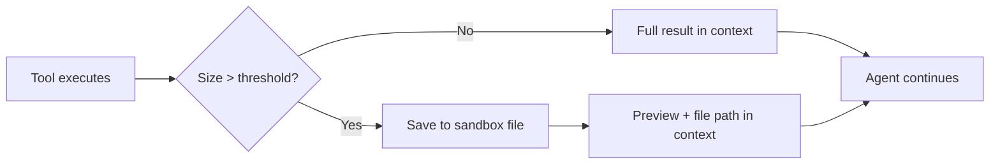

## Why

- An MCP tool call may return a large amount of data, which can quickly fill the available context window.
- The agent may not be able to control how much data a server returns by adjusting tool arguments alone. Fetching a single pull request can still return a very large `description` field.

Large tool response handling is **enabled by default** and requires the agent's [sandbox](/sandbox) to be enabled (the offloaded data is written to a sandbox file).

## How it works



Two complementary thresholds govern when tool responses are written to the sandbox instead of staying in context:

**A single tool response that's too large.** If an individual tool response exceeds the per-call threshold (default **6,000 tokens**), the full result is written to a file in the sandbox and replaced in context with a short preview (default the first and last **100 characters**) plus the file path.

**Parallel tool calls returning together.** When the agent fires several tool calls in parallel, no single response may be over the per-call threshold but their _combined_ size can still flood the context window. If the combined tool-call content exceeds the total threshold (default **10,000 tokens**), the harness offloads responses one at a time — **starting with the largest** — until the total drops below the limit. The smallest responses stay inline and the largest end up on disk.

In every case the offloaded content remains accessible — the agent can read, `grep`, or parse the saved file from the sandbox whenever it needs the original data, typically using [Code Mode](/key-features/code-mode) to extract just the fields it needs.

## Example

1. The user asks: _"List the MCP servers I have access to."_
2. The agent calls `list_mcp_servers`. The response is a 180-item JSON array — far over the threshold. The harness writes it to a sandbox file and returns only a preview:

   ```text
   Tool response too large — full result saved to /tmp/tool-id-xyz-output
   Use the sandbox to read parts of the file or extract data.

   Preview (first and last 100 chars):
   {"data":[{"id":"v3sgnimki67gd1do5vkcv9wz","name":"test-realtime-global", ... "total":180}
   ```

3. The agent inspects the file's structure, then writes a small script to extract just the names:

   ```python
   import json
   with open('/tmp/tool-id-xyz-output') as f:
       data = json.load(f)
   for item in data['data']:
       print(item['name'])
   ```

4. It answers with the list of names. The 180 full records never entered the model's context.

## Configuration

Turn offloading on or off per agent:

```json
{
  "config": {
    "context_management": {
      "large_tool_response": { "enabled": true }
    }
  }
}
```

The thresholds themselves default to **6,000 tokens** per response, **10,000 tokens** combined, and a **100-character** preview. See [`config.context_management`](/create-agent/agent-spec#config) in the agent spec reference.
