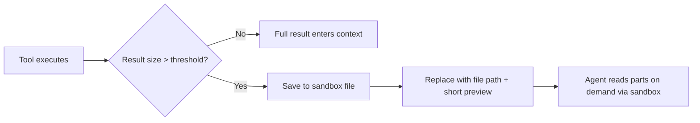
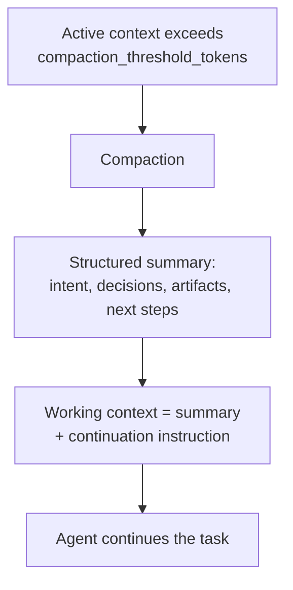

TrueForge is more than model + tools. These harness features keep long agent runs accurate, cheaper, and safer.

| Feature | What it does |
| --- | --- |
| [Sandbox as a tool](/sandbox) | Isolated code/file execution without putting secrets or the agent loop inside the sandbox |
| [Context engineering](#what-is-context-engineering) | Progressive skills, deferred tools, subagents, offloading, Code Mode, compaction |
| [Tool approval](/create-agent/overview#whats-in-an-agent) | Pause before write/destructive MCP tools |
| [Ask clarifying questions](/create-agent/overview#whats-in-an-agent) | Structured clarification mid-run |
| [Generative UI](/create-agent/overview#whats-in-an-agent) | Charts, tables, and cards streamed into chat |
| [In-chat MCP OAuth](/mcp-servers#in-chat-authentication) | Connect button when a connector needs authorization |

## Sandbox as a tool

Unlike harnesses that run the whole agent inside a VM, TrueForge keeps the agent loop on the server and uses the [sandbox](/sandbox) only for code, files, and shell. Secrets stay out of the sandbox; compute is provisioned only when needed. Skills and Code Mode require it.

## What is context engineering?

Context engineering is providing the **right information in the right format** so an agent can finish the job reliably. In TrueForge, _context_ is everything the model sees on each step — instructions, [skills](/skills), [MCP](/mcp-servers) tool definitions, conversation history, and tool results.

Getting that balance wrong hurts quality:

- **Too little context** — the agent lacks what it needs and answers poorly.
- **Too much context** — the window fills with noise, reasoning degrades, and cost/latency climb.

TrueForge manages the balance with layered strategies. Think of context in two phases:

<CardGroup cols={2}>
  <Card title="Input context" icon="upload" href="#input-context">
    Information loaded into the model's context at the **start** of every run. You configure this when you build the
    agent: the instructions, skills, and which MCP servers are available.
  </Card>
  <Card title="Runtime context" icon="bolt" href="#runtime-context">
    Information that accumulates **during the run** as the agent works: user messages, tool calls, tool results,
    subagent outputs. This grows turn by turn and is what the harness actively manages.
  </Card>
</CardGroup>

<Frame caption="Input context is set at startup; runtime context grows turn by turn as the agent loop runs">
  
</Frame>

## Input context

Input context is everything the model receives at the **start** of a run. It is mostly static across runs of the same agent — you configure it once and the harness loads it every time. The smaller and more focused your input context, the more room the model has to reason.

<AccordionGroup>
  <Accordion title="Instructions" icon="message">
    Your `instructions` are the system prompt — plus built-in harness guidance for using the sandbox, subagents, and other enabled capabilities. It is the single biggest lever you control:

    - **Stick to this agent's role** — what it does, who it's for, how it should behave.
    - **Don't duplicate MCP tool docs or skill content** — the harness already injects those.
    - **Move long procedures into skills** — anything that reads like a workflow or playbook belongs in a [skill](/skills), not the instructions.

  </Accordion>

<Accordion title="Skills" icon="book">
  Each attached skill contributes only its `name` and `description` to the input context. The full `SKILL.md` body is
  read from the sandbox on demand when the agent decides the skill is relevant — this is called **progressive
  disclosure**. See [Skills](/skills).
</Accordion>

  <Accordion title="MCP tool definitions" icon="plug">
    Each tool definition — name, description, input schema, output schema — consumes tokens. With many MCP servers each exposing dozens of tools, the schemas alone can fill a large portion of the context window before the user types anything.

    By default (`preload: false`), each attached MCP server contributes only its `name` and `description`; individual tool schemas are discovered on demand. Turn `preload` on only for small, frequently-used servers. See [Deferred tool loading](/key-features/deferred-tool-loading).

  </Accordion>
</AccordionGroup>

## Runtime context

Runtime context is everything added to the model's context **as the run progresses**:

| Source                 | What it is                                                                        |
| ---------------------- | --------------------------------------------------------------------------------- |
| **User messages**      | Whatever the user sends, including follow-ups in a multi-turn conversation        |
| **Assistant messages** | The model's reasoning and replies on each step                                    |
| **Tool calls**         | Each tool invocation made by the agent, with its arguments                        |
| **Tool results**       | Whatever the tool returns — JSON payloads, file contents, search results, errors  |
| **Subagent outputs**   | Final results returned from delegated [subagents](/key-features/subagents) |

Runtime context is where most of the **context bloat problem** happens. A single tool call returning a 50,000-token JSON payload, or a long conversation with dozens of intermediate steps, can quickly approach the model's limit. This is the part the harness actively manages.

## Managing runtime context

<CardGroup cols={2}>
  <Card title="Subagents" icon="diagram-project" href="/key-features/subagents">
    Delegate focused subtasks to parallel subagents, each with its own clean context. Only the final result flows back —
    the intermediate tool calls never touch the main context.
  </Card>
  <Card title="Large Tool Responses" icon="file-export" href="/key-features/large-tool-responses">
    When a tool returns more data than fits comfortably in context, the harness writes the full output to a sandbox file
    and replaces it with a short preview and the file path.
  </Card>
  <Card title="Code Mode" icon="code" href="/key-features/code-mode">
    The agent calls MCP tools from a Python script in the sandbox, processing results in code. Only the printed summary
    enters context.
  </Card>
  <Card title="Context Compaction" icon="compress" href="#context-compaction">
    When context grows past a threshold, the harness replaces older history with a structured in-context summary so the
    agent can keep working.
  </Card>
</CardGroup>

### Subagents — context isolation

Subagents isolate heavy work. When the root agent spawns a subagent:

- The subagent runs with its **own fresh context** — instructions and tools, but no shared message history.
- It executes autonomously, makes its own tool calls, and produces a final result.
- Only the **final result** returns to the root agent. Intermediate tool calls, large search results, and reasoning steps never enter the root's context.

This is especially valuable for tasks that touch many entities or require many tool calls. For example, summarizing PRs across a 10-person team can fan out to 10 subagents in parallel — the root agent collects 10 short summaries instead of 10 sets of raw tool output. See [Subagents](/key-features/subagents).

### Large result offloading

Sometimes a single tool call returns far more data than the agent needs to reason about — a large JSON list, a long file, a detailed search response. Offloading keeps that data out of context:



The agent can then use sandbox tools to inspect the file, infer its schema, extract specific fields, or filter the data — all without the raw payload ever entering the conversation. See [Large Tool Responses](/key-features/large-tool-responses).

### Code Mode — process tool output in code

For tasks that involve **aggregating, filtering, or transforming** tool output (counts, group-bys, joins across multiple tool calls), [Code Mode](/key-features/code-mode) lets the agent run a Python script in the sandbox that calls MCP tools directly. The script processes the data in code and prints only the summary.

This avoids two failure modes at once:

- **Context bloat** — raw tool output never enters context, only the printed result.
- **Hallucinated arithmetic** — counts, sums, and group-bys are computed in code, not inferred from prose.

### Context compaction

When the conversation grows longer than offloading alone can manage, the harness triggers **compaction**. Compaction is enabled by default and kicks in when the active context crosses a token threshold (default **50,000 tokens**, configurable per agent).

An LLM generates a structured summary of the conversation so far — the original intent, key decisions, files and artifacts, errors and fixes, and next steps — and that summary replaces the older message history in the agent's working context, freeing tokens for continued reasoning.



<Note>
  Compaction is **lossy in the working context** — fine-grained details from earlier messages are condensed into the
  summary. The full event history of the session remains persisted and queryable via the [session events
  API](/api/overview), but the agent works from the summary after compaction.
</Note>

Configuration:

```json
{
  "config": {
    "context_management": {
      "compaction": {
        "enabled": true,
        "compaction_threshold_tokens": 50000
      }
    }
  }
}
```

## How the strategies compose

In practice, these strategies stack. A single agent run might:

1. Start with **preload off**, so only a handful of tool schemas are in input context.
2. **Delegate** a research subtask to a subagent that makes dozens of tool calls in isolation.
3. **Offload** a large tool result inside the subagent to a sandbox file.
4. Use **Code Mode** to aggregate the offloaded data into a small summary.
5. Return the summary to the root agent — keeping the root's runtime context clean.
6. **Compact** the root agent's history later if a long conversation crosses the threshold.
