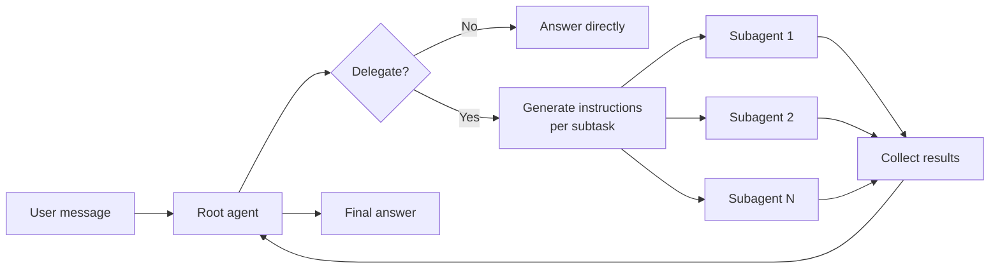

When a task involves gathering or processing information from multiple sources, a single agent can quickly fill its context window with intermediate tool calls and results. TrueForge solves this with **subagents** — lightweight, isolated agent runs that handle focused subtasks in parallel and return only their final results to the root agent. Dynamic subagents are **enabled by default**.

The root agent stays focused on high-level coordination. Subagents do the heavy lifting.

## Why subagents?

Subagents solve the **context bloat problem**. When an agent uses tools with large outputs — API responses, search results, file contents — the context window fills up with intermediate data that is only needed temporarily. As the context grows, the agent becomes slower, more expensive, and more prone to errors.

Consider a task: _"Summarize the recent pull requests for every member of my team."_

<Tabs>
  <Tab title="Without subagents">
    1. The agent looks up members of the team.
    2. It works on each member **one by one**, fetching pull requests and summarizing each.
    3. All intermediate tool calls and results stay in the context window.
    4. The agent has to reason over a large, cluttered context to produce the final answer.
    5. The bloat carries over to future turns in the session.
  </Tab>
  <Tab title="With subagents">
    1. The agent looks up members of the team.
    2. It creates a subagent **per team member** — they run in parallel.
    3. Each subagent fetches pull requests and produces a summary independently.
    4. Subagents return only their summaries to the root agent.
    5. The root agent combines the summaries — the raw data never enters its context.
  </Tab>
</Tabs>

**When subagents help most:**

- Multi-step research across several entities (users, repos, services) that can run in parallel
- Tasks where intermediate tool output is large but the final answer is a summary
- Work that benefits from isolation — each subtask gets a clean context to reason in

## How it works

The root agent decides at runtime whether to delegate. When it does, it calls the built-in `create_sub_agent` tool with focused, generated instructions for each subtask, spawns the subagents, and waits for their results.



<Note>
  - **Shared tools and sandbox** — subagents have access to the same MCP tools and sandbox environment as the root agent.
  - **No user interaction** — subagents cannot ask the user questions. Only the root agent talks to the user. Subagent tool calls that require [approval](/create-agent/overview#whats-in-an-agent) still pause for the user, though.
  - **No nesting** — subagents cannot create other subagents. Delegation is one level deep.
  - **Parallel execution** — multiple subagents run concurrently. The root agent waits for all of them before continuing.
</Note>

## Example

In this example, the user asks for a summary of work merged by a team. The root agent looks up team members, then delegates PR research for each member to parallel subagents.

<Steps>

<Step title="User" icon={<svg viewBox="0 0 28 28"><rect width="28" height="28" rx="6" fill="#4f46e5"/><circle cx="14" cy="10" r="3.5" fill="#fff"/><path d="M7 23c0-3.3 3.1-6 7-6s7 2.7 7 6" fill="#fff"/></svg>} noAnchor>
  Can you please give me a summary of work merged by "agent" team in agent-runtime in last 7 days?
</Step>

<Step title="Assistant" icon={<svg viewBox="0 0 28 28"><rect width="28" height="28" rx="6" fill="#10b981"/><rect x="8" y="11" width="12" height="10" rx="2" fill="#fff"/><circle cx="12" cy="15" r="1.5" fill="#10b981"/><circle cx="16" cy="15" r="1.5" fill="#10b981"/><rect x="13" y="5" width="2" height="6" rx="1" fill="#fff"/><circle cx="14" cy="4.5" r="1.5" fill="#fff"/></svg>} noAnchor>
  <AccordionGroup>
    <Accordion title="get_team_members" icon="wrench">
      **Tool Call**
      ```json lines
      {
        "org": "truefoundry",
        "team_slug": "agent"
      }
      ```

      **Tool Response**
      ```json lines
      [
        "alice",
        "bob"
      ]
      ```
    </Accordion>
  </AccordionGroup>
</Step>

<Step title="Assistant" icon={<svg viewBox="0 0 28 28"><rect width="28" height="28" rx="6" fill="#10b981"/><rect x="8" y="11" width="12" height="10" rx="2" fill="#fff"/><circle cx="12" cy="15" r="1.5" fill="#10b981"/><circle cx="16" cy="15" r="1.5" fill="#10b981"/><rect x="13" y="5" width="2" height="6" rx="1" fill="#fff"/><circle cx="14" cy="4.5" r="1.5" fill="#fff"/></svg>} noAnchor>
  <Note>
    These subagents run in parallel and return their final assistant messages to the main agent.
    The main agent waits for all the subagents to finish and then combines the results to produce the final answer.
  </Note>

  The agent team has 2 members. The date is 2026-05-22, so I need PRs merged in the last 7 days (since 2026-05-15). Let me now fetch merged PRs for each team member in parallel using sub-agents!

  <AccordionGroup>
    <Accordion title="Subagent: bob-prs" icon="robot">
      <Steps>
        <Step title="System" icon={<svg viewBox="0 0 28 28"><rect width="28" height="28" rx="6" fill="#f59e0b"/><path d="M16 4L9 15h5l-2 9 7-11h-5l2-9z" fill="#fff"/></svg>} noAnchor>
          <Note>
          These instructions are generated by the main agent for the subagent to execute.
          </Note>
          Search for pull requests merged by GitHub user "bob" in the repository "agent-runtime" owned by "truefoundry" since 2026-05-15 (last 7 days, today is 2026-05-22).
          Use the search_pull_requests tool with:
          - query: "repo:truefoundry/agent-runtime author:bob is:merged merged:>=2026-05-15"

          For each PR found, provide:
          1. PR number and title
          2. Merged date
          3. A brief 1-2 sentence description of what the PR does (infer from the title or any available description)

          Return a concise structured summary of all PRs found. If none found, say "No PRs merged in the last 7 days."
        </Step>
        <Step title="Assistant" icon={<svg viewBox="0 0 28 28"><rect width="28" height="28" rx="6" fill="#10b981"/><rect x="8" y="11" width="12" height="10" rx="2" fill="#fff"/><circle cx="12" cy="15" r="1.5" fill="#10b981"/><circle cx="16" cy="15" r="1.5" fill="#10b981"/><rect x="13" y="5" width="2" height="6" rx="1" fill="#fff"/><circle cx="14" cy="4.5" r="1.5" fill="#fff"/></svg>} noAnchor>
          <AccordionGroup>
            <Accordion title="search_pull_requests" icon="wrench" defaultOpen>
              **Tool Call**
              ```json lines
              {
                "query": "repo:truefoundry/agent-runtime author:bob is:merged merged:>=2026-05-15"
              }
              ```

              **Tool Response**
              ```json lines
              {
                "total_count": 2,
                "incomplete_results": false,
                "items": [
                  {
                    "id": 4475054266,
                    "title": "misc: add responseUpdatedAt to agent response store"
                  },
                  {
                    "id": 4454608143,
                    "title": "fix: Sandbox: update instruction on agent to invoke mcp_client.py script directly, not via python"
                  }
                ]
              }
              ```
            </Accordion>
          </AccordionGroup>
        </Step>
        <Step title="Assistant" icon={<svg viewBox="0 0 28 28"><rect width="28" height="28" rx="6" fill="#10b981"/><rect x="8" y="11" width="12" height="10" rx="2" fill="#fff"/><circle cx="12" cy="15" r="1.5" fill="#10b981"/><circle cx="16" cy="15" r="1.5" fill="#10b981"/><rect x="13" y="5" width="2" height="6" rx="1" fill="#fff"/><circle cx="14" cy="4.5" r="1.5" fill="#fff"/></svg>} noAnchor>
          - Merged: 2026-05-20
            Description: Adds a new responseUpdatedAt timestamp field to ResponseInStore ...

          - Merged: 2026-05-19
            Description: Fixes sandbox initialization by symlinking the uploaded mcp_client.py as mcp-client
        </Step>
      </Steps>
    </Accordion>
    <Accordion title="Subagent: alice-prs" icon="robot">
      <Steps>
        <Step title="System" icon={<svg viewBox="0 0 28 28"><rect width="28" height="28" rx="6" fill="#f59e0b"/><path d="M16 4L9 15h5l-2 9 7-11h-5l2-9z" fill="#fff"/></svg>} noAnchor>
          <Note>
          These instructions are generated by the main agent for the subagent to execute.
          </Note>
          Search for pull requests merged by GitHub user "alice" in the repository "agent-runtime" owned by "truefoundry" since 2026-05-15 (last 7 days, today is 2026-05-22).
          Use the search_pull_requests tool with:
          - query: "repo:truefoundry/agent-runtime author:alice is:merged merged:>=2026-05-15"

          For each PR found, provide:
          1. PR number and title
          2. Merged date
          3. A brief 1-2 sentence description of what the PR does (infer from the title or any available description)

          Return a concise structured summary of all PRs found. If none found, say "No PRs merged in the last 7 days."
        </Step>
        <Step title="Assistant" icon={<svg viewBox="0 0 28 28"><rect width="28" height="28" rx="6" fill="#10b981"/><rect x="8" y="11" width="12" height="10" rx="2" fill="#fff"/><circle cx="12" cy="15" r="1.5" fill="#10b981"/><circle cx="16" cy="15" r="1.5" fill="#10b981"/><rect x="13" y="5" width="2" height="6" rx="1" fill="#fff"/><circle cx="14" cy="4.5" r="1.5" fill="#fff"/></svg>} noAnchor>
          <AccordionGroup>
            <Accordion title="search_pull_requests" icon="wrench" defaultOpen>
              **Tool Call**
              ```json lines
              {
                "query": "repo:truefoundry/agent-runtime author:alice is:merged merged:>=2026-05-15"
              }
              ```

              **Tool Response**
              ```json lines
              {
                "total_count": 0,
                "incomplete_results": false,
                "items": []
              }
              ```
            </Accordion>
          </AccordionGroup>
        </Step>
        <Step title="Assistant" icon={<svg viewBox="0 0 28 28"><rect width="28" height="28" rx="6" fill="#10b981"/><rect x="8" y="11" width="12" height="10" rx="2" fill="#fff"/><circle cx="12" cy="15" r="1.5" fill="#10b981"/><circle cx="16" cy="15" r="1.5" fill="#10b981"/><rect x="13" y="5" width="2" height="6" rx="1" fill="#fff"/><circle cx="14" cy="4.5" r="1.5" fill="#fff"/></svg>} noAnchor>
          No PRs merged by alice in the last 7 days.
        </Step>
      </Steps>
    </Accordion>
  </AccordionGroup>
</Step>

<Step title="Assistant" icon={<svg viewBox="0 0 28 28"><rect width="28" height="28" rx="6" fill="#10b981"/><rect x="8" y="11" width="12" height="10" rx="2" fill="#fff"/><circle cx="12" cy="15" r="1.5" fill="#10b981"/><circle cx="16" cy="15" r="1.5" fill="#10b981"/><rect x="13" y="5" width="2" height="6" rx="1" fill="#fff"/><circle cx="14" cy="4.5" r="1.5" fill="#fff"/></svg>} noAnchor>
  Here is a summary of work merged by the agent team in the last 7 days:

  - Alice: No PRs merged in the last 7 days.
  - Bob: 2 PRs merged in the last 7 days. The theme of work is around sandbox initialization and responseUpdatedAt ...
  ...
</Step>

</Steps>

## Disabling

Set `config.dynamic_sub_agents.enabled: false` on the agent. See [`config.dynamic_sub_agents`](/create-agent/overview#config) in the agent spec reference.
