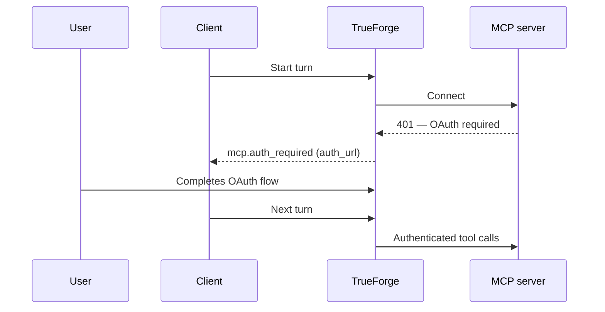

MCP servers are how your agent reaches real systems: SaaS apps, internal APIs, data platforms, ticketing tools, and infrastructure controls.

In TrueForge, MCP servers are registered once — in the UI under **Settings → MCP Servers** or via the settings API — and agents reference them by name. Credentials live in the server configuration, never in agent definitions.

## Registering an MCP server

An MCP server is configured with a small manifest:

```json
{
  "type": "remote",
  "name": "github",
  "url": "https://api.githubcopilot.com/mcp/",
  "auth": { "type": "dcr" }
}
```

| Field  | Description                                                                                                                                        |
| ------ | -------------------------------------------------------------------------------------------------------------------------------------------------- |
| `type` | `remote` — a server reachable over HTTP. TrueForge connects via Streamable HTTP, falling back to SSE.                                              |
| `name` | How agents reference the server.                                                                                                                   |
| `url`  | The MCP endpoint URL.                                                                                                                              |
| `auth` | Optional. `{ "type": "header", "headers": { ... } }` for static credentials, or `{ "type": "dcr" }` for OAuth. Omit for servers that need no auth. |

Register it with `PUT /api/v1/settings/mcp-servers` (or through the UI). A catalog of popular servers is available at `GET /api/v1/settings/mcp-servers/catalog`, and you can verify connectivity with `GET /api/v1/settings/mcp-servers/{name}/tools`, which lists the server's live tools.

### Authentication options

- **No auth** — public or network-trusted servers.
- **Header auth** (`type: "header"`) — static HTTP headers (API keys, bearer tokens) sent on every request to the server.
- **OAuth with Dynamic Client Registration** (`type: "dcr"`) — TrueForge registers itself as an OAuth client with the server's authorization server, runs the authorization-code flow, and stores and refreshes tokens. Users never handle tokens.

## In-chat authentication

If a server uses OAuth and the user has not yet authorized it, the agent does not fail — the turn pauses with an `mcp.auth_required` event that carries an `auth_url` for each server that needs authorization. The chat UI renders this as a **Connect** button: the user completes the OAuth flow in a popup and continues the conversation.



Set `PUBLIC_BASE_URL` on the server so OAuth callbacks resolve to the right origin.

## Attaching servers to an agent

Each agent lists the servers it uses, with fine-grained control over which tools are exposed and which require approval:

```json
{
  "mcp_servers": [
    {
      "name": "github",
      "enable_tools": ["@all"],
      "disable_tools": ["delete_repository"],
      "require_approval_for_tools": ["@write", "@destructive"],
      "preload": false
    }
  ]
}
```

| Field                        | Default                      | Description                                                                                                                    |
| ---------------------------- | ---------------------------- | ------------------------------------------------------------------------------------------------------------------------------ |
| `enable_tools`               | `["@all"]`                   | Tools exposed to the agent. `@all`, `@read-only`, or literal names.                                                            |
| `disable_tools`              | `[]`                         | Tools removed from the enabled set.                                                                                            |
| `require_approval_for_tools` | `["@write", "@destructive"]` | Tools that pause for [human approval](/human-in-the-loop). `@all`, `@write`, `@destructive`, or literal names.                 |
| `preload`                    | `false`                      | Whether tool schemas are loaded into context upfront. See [Deferred tool loading](/context-engineering/deferred-tool-loading). |
| `preload_tools`              | `[]`                         | Specific tools to load eagerly while the rest stay deferred.                                                                   |

The `@read-only`, `@write`, and `@destructive` selectors are derived from the tool annotations the MCP server publishes (`readOnlyHint`, `destructiveHint`), so approval policy follows the server's own metadata.

<Tip>
  Attach only the servers an agent needs, and disable tools it should never call. A smaller tool surface reduces risk
  and improves tool-call quality by minimizing irrelevant choices.
</Tip>

## Safety controls

- Tools matching `require_approval_for_tools` pause the turn for explicit user confirmation — see [Human in the Loop](/human-in-the-loop).
- The defaults (`@write`, `@destructive`) mean state-changing tools require approval out of the box; read-only tools run freely.
- Approval enforcement also applies when tools are called from [Code Mode](/context-engineering/code-mode) scripts inside the sandbox.

## Keeping context lean

Tool definitions consume context. With many servers each exposing dozens of tools, the schemas alone can fill a large share of the context window before the user types anything. By default (`preload: false`), TrueForge only puts each server's name and description in context and lets the agent discover tool schemas on demand.

See [Deferred tool loading](/context-engineering/deferred-tool-loading) for the full flow.
