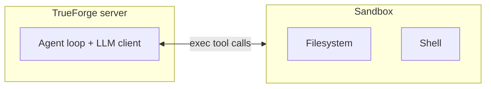
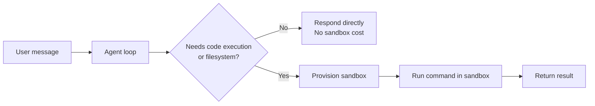

The sandbox gives your agent a secure, isolated environment to run code, manipulate files, and execute shell commands — completely separate from the TrueForge server and your infrastructure.

## Sandbox as a tool

There are two architecture patterns for combining agents with sandboxes. TrueForge uses the **sandbox as tool** pattern: the agent and all orchestration logic run in the harness, and the sandbox is only used for code execution, file operations, and shell commands.



This design has several consequences:

- **Secrets stay out of the sandbox** — model API keys and MCP credentials live in the harness. Even a sandbox compromised through prompt injection has no secrets to exfiltrate.
- **Agent state survives sandbox failures** — conversation history, context, and tool definitions live in the harness. A sandbox crash doesn't lose the agent's progress.
- **On-demand provisioning** — a sandbox is created only when the agent actually needs one. Simple Q&A and MCP tool calls incur no sandbox cost.

## Configuring a sandbox provider

TrueForge delegates sandbox compute to a provider. Configure it once — in the UI under **Settings → Sandbox** or via `PUT /api/v1/settings/sandbox-providers`. Today the supported provider is [Daytona](https://www.daytona.io):

```json
{
  "type": "daytona",
  "snapshot_name": "your-snapshot",
  "auth": { "api_key": "..." },
  "exec_timeout_ms": 120000,
  "auto_stop_interval_in_minutes": 15,
  "auto_archive_interval_in_minutes": 10080,
  "auto_delete_interval_in_minutes": 43200
}
```

| Field                              | Description                                                      |
| ---------------------------------- | ---------------------------------------------------------------- |
| `snapshot_name`                    | Daytona snapshot (base image) used when creating sandboxes.      |
| `auth.api_key`                     | Daytona API key.                                                 |
| `exec_timeout_ms`                  | Default timeout for a single command execution.                  |
| `auto_stop_interval_in_minutes`    | Idle time before a running sandbox is stopped (files preserved). |
| `auto_archive_interval_in_minutes` | Time before a stopped sandbox is archived.                       |
| `auto_delete_interval_in_minutes`  | Time before an archived sandbox is deleted.                      |

A template with defaults is available at `GET /api/v1/settings/sandbox-providers/catalog`. Whether a provider is configured is reported by `GET /api/v1/capabilities`.

## Enabling the sandbox on an agent

The sandbox is **off by default** per agent. Enable it in the agent spec:

```json
{
  "config": {
    "sandbox": {
      "enabled": true,
      "file_downloads": true
    }
  }
}
```

| Field                        | Default | Description                                                                                                                                      |
| ---------------------------- | ------- | ------------------------------------------------------------------------------------------------------------------------------------------------ |
| `enabled`                    | `false` | Give this agent a sandbox. Required for [skills](/skills) and [Code Mode](/context-engineering/code-mode).                                       |
| `file_downloads`             | `true`  | Allow users to download files the agent produces (via the turn download endpoint).                                                               |
| `network_policy.auth_inject` | —       | Optional: inject git basic-auth credentials for specific hosts, so the agent can clone private repositories without ever seeing the credentials. |

```json
{
  "config": {
    "sandbox": {
      "enabled": true,
      "network_policy": {
        "auth_inject": [
          {
            "type": "git",
            "match": { "hosts": ["github.com"] },
            "auth_data": { "type": "basic", "username": "x-access-token", "password": "<token>" }
          }
        ]
      }
    }
  }
}
```

## On-demand provisioning

Most agent tasks — answering questions, calling MCP tools, reasoning — do not require code execution. TrueForge provisions a sandbox only when the agent decides it needs one:



The sandbox is used when the agent needs to:

- Run Python, shell, or other code
- Write, read, or process files
- Use [skills](/skills) (skill repositories are cloned into the sandbox)
- Run [Code Mode](/context-engineering/code-mode) scripts that chain MCP tool calls programmatically
- Generate downloadable artifacts (CSVs, reports, images)

When a sandbox is created, the turn stream emits a [`sandbox.created`](/api/turn-events#sandbox-created) event with the `sandbox_id`.

## Persistence across turns

Once provisioned, the sandbox is reused across turns in the same session — files written in one turn are available in the next, and no new `sandbox.created` event is emitted. Idle sandboxes are stopped after `auto_stop_interval_in_minutes` (state preserved and restartable), then archived and eventually deleted per the provider configuration.

## File downloads

When the agent produces a file, clients can fetch it through the server:

```text
GET /api/v1/sessions/{session_id}/turns/{turn_id}/download?path=...
```

The bundled chat UI renders download links automatically. Set `config.sandbox.file_downloads: false` to disable this per agent. The maximum download size is controlled by the `SANDBOX_FILE_MAX_BYTES_FOR_DOWNLOAD` server environment variable (default 20 MB).

## Credential safety

Because TrueForge uses the sandbox-as-tool pattern:

- Model and MCP credentials are used by the harness, outside the sandbox.
- When the agent calls MCP tools from inside a [Code Mode](/context-engineering/code-mode) script, the calls are **bridged back to the harness**, which applies the stored credentials — the sandbox never holds tokens.
- The only credentials that can enter the sandbox are ones you explicitly inject via `network_policy.auth_inject` (for cloning private git repositories).
