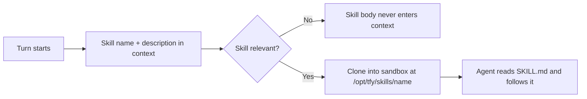

Skills are reusable capability bundles that teach an agent how to perform specialized tasks — querying a database, triaging an alert, following an escalation playbook, or drafting release notes.

In TrueForge, a skill is a **directory in a git repository** rooted at a `SKILL.md` file. You register skills once — in the UI under **Settings → Skills** or via the settings API — and attach them to agents by name.

## What a skill contains

A skill is a directory with a `SKILL.md` file (YAML frontmatter with `name` and `description`, plus a markdown body of instructions) and any supporting files:

```text
customer-support-skill/
├── SKILL.md
├── references/
│   └── escalation-policy.md
└── scripts/
    └── classify_ticket.py
```

The `description` is what the agent sees upfront to decide whether the skill is relevant. The full body — and the supporting files — are only read when the agent picks the skill. This **progressive disclosure** keeps context lean while giving the agent access to detailed procedures on demand.

## Registering a skill

A skill manifest points at a GitHub or GitLab repository:

```json
{
  "type": "git",
  "name": "customer-support",
  "url": "https://github.com/your-org/agent-skills",
  "path": "skills/customer-support",
  "ref": "main",
  "description": "Triage and respond to customer support tickets following the escalation policy."
}
```

| Field         | Description                                                                     |
| ------------- | ------------------------------------------------------------------------------- |
| `type`        | `git` — the skill lives in a git repository.                                    |
| `name`        | How agents reference the skill. Also the directory name inside the sandbox.     |
| `url`         | HTTPS URL of a GitHub or GitLab repository.                                     |
| `path`        | Optional path to the skill directory within the repo. Omit for the repo root.   |
| `ref`         | Branch name, tag, or commit SHA. **Pin a tag or SHA for production stability.** |
| `description` | Concise guidance for when the agent should use the skill.                       |

Register it with `PUT /api/v1/settings/skills` (or through the UI). Starter skills are available in the catalog at `GET /api/v1/settings/skills/catalog`.

<Tip>
  Because `ref` can be a branch, tag, or commit SHA, you get versioning through git itself: pin production agents to a
  tag or SHA, test changes on a branch, and roll back by changing the ref.
</Tip>

## Attaching skills to an agent

Agents reference skills by name only:

```json
{
  "skills": [{ "name": "customer-support" }],
  "config": {
    "sandbox": { "enabled": true }
  }
}
```

<Note>
  Skills require the agent's **[sandbox](/sandbox)** to be enabled — the skill repository is cloned into the sandbox, and the agent reads `SKILL.md` and runs any bundled scripts there. Session creation rejects agents that attach skills without a sandbox (check `GET /api/v1/capabilities` to see whether a sandbox provider is configured).

Two skills cannot share the same `name` within a single agent.

</Note>

## How skills are used at runtime

1. At startup, the harness exposes each attached skill's `name` and `description` to the model.
2. When the model decides a skill is relevant, the skill's repository is materialized in the sandbox under `/opt/tfy/skills/{name}`.
3. The agent reads `SKILL.md`, follows its instructions, and accesses supporting files or runs bundled scripts as needed.



## Skills + MCP tools

Skills and MCP tools are complementary:

- **Skills** define _how_ to handle a task — the procedure, decision logic, and formatting rules.
- **MCP tools** provide the _actions and data_ needed to execute it.

Example: a "CRM follow-up" skill instructs the agent on decision logic and message tone, while MCP tools handle record lookup, ticket update, and Slack notification.

## Authoring guidelines

- Keep the `description` sharp — it is the only thing the model sees before deciding to load the skill.
- Write `SKILL.md` like instructions to a competent new teammate: the workflow, the edge cases, the output format.
- Move heavy reference material into supporting files the skill links to, so the agent reads them only when needed.
- Prefer several focused skills over one sprawling skill — the agent composes them per task.
